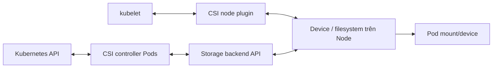
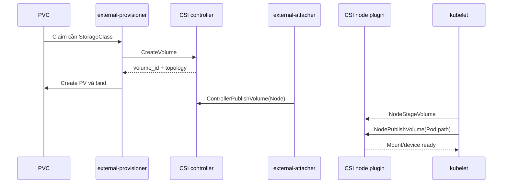

# Container Storage Interface

## Mục lục

- [Tổng quan](#tổng-quan)
- [1. Vì sao CSI tồn tại](#1-vì-sao-csi-tồn-tại)
- [2. Kiến trúc controller và node](#2-kiến-trúc-controller-và-node)
- [3. Các sidecar phổ biến](#3-các-sidecar-phổ-biến)
- [4. API objects liên quan](#4-api-objects-liên-quan)
- [5. Luồng provision, attach và mount](#5-luồng-provision-attach-và-mount)
- [6. Capability không đồng nhất giữa drivers](#6-capability-không-đồng-nhất-giữa-drivers)
- [7. Topology, capacity và attach limits](#7-topology-capacity-và-attach-limits)
- [8. Credentials và security boundary](#8-credentials-và-security-boundary)
- [9. Cài đặt và nâng cấp an toàn](#9-cài-đặt-và-nâng-cấp-an-toàn)
- [10. Quan sát CSI trong cluster](#10-quan-sát-csi-trong-cluster)
- [11. Troubleshooting theo operation](#11-troubleshooting-theo-operation)
- [12. Best practices](#12-best-practices)
- [Tài liệu tham khảo](#tài-liệu-tham-khảo)

---

## Tổng quan

Container Storage Interface (CSI) là chuẩn gRPC để container orchestrator dùng storage system mà không nhúng code vendor vào Kubernetes core. Storage vendor phát hành driver độc lập; Kubernetes và CSI sidecars chuyển API objects thành operation chuẩn như `CreateVolume`, `ControllerPublishVolume`, `NodeStageVolume` và `NodePublishVolume`.



CSI là interface, không phải một storage product. Mỗi driver có support matrix, deployment, failure domain và operational behavior riêng.

## 1. Vì sao CSI tồn tại

Volume plugin in-tree trước đây được build cùng Kubernetes binaries. Thêm/sửa driver phụ thuộc release Kubernetes và tăng blast radius core. CSI tách lifecycle:

- Driver nâng cấp độc lập.
- Vendor triển khai feature theo chuẩn CSI.
- Kubernetes dùng sidecar/controllers dùng chung.
- Cluster có thể cài nhiều driver cho nhiều storage profile.

Đổi lại, platform phải quản lý compatibility giữa Kubernetes, CSI spec, driver, sidecar images và backend API.

## 2. Kiến trúc controller và node

### 2.1 Controller plugin

Thường chạy Deployment/StatefulSet với leader election, xử lý operation ở cấp backend:

- Create/Delete volume.
- Attach/Detach khi backend cần controller publish.
- Create/Delete snapshot.
- Controller expansion.
- List/get capacity hoặc modify volume nếu hỗ trợ.

Controller không nhất thiết chạy trên mọi Node.

### 2.2 Node plugin

Thường chạy DaemonSet trên mỗi Node có thể consume storage. Nó:

- Đăng ký driver với kubelet qua Unix socket.
- Stage device/filesystem ở path dùng chung trên Node.
- Publish/bind-mount Volume vào Pod path.
- Unpublish/unstage khi Pod ngừng dùng.
- Node expansion/stats/health nếu capability hỗ trợ.

Node plugin thường cần host mounts và quyền cao để thao tác device/mount. Đây là thành phần đặc quyền cần supply-chain và RBAC control chặt.

## 3. Các sidecar phổ biến

Sidecar là Kubernetes-specific controller/helper nói chuyện với CSI plugin qua socket:

| Sidecar | Theo dõi/gọi operation |
|---|---|
| `external-provisioner` | Watch PVC; gọi `CreateVolume`/`DeleteVolume`; tạo PV |
| `external-attacher` | Watch `VolumeAttachment`; gọi controller publish/unpublish |
| `external-resizer` | Watch PVC expansion; gọi controller expand |
| `external-snapshotter` | Watch snapshot content; gọi create/delete snapshot |
| `node-driver-registrar` | Lấy driver info và đăng ký socket với kubelet |
| Liveness probe | Kiểm tra CSI endpoint của plugin |

Không phải driver nào cũng cần mọi sidecar. Ví dụ network filesystem không có attach step có thể không cần external-attacher. Sidecar version phải nằm trong compatibility matrix của driver/Kubernetes; không tự nâng riêng image chỉ vì có bản mới.

## 4. API objects liên quan

### 4.1 `CSIDriver`

Cluster-scoped object mô tả behavior driver, ví dụ attach required, pod info on mount, filesystem group policy và lifecycle modes.

```bash
kubectl get csidriver
kubectl get csidriver DRIVER_NAME -o yaml
```

`CSIDriver` không chứng minh node plugin đang healthy; nó là capability/config object.

### 4.2 `CSINode`

Mỗi Node ghi driver đã đăng ký và topology/allocatable information:

```bash
kubectl get csinode
kubectl get csinode NODE -o yaml
```

Nếu driver thiếu trong `CSINode`, kubelet/node registrar/plugin có thể chưa hoạt động trên Node đó.

### 4.3 `VolumeAttachment`

Cluster-scoped object đại diện desired/actual attach giữa PV và Node cho driver cần attach:

```bash
kubectl get volumeattachment
kubectl describe volumeattachment ATTACHMENT
```

Không sửa/xóa object này tùy tiện khi Node cũ có thể còn I/O.

### 4.4 `CSIStorageCapacity`

Driver/provisioner có thể publish capacity theo topology để scheduler hỗ trợ `WaitForFirstConsumer`. Đây là signal scheduling, không phải monitoring đầy đủ của backend.

### 4.5 PV `spec.csi`

```yaml
spec:
  csi:
    driver: csi.storage.example.com
    volumeHandle: backend-volume-123
    fsType: ext4
```

`volumeHandle` là identity backend quan trọng để correlate log/inventory. Không thay handle thủ công trên PV đang dùng.

## 5. Luồng provision, attach và mount



Operation cụ thể phụ thuộc capability:

1. Provisioning có thể bị trì hoãn cho first consumer.
2. Attach step có thể được bỏ nếu backend không cần.
3. Stage có thể dùng một mount/device path chung trên Node.
4. Publish đưa Volume vào path của Pod.
5. Cleanup chạy ngược: unpublish → unstage → detach → delete theo lifecycle.

Một lỗi ở mỗi phase tạo Event khác nhau. Đọc operation name trong log/Event giúp xác định controller side hay node side.

## 6. Capability không đồng nhất giữa drivers

CSI chuẩn hóa RPC, không bắt mọi driver support mọi feature. Kiểm tra riêng:

- Dynamic provisioning.
- RWO/ROX/RWX/RWOP.
- Filesystem/raw Block và filesystem type.
- Online/offline expansion.
- Snapshot/clone.
- Topology/capacity tracking.
- Ephemeral inline/generic ephemeral.
- Volume health monitoring.
- Node attach limit.
- Encryption/KMS, multi-zone và performance tier.

“CSI-compatible” không đủ để kết luận snapshot hoặc RWX hoạt động. Test exact StorageClass + driver version + backend tier.

## 7. Topology, capacity và attach limits

Controller `CreateVolume` có thể nhận topology requirement từ scheduler. Driver trả accessible topology để PV có node affinity. Nếu labels hoặc backend location sai, Pod có thể schedule sai hoặc bị volume node affinity conflict.

Block storage thường có giới hạn số Volume attach trên Node. Scheduler có thể dùng allocatable count driver quảng bá. Capacity/limit có thể thay đổi theo instance type hoặc attachment đang dùng; monitoring thực tế vẫn cần thiết.

Các failure mode:

- Zone có compute nhưng hết storage capacity.
- Node còn CPU nhưng đạt attach limit.
- Driver DaemonSet không chạy trên tainted/special Node pool.
- Topology label của CSINode khác labels scheduler/backend kỳ vọng.
- Nhiều PVC của một Pod được provision ở các zone không giao nhau.

## 8. Credentials và security boundary

CSI controller thường có credential mạnh để tạo/xóa disk/snapshot. Node plugin có quyền mount device trên host. Bảo vệ:

- Workload identity/short-lived credentials khi backend hỗ trợ.
- Secret encryption at rest và RBAC tối thiểu.
- Namespace/ServiceAccount riêng cho driver.
- Pin image digest, verify provenance/signature và scan vulnerabilities.
- NetworkPolicy phù hợp nhưng không chặn API/backend endpoint cần thiết.
- Pod Security exception chỉ cho driver namespace, không mở rộng tenant.
- Audit operation create/delete/attach/snapshot.

StorageClass secret references có thể dùng template theo PVC Namespace/name. Review driver docs để tránh tenant điều khiển secret namespace hoặc parameter đặc quyền.

## 9. Cài đặt và nâng cấp an toàn

Trước upgrade:

1. Đọc compatibility matrix Kubernetes/driver/sidecars/backend.
2. Backup manifests/values và inventory driver/PV capability.
3. Kiểm tra controller replica/leader election và PodDisruptionBudget nếu vendor hỗ trợ.
4. Canary trên Node pool/non-critical StorageClass nếu có thể.
5. Test provision, attach, write, reschedule, resize, snapshot và delete.
6. Theo dõi in-flight operations và error rate.
7. Có rollback image/chart; lưu ý CRD/API migration có thể không rollback đơn giản.

Không restart toàn bộ node plugin cùng lúc nếu workload phụ thuộc mount/health operation. Existing mounts có thể tiếp tục nhưng recovery/new Pod bị ảnh hưởng.

## 10. Quan sát CSI trong cluster

Bắt đầu từ inventory:

```bash
kubectl get csidriver
kubectl get csinode
kubectl get storageclass
kubectl get pods -A -o wide | grep -i csi
kubectl get volumeattachment
```

Map PVC tới driver/handle:

```bash
PVC=app-data
NS=production
PV=$(kubectl get pvc "$PVC" -n "$NS" -o jsonpath='{.spec.volumeName}')
kubectl get pv "$PV" \
  -o jsonpath='{.spec.csi.driver}{" "}{.spec.csi.volumeHandle}{"\n"}'
```

Map Pod tới Node:

```bash
kubectl get pod POD -n "$NS" -o wide
kubectl get csinode NODE -o yaml
```

Liệt kê containers trước khi đọc log:

```bash
kubectl get pod CSI_POD -n CSI_NAMESPACE \
  -o jsonpath='{.spec.containers[*].name}{"\n"}'
kubectl logs CSI_POD -n CSI_NAMESPACE -c CONTAINER --since=30m
```

Dùng UTC timestamp, PVC UID, PV name, volumeHandle, Pod UID và Node để correlate.

## 11. Troubleshooting theo operation

### `CreateVolume` / provisioning lỗi

Signal: PVC `Pending`, Event `ProvisioningFailed`.

Kiểm tra StorageClass parameters/secret, controller Pods, backend quota/capacity/API và selected topology. Đừng điều tra node plugin trước khi PV tồn tại.

### `ControllerPublishVolume` / attach lỗi

Signal: `FailedAttachVolume`, `Multi-Attach`, VolumeAttachment error.

Kiểm tra volume zone, target Node, attachment cũ, Node fencing, attach limit và controller credential. Không force detach nếu writer cũ chưa bị fence.

### `NodeStageVolume` lỗi

Signal: mount device/stage error trước Pod mount.

Kiểm tra node plugin trên đúng Node, device xuất hiện, filesystem type, mount helper, secret và host permission. So sánh với Node khác để xác định scope.

### `NodePublishVolume` lỗi

Signal: bind mount/publish path lỗi.

Kiểm tra Pod mount path, read-only, SELinux, `fsGroup`, subPath và node plugin log. Existing stage có thể khỏe nhưng publish vào Pod cụ thể thất bại.

### `NodeUnpublish`/`Unstage`/detach kẹt

Pod/object deletion có thể chờ mount busy, process giữ file, kubelet/node unreachable hoặc driver timeout. Thu process/mount/driver evidence trước restart Node. Force cleanup cần storage vendor runbook.

### Driver thiếu trên một Node

```bash
kubectl get csinode NODE -o yaml
kubectl get daemonset -A
kubectl get pods -A -o wide --field-selector spec.nodeName=NODE
```

Kiểm tra taint/toleration, node selector/OS/architecture, host socket, registrar log và kubelet log.

### Snapshot/resize lỗi

Xác định sidecar tương ứng (`external-snapshotter`, `external-resizer`) có cài và compatible không; kiểm tra driver capability, CRDs, backend API và resource Events.

## 12. Best practices

1. Pin và quản lý driver + sidecar như một tested release bundle.
2. Ghi support matrix theo StorageClass, không chỉ theo driver marketing.
3. Tách controller/node health dashboard và alert theo operation.
4. Correlate Kubernetes object UID với backend tag/volume handle.
5. Dùng least privilege, short-lived credential và restricted privileged namespace.
6. Test upgrade/rollback, Node failure, controller loss và backend throttling.
7. Không xóa finalizer/VolumeAttachment trước khi xác minh backend và fencing.
8. Dùng `WaitForFirstConsumer` và theo dõi capacity/attach limit cho zonal block storage.
9. Diễn tập snapshot/restore; capability báo true không chứng minh dữ liệu application-consistent.

## Tài liệu tham khảo

- [CSI Volume Source](https://kubernetes.io/docs/concepts/storage/volumes/#csi)
- [Kubernetes CSI Developer Documentation](https://kubernetes-csi.github.io/docs/)
- [CSI external-provisioner](https://kubernetes-csi.github.io/docs/external-provisioner.html)
- [CSI external-attacher](https://kubernetes-csi.github.io/docs/external-attacher.html)
- [CSI node-driver-registrar](https://kubernetes-csi.github.io/docs/node-driver-registrar.html)
