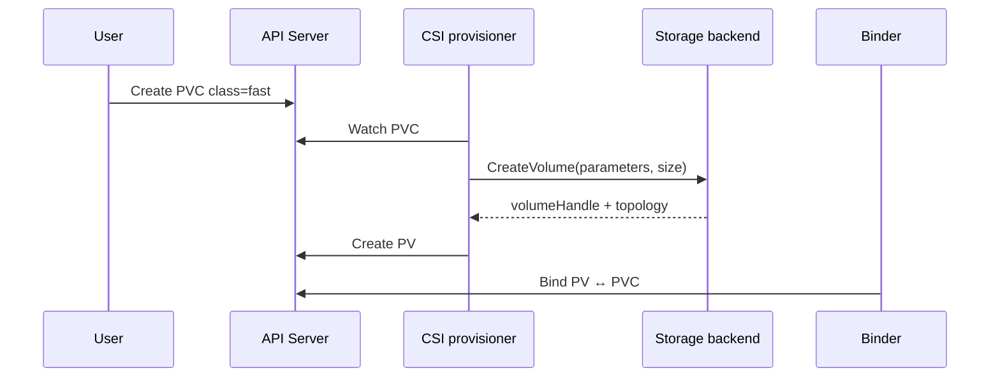
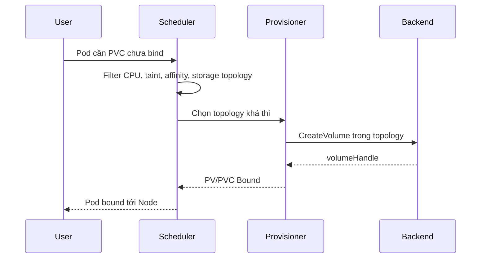

# Dynamic Provisioning

## Mục lục

- [Tổng quan](#tổng-quan)
- [1. Static và dynamic provisioning](#1-static-và-dynamic-provisioning)
- [2. Thành phần tham gia](#2-thành-phần-tham-gia)
- [3. Luồng Immediate](#3-luồng-immediate)
- [4. Luồng WaitForFirstConsumer](#4-luồng-waitforfirstconsumer)
- [5. Default provisioning](#5-default-provisioning)
- [6. Từ PVC đến Volume được mount](#6-từ-pvc-đến-volume-được-mount)
- [7. Idempotency, retry và cleanup](#7-idempotency-retry-và-cleanup)
- [8. Capacity, quota và scale](#8-capacity-quota-và-scale)
- [9. Thực hành quan sát provisioning](#9-thực-hành-quan-sát-provisioning)
- [10. Troubleshooting theo từng tầng](#10-troubleshooting-theo-từng-tầng)
- [11. Best practices](#11-best-practices)
- [Tài liệu tham khảo](#tài-liệu-tham-khảo)

---

## Tổng quan

Dynamic provisioning tạo storage asset khi một PVC yêu cầu, thay vì administrator chuẩn bị sẵn từng PV. StorageClass chọn provisioner và policy; provisioner tạo asset rồi tạo PV đại diện và binder nối PV với PVC.

```text
Create PVC
→ chọn StorageClass
→ provisioner CreateVolume
→ storage backend tạo asset
→ tạo PV với volumeHandle
→ bind PV ↔ PVC
→ scheduler/kubelet attach và mount cho Pod
```

Automation giảm inventory PV rỗi, nhưng mở rộng blast radius của cấu hình sai: một StorageClass sai, credential hết hạn hoặc backend quota cạn có thể chặn mọi workload mới dùng class đó.

## 1. Static và dynamic provisioning

| Tiêu chí | Static | Dynamic |
|---|---|---|
| Tạo asset | Administrator trước | Provisioner theo PVC |
| Tạo PV | Administrator/controller inventory | Provisioner tự động |
| Tốc độ self-service | Thấp hơn | Cao |
| Import dữ liệu có sẵn | Phù hợp | Không phải đường chính |
| Topology | Admin phải mô tả đúng | Driver/scheduler phối hợp |
| Cleanup | Manual theo PV policy | Tự động theo reclaim policy, vẫn cần audit |

Dynamic không thay thế storage capacity planning, backup, encryption hoặc recovery. Nó chỉ tự động hóa lifecycle cấp phát.

## 2. Thành phần tham gia

Với CSI, luồng thường có:

- API server lưu PVC, StorageClass, PV, Pod và VolumeAttachment.
- Persistent volume controller/binder theo dõi claim và binding.
- Scheduler chọn Node/topology cho `WaitForFirstConsumer`.
- CSI `external-provisioner` xem PVC phù hợp và gọi `CreateVolume`.
- CSI controller plugin nói chuyện với backend.
- `external-attacher` và attach/detach controller xử lý volume cần attach.
- Kubelet và CSI node plugin stage/publish Volume trên Node.

Xem kiến trúc chi tiết tại [Container Storage Interface](/storage/csi/).

## 3. Luồng Immediate

StorageClass mặc định dùng `Immediate` nếu không khai báo `volumeBindingMode`:



Ưu điểm: PVC có thể `Bound` trước khi Pod tồn tại. Nhược điểm: với zonal/local storage, provisioner chưa biết Pod constraints. Volume có thể xuất hiện ở zone mà Pod không thể chạy.

`Immediate` phù hợp hơn với backend accessible từ mọi Node/topology hoặc khi driver có semantics không bị location constrain.

## 4. Luồng WaitForFirstConsumer

StorageClass:

```yaml
apiVersion: storage.k8s.io/v1
kind: StorageClass
metadata:
  name: zonal-storage
provisioner: csi.storage.example.com
volumeBindingMode: WaitForFirstConsumer
reclaimPolicy: Delete
allowVolumeExpansion: true
```

PVC ở `Pending` cho đến khi Pod cần nó. Scheduler chọn candidate Node, provisioner nhận selected topology rồi tạo Volume đúng location.



Behavior “PVC Pending, Event waiting for first consumer” là bình thường. Chẩn đoán chỉ cần escalation nếu Pod đã tồn tại nhưng scheduler không tìm được topology/capacity phù hợp.

## 5. Default provisioning

PVC không có `storageClassName` nhận default class nếu cluster cấu hình default. PVC có `storageClassName: ""` chủ động tắt dynamic provisioning qua default và chỉ bind PV không class.

```yaml
apiVersion: v1
kind: PersistentVolumeClaim
metadata:
  name: app-data
  namespace: app
spec:
  accessModes: ["ReadWriteOnce"]
  resources:
    requests:
      storage: 10Gi
```

Kiểm tra class được gán:

```bash
kubectl get pvc app-data -n app \
  -o jsonpath='{.spec.storageClassName}{"\n"}'
```

Application chart nên cho phép user override class. Bỏ field để dùng default là portable hơn hard-code tên class chỉ tồn tại ở một platform.

## 6. Từ PVC đến Volume được mount

Provisioning hoàn tất không đồng nghĩa Pod đã dùng được Volume. End-to-end có các milestone:

| Milestone | Object/signal | Nếu lỗi |
|---|---|---|
| Class selected | PVC `.spec.storageClassName` | Default/tên class |
| Asset created | Provisioner log/backend inventory | Credential, quota, parameters |
| PV created/bound | PVC/PV `Bound` | Binder, mode, size, topology |
| Pod scheduled | Pod `.spec.nodeName` | Resource, affinity, volume topology |
| Attached | `VolumeAttachment`/Event | Attach limit, stale attachment, zone |
| Mounted | Pod Event, container start | Node plugin, filesystem, mount option |
| Application usable | App read/write/health | Permission, corruption, wrong path |

Điều tra theo milestone đầu tiên chưa đạt; restart Pod không sửa lỗi provisioner hoặc backend quota.

## 7. Idempotency, retry và cleanup

Controller và CSI operation phải chịu retry vì distributed system có timeout. Một request timeout không chứng minh backend chưa tạo asset. Driver/provisioner dùng operation identity để tránh tạo volume trùng, nhưng operator vẫn cần kiểm tra cả Kubernetes và backend khi có sự cố.

Deletion cũng nhiều bước:

```text
Delete PVC
→ PVC protection chờ Pod ngừng dùng
→ PV release
→ reclaimPolicy
   ├── Delete: CSI DeleteVolume → xóa PV
   └── Retain: giữ PV/asset để xử lý thủ công
```

Nếu provisioner crash giữa operation, finalizer và retry giúp tiếp tục. Xóa finalizer thủ công có thể cắt ngang workflow và tạo orphan asset.

## 8. Capacity, quota và scale

Dynamic provisioning không tạo capacity từ hư không. Các giới hạn gồm:

- Backend pool/zone capacity.
- Cloud/project quota và API rate limit.
- Maximum volume size.
- CSI node attach limit.
- Namespace ResourceQuota.
- Topology segment còn cả compute lẫn storage.

Theo dõi không chỉ tổng free bytes mà cả phân bố theo zone/tier. Một cluster còn tổng 10Ti nhưng zone cần thiết hết capacity vẫn làm PVC/Pod Pending.

Ở quy mô lớn, quan sát:

- Provisioning latency/error rate theo class/zone.
- PVC Pending age.
- PV orphan/Released và backend volume không có PV.
- Attach count trên Node.
- API throttling của provider.
- Cost theo owner/PVC UID.

## 9. Thực hành quan sát provisioning

Prerequisite: có một StorageClass dynamic. Chọn class:

```bash
kubectl get storageclass
export SC=REPLACE_WITH_STORAGE_CLASS
kubectl get storageclass "$SC" \
  -o custom-columns=NAME:.metadata.name,PROVISIONER:.provisioner,MODE:.volumeBindingMode,RECLAIM:.reclaimPolicy
```

Tạo Namespace, PVC và consumer Pod:

```yaml
apiVersion: v1
kind: PersistentVolumeClaim
metadata:
  name: dynamic-demo
  namespace: storage-lab
spec:
  storageClassName: REPLACE_WITH_STORAGE_CLASS
  accessModes: ["ReadWriteOnce"]
  resources:
    requests:
      storage: 1Gi
---
apiVersion: v1
kind: Pod
metadata:
  name: dynamic-consumer
  namespace: storage-lab
spec:
  containers:
    - name: app
      image: busybox:1.36
      command: ["sh", "-c", "echo provisioned > /data/status; sleep 3600"]
      volumeMounts:
        - name: data
          mountPath: /data
  volumes:
    - name: data
      persistentVolumeClaim:
        claimName: dynamic-demo
```

Thay placeholder trong file, rồi:

```bash
kubectl create namespace storage-lab
kubectl apply -f dynamic-demo.yaml
kubectl get pod,pvc -n storage-lab -w
```

Khi ready:

```bash
PV=$(kubectl get pvc dynamic-demo -n storage-lab -o jsonpath='{.spec.volumeName}')
kubectl get pv "$PV" -o yaml
kubectl exec dynamic-consumer -n storage-lab -- cat /data/status
```

Ghi lại `csi.driver`, `volumeHandle`, node affinity, reclaim policy và Node của Pod. Đây là trace end-to-end từ policy tới data path.

Trước cleanup:

```bash
kubectl get pv "$PV" \
  -o custom-columns=NAME:.metadata.name,POLICY:.spec.persistentVolumeReclaimPolicy
kubectl delete namespace storage-lab
```

Nếu policy `Retain`, dọn PV/backend asset theo runbook.

## 10. Troubleshooting theo từng tầng

### Tầng 1: PVC và StorageClass

```bash
kubectl describe pvc PVC -n NS
kubectl get storageclass SC -o yaml
kubectl get events -n NS --sort-by=.lastTimestamp
```

Kiểm tra tên class, provisioner, quota, size, selector và first consumer.

### Tầng 2: CSI controller

```bash
kubectl get pods -A -o wide | grep -i csi
kubectl get csidriver
```

Xác định Deployment/StatefulSet controller của đúng driver rồi đọc log provisioner và plugin trong time window. Tên container phụ thuộc chart/distribution; dùng `kubectl get pod -o jsonpath` để liệt kê trước.

Tín hiệu phổ biến:

- Authentication/authorization tới backend lỗi.
- Quota/capacity hết.
- Parameter/secret reference sai.
- API timeout/rate limit.
- Driver leader election hoặc controller unavailable.

### Tầng 3: Scheduler và topology

```bash
kubectl describe pod POD -n NS
kubectl get nodes -L topology.kubernetes.io/zone
kubectl get pv PV -o jsonpath='{.spec.nodeAffinity}{"\n"}'
```

So sánh zone, node selector, affinity, taint/toleration và capacity. Với nhiều PVC, mỗi Volume có thể bị tạo ở topology khác khiến giao điểm rỗng.

### Tầng 4: Attach và mount

```bash
kubectl get volumeattachment
kubectl describe pod POD -n NS
kubectl get pods -A -o wide | grep -i csi
```

Kiểm tra stale attachment, attach limit, Node plugin thiếu, mount helper/filesystem lỗi và permission. Không force detach khi Node cũ có thể vẫn ghi.

### Tầng 5: Cleanup bị kẹt

```bash
kubectl get pvc PVC -n NS -o jsonpath='{.metadata.finalizers}{"\n"}'
kubectl get pv PV -o jsonpath='{.metadata.finalizers}{"\n"}'
```

Map volume handle với backend, thu controller log rồi sửa root cause. Chỉ can thiệp finalizer sau khi có xác nhận data/asset state và rollback plan.

## 11. Best practices

1. Dùng `WaitForFirstConsumer` cho zonal/local topology.
2. Giữ một default StorageClass an toàn, không phải tier đắt hoặc thử nghiệm.
3. Version StorageClass contract; canary class/driver change với PVC mới.
4. Đặt ResourceQuota, backend quota alert và capacity forecast theo zone.
5. Tag backing asset bằng cluster/PVC identity để reconciliation orphan volume.
6. Theo dõi toàn luồng provision → bind → schedule → attach → mount, không chỉ PVC phase.
7. Chọn reclaim policy có chủ đích và kiểm tra trước cleanup automation.
8. Test idempotency, controller restart, zone capacity exhaustion và restore trong staging.

## Tài liệu tham khảo

- [Dynamic Volume Provisioning](https://kubernetes.io/docs/concepts/storage/dynamic-provisioning/)
- [Storage Classes](https://kubernetes.io/docs/concepts/storage/storage-classes/)
- [CSI external-provisioner](https://kubernetes-csi.github.io/docs/external-provisioner.html)
