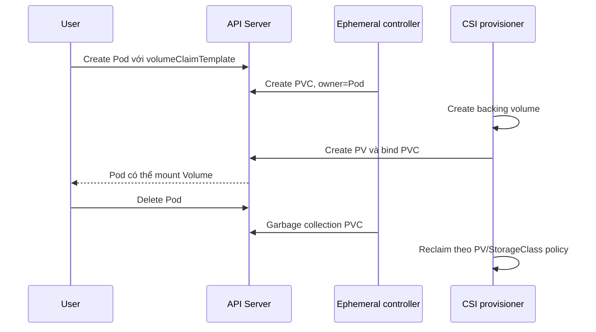

# Ephemeral Volumes

## Mục lục

- [Tổng quan](#tổng-quan)
- [1. Ephemeral nghĩa là gì](#1-ephemeral-nghĩa-là-gì)
- [2. Các nhóm Ephemeral Volume](#2-các-nhóm-ephemeral-volume)
- [3. emptyDir và local ephemeral storage](#3-emptydir-và-local-ephemeral-storage)
- [4. ConfigMap, Secret, Downward API và projected](#4-configmap-secret-downward-api-và-projected)
- [5. CSI inline ephemeral Volume](#5-csi-inline-ephemeral-volume)
- [6. Generic ephemeral Volume](#6-generic-ephemeral-volume)
- [7. Scheduling, capacity và quota](#7-scheduling-capacity-và-quota)
- [8. Security boundary](#8-security-boundary)
- [9. Thực hành emptyDir](#9-thực-hành-emptydir)
- [10. Thực hành generic ephemeral Volume](#10-thực-hành-generic-ephemeral-volume)
- [11. Troubleshooting](#11-troubleshooting)
- [12. Decision guide và best practices](#12-decision-guide-và-best-practices)
- [Tài liệu tham khảo](#tài-liệu-tham-khảo)

---

## Tổng quan

Ephemeral Volume đi theo lifecycle của Pod. Nó phù hợp với scratch data, cache có thể tái tạo, file trao đổi giữa sidecar và application, hoặc dữ liệu đầu vào read-only. Khi Pod bị xóa, Kubernetes không hứa giữ dữ liệu để Pod kế tiếp dùng lại.

```text
Pod được tạo → Ephemeral Volume được chuẩn bị → containers sử dụng
Pod bị xóa  → Volume được dọn            → dữ liệu không còn contract tồn tại
```

Điểm chung là lifecycle, không phải backing storage. Một ephemeral Volume có thể nằm trên Node disk, RAM, storage do CSI driver chuẩn bị hoặc một PVC tự động được tạo rồi garbage-collect.

## 1. Ephemeral nghĩa là gì

Ephemeral không đồng nghĩa với “mất khi container restart”. Volume thuộc Pod vẫn tồn tại qua restart của container trong chính Pod đó. Dữ liệu mất contract bền vững khi Pod không còn hoặc Volume bị dọn theo Pod.

| Sự kiện | `emptyDir` trong Pod hiện tại | Generic ephemeral Volume |
|---|---:|---:|
| Process crash | Giữ | Giữ |
| Container restart | Giữ | Giữ |
| Pod reschedule thành object mới | Mất | PVC/volume cũ được dọn theo owner policy |
| Pod delete | Xóa dữ liệu local | Xóa PVC tự sinh; backing asset thường theo reclaim policy |
| Node mất vĩnh viễn | Không phục hồi local data | Phụ thuộc backend, nhưng object vẫn đi theo Pod lifecycle |

Không đặt dữ liệu duy nhất cần recovery vào ephemeral Volume. Nếu có RPO/RTO, dùng [PersistentVolumeClaim](/storage/persistent-volume-claim/) và chiến lược [Backup và Restore](/storage/storage-backup-restore/).

## 2. Các nhóm Ephemeral Volume

| Nhóm | Ai quản lý | Use case | Capacity-aware scheduling |
|---|---|---|---|
| `emptyDir` | kubelet | Scratch, cache, file chia sẻ | Qua `ephemeral-storage` request ở cấp Pod/container |
| `configMap`, `secret`, `downwardAPI`, `projected` | kubelet + API data | Input read-only | Không phải storage tùy ý |
| CSI inline ephemeral | CSI node driver | Driver-specific local/injected data | Không |
| Generic ephemeral | Ephemeral volume controller + provisioner | Scratch cần size, snapshot, clone hoặc network storage | Có thể dùng `WaitForFirstConsumer` |

Loại `image` Volume cũng có thể đưa OCI artifact vào Pod ở chế độ read-only, nhưng availability và behavior phụ thuộc Kubernetes/container runtime version. Kiểm tra API của cluster trước khi đưa vào manifest portable.

## 3. emptyDir và local ephemeral storage

`emptyDir` được tạo sau khi Pod được schedule lên Node. Nó có thể dùng disk backing của kubelet hoặc tmpfs:

```yaml
volumes:
  - name: scratch
    emptyDir:
      sizeLimit: 1Gi
```

```yaml
volumes:
  - name: hot-cache
    emptyDir:
      medium: Memory
      sizeLimit: 128Mi
```

Node local ephemeral storage còn chứa:

- Writable layer của containers.
- Node-level container logs.
- Disk-backed `emptyDir`.
- Container images trên filesystem tương ứng.

`emptyDir.sizeLimit` chỉ giới hạn Volume. Scheduler dùng tổng `resources.requests.ephemeral-storage`; kubelet có thể evict Pod khi usage vượt limit hoặc Node vào `DiskPressure`.

```yaml
containers:
  - name: worker
    image: busybox:1.36
    resources:
      requests:
        ephemeral-storage: 256Mi
      limits:
        ephemeral-storage: 1Gi
    volumeMounts:
      - name: scratch
        mountPath: /scratch
```

Với memory-backed `emptyDir`, bytes ghi vào tmpfs tính vào memory usage của container ghi. Đừng xem nó là cách né memory limit.

## 4. ConfigMap, Secret, Downward API và projected

Nhóm này đưa data của Kubernetes vào file. `projected` ghép nhiều source vào một mount:

```yaml
volumes:
  - name: identity
    projected:
      defaultMode: 0440
      sources:
        - serviceAccountToken:
            path: token
            audience: https://api.internal.example
            expirationSeconds: 3600
        - downwardAPI:
            items:
              - path: namespace
                fieldRef:
                  fieldPath: metadata.namespace
        - configMap:
            name: trust-config
            items:
              - key: ca.crt
                path: ca.crt
```

Projected ServiceAccount token ngắn hạn có audience và rotation tốt hơn token tĩnh. Application phải mở lại file khi token rotate; không cache vô hạn trong memory.

ConfigMap và Secret phải cùng Namespace với Pod. File được mount read-only. `subPath` trên một key không nhận update tự động, vì vậy tránh `subPath` nếu cần rotation.

## 5. CSI inline ephemeral Volume

CSI inline Volume được mô tả trực tiếp trong Pod:

```yaml
apiVersion: v1
kind: Pod
metadata:
  name: csi-inline-example
  namespace: storage-lab
spec:
  containers:
    - name: app
      image: busybox:1.36
      command: ["sh", "-c", "ls -la /data && sleep 3600"]
      volumeMounts:
        - name: inline-data
          mountPath: /data
  volumes:
    - name: inline-data
      csi:
        driver: inline.storage.example.com
        volumeAttributes:
          profile: demo
```

Tên driver và `volumeAttributes` ở trên chỉ là placeholder. Manifest chỉ hoạt động nếu cluster cài driver đó và `CSIDriver.spec.volumeLifecycleModes` cho phép `Ephemeral`.

CSI inline storage được chuẩn bị sau khi Pod đã tới Node. Scheduler không dùng storage capacity để chọn Node cho loại này. Driver phải tạo Volume nhanh và có xác suất thành công cao; nếu không, Pod kẹt ở startup.

## 6. Generic ephemeral Volume

Generic ephemeral Volume nhúng một `volumeClaimTemplate` vào Pod:

```yaml
apiVersion: v1
kind: Pod
metadata:
  name: generic-ephemeral-demo
  namespace: storage-lab
spec:
  containers:
    - name: app
      image: busybox:1.36
      command: ["sh", "-c", "echo ready > /scratch/status; sleep 3600"]
      volumeMounts:
        - name: scratch
          mountPath: /scratch
  volumes:
    - name: scratch
      ephemeral:
        volumeClaimTemplate:
          spec:
            accessModes: ["ReadWriteOnce"]
            storageClassName: scratch-class
            resources:
              requests:
                storage: 1Gi
```

Thay `scratch-class` bằng StorageClass hỗ trợ dynamic provisioning. Controller tạo PVC cùng Namespace, tên mặc định theo `<pod-name>-<volume-name>`, và đặt Pod làm owner. Khi Pod bị xóa, garbage collector xóa PVC.



`reclaimPolicy: Retain` có thể làm backing asset sống sau PVC. Khi đó Volume chỉ “ephemeral” ở API ownership; operator phải dọn asset và chi phí còn lại.

### 6.1 Xung đột tên PVC

Tên PVC deterministic có thể đụng PVC có sẵn hoặc cặp Pod/Volume khác tạo cùng chuỗi. Controller không chiếm PVC không thuộc Pod; Pod sẽ không start. Dùng naming convention rõ và kiểm tra Event.

## 7. Scheduling, capacity và quota

Với generic ephemeral Volume, ưu tiên StorageClass có:

```yaml
volumeBindingMode: WaitForFirstConsumer
```

Provisioning lúc đó biết Node/topology mà scheduler đang cân nhắc. `Immediate` có thể tạo volume trong zone không phù hợp với CPU, taint, affinity hoặc các Volume khác của Pod.

Quyền tạo Pod có generic ephemeral Volume gián tiếp tạo PVC dù user không có verb `create` trên PVC. Tuy nhiên quota PVC/storage của Namespace vẫn áp dụng. Platform nên kiểm soát:

```yaml
apiVersion: v1
kind: ResourceQuota
metadata:
  name: storage-quota
  namespace: tenant-a
spec:
  hard:
    persistentvolumeclaims: "20"
    requests.storage: 200Gi
    requests.ephemeral-storage: 50Gi
    limits.ephemeral-storage: 100Gi
```

Quota theo StorageClass có thể được cấu hình thêm khi platform cung cấp nhiều tier.

## 8. Security boundary

Rủi ro khác nhau theo loại:

- `emptyDir`: dữ liệu chia sẻ cho mọi container được mount; sidecar bị xâm nhập có thể sửa input của app nếu mount read-write.
- `secret`/projected token: giới hạn mode, audience, RBAC và container được mount.
- CSI inline: user có thể gửi `volumeAttributes` trực tiếp cho driver; không cho phép driver expose tham số đặc quyền qua đường này.
- Generic ephemeral: quyền tạo Pod trở thành khả năng yêu cầu storage; admission và quota phải phản ánh điều đó.
- Dữ liệu nhạy cảm trong local scratch vẫn có thể xuất hiện trên Node disk, core dump hoặc backup của Node; mã hóa và cleanup phụ thuộc môi trường.

Mount read-only cho consumer không cần ghi và tách Volume nếu các container có trust boundary khác nhau.

## 9. Thực hành emptyDir

Tạo file `ephemeral-emptydir.yaml`:

```yaml
apiVersion: v1
kind: Pod
metadata:
  name: ephemeral-lab
  namespace: storage-lab
spec:
  containers:
    - name: app
      image: busybox:1.36
      command: ["sh", "-c"]
      args:
        - echo "$HOSTNAME $(date -Iseconds)" > /cache/created-by;
          while true; do cat /cache/created-by; sleep 10; done
      resources:
        requests:
          ephemeral-storage: 16Mi
        limits:
          ephemeral-storage: 128Mi
      volumeMounts:
        - name: cache
          mountPath: /cache
  volumes:
    - name: cache
      emptyDir:
        sizeLimit: 64Mi
```

Chạy và xác minh:

```bash
kubectl create namespace storage-lab
kubectl apply -f ephemeral-emptydir.yaml
kubectl wait --for=condition=Ready pod/ephemeral-lab -n storage-lab --timeout=90s
kubectl exec ephemeral-lab -n storage-lab -- cat /cache/created-by
```

Ghi lại Pod UID, xóa và tạo lại:

```bash
kubectl get pod ephemeral-lab -n storage-lab \
  -o jsonpath='{.metadata.uid}{"\n"}'
kubectl delete pod ephemeral-lab -n storage-lab
kubectl apply -f ephemeral-emptydir.yaml
kubectl get pod ephemeral-lab -n storage-lab \
  -o jsonpath='{.metadata.uid}{"\n"}'
kubectl exec ephemeral-lab -n storage-lab -- cat /cache/created-by
```

UID và nội dung timestamp đổi, chứng minh Volume gắn với Pod cũ chứ không gắn với tên Pod.

## 10. Thực hành generic ephemeral Volume

Chỉ chạy nếu cluster có StorageClass hỗ trợ. Liệt kê class trước:

```bash
kubectl get storageclass
```

Thay `STORAGE_CLASS` rồi apply manifest phần 6. Quan sát PVC tự sinh:

```bash
kubectl get pod,pvc,pv -n storage-lab -w
kubectl get pvc generic-ephemeral-demo-scratch -n storage-lab \
  -o jsonpath='{.metadata.ownerReferences}{"\n"}'
```

Xóa Pod và kiểm tra PVC biến mất:

```bash
kubectl delete pod generic-ephemeral-demo -n storage-lab
kubectl get pvc -n storage-lab
```

Kiểm tra PV/backend nếu StorageClass dùng `Retain`; không giả định asset đã được xóa.

Cleanup lab:

```bash
kubectl delete namespace storage-lab
```

## 11. Troubleshooting

### `emptyDir` hết chỗ hoặc Pod bị eviction

```bash
kubectl describe pod POD -n NS
kubectl describe node NODE
kubectl get events -A --sort-by=.lastTimestamp | tail -n 100
```

Tìm `DiskPressure`, `Evicted`, local ephemeral usage vượt limit, logs tăng không giới hạn hoặc inode exhaustion. Tăng limit mà không sửa growth/rotation chỉ trì hoãn lỗi.

### Generic ephemeral PVC `Pending`

```bash
kubectl get pvc -n NS
kubectl describe pvc POD-VOLUME -n NS
kubectl get storageclass
kubectl describe pod POD -n NS
```

Kiểm tra StorageClass tồn tại, provisioner khỏe, quota, `WaitForFirstConsumer`, topology/capacity và name conflict.

### CSI inline mount lỗi

```bash
kubectl describe pod POD -n NS
kubectl get csidriver
kubectl get csinode NODE -o yaml
kubectl get pods -A -o wide | grep -i csi
```

Nếu driver không đăng ký trên Node hoặc không quảng bá lifecycle `Ephemeral`, sửa installation/capability thay vì restart application.

### Projected file không cập nhật

Kiểm tra object mới, mount có dùng `subPath`, application có reopen file và kubelet/Node có hoạt động không. Không đưa credential vào environment variable nếu cần rotation runtime, vì env không đổi trong process đang chạy.

## 12. Decision guide và best practices

| Nếu cần | Chọn |
|---|---|
| Nhanh, đơn giản, mất được, dùng trong một Pod | `emptyDir` |
| Cache trong RAM có limit chặt | `emptyDir.medium: Memory` |
| Configuration/identity read-only | `configMap`, `secret`, `projected` |
| Driver inject dữ liệu cục bộ không cần capacity-aware scheduling | CSI inline ephemeral |
| Scratch có size cứng, topology, snapshot/clone hoặc network backend | Generic ephemeral |
| Dữ liệu cần sống qua Pod và có restore plan | PVC, không phải ephemeral Volume |

Best practices:

1. Gắn lifecycle dữ liệu với requirement rõ; “cache” phải thật sự tái tạo được.
2. Đặt `ephemeral-storage` requests/limits và theo dõi Node `DiskPressure`.
3. Dùng `WaitForFirstConsumer` cho generic ephemeral storage topology-constrained.
4. Áp quota và admission policy vì create Pod có thể gián tiếp provision storage.
5. Không để secret/token trong scratch lâu hơn cần thiết; mount read-only và giới hạn audience.
6. Kiểm tra reclaim policy của generic ephemeral Volume để tránh orphan asset và chi phí.

## Tài liệu tham khảo

- [Ephemeral Volumes](https://kubernetes.io/docs/concepts/storage/ephemeral-volumes/)
- [Local ephemeral storage](https://kubernetes.io/docs/concepts/storage/ephemeral-storage/)
- [Projected Volumes](https://kubernetes.io/docs/concepts/storage/projected-volumes/)
