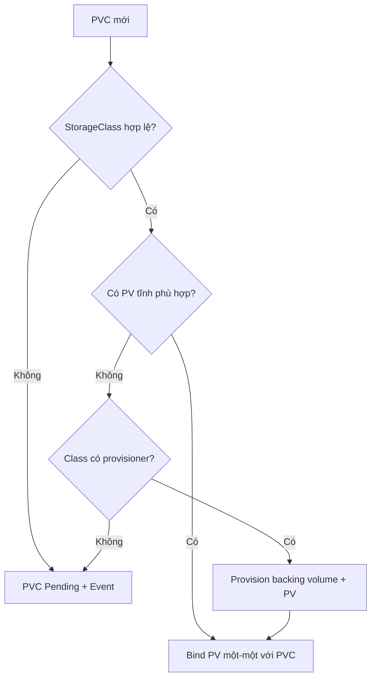

# PersistentVolumeClaim

## Mục lục

- [Tổng quan](#tổng-quan)
- [1. PVC là storage contract của workload](#1-pvc-là-storage-contract-của-workload)
- [2. Cấu trúc một PVC](#2-cấu-trúc-một-pvc)
- [3. Binding hoạt động như thế nào](#3-binding-hoạt-động-như-thế-nào)
- [4. storageClassName bị bỏ trống và chuỗi rỗng](#4-storageclassname-bị-bỏ-trống-và-chuỗi-rỗng)
- [5. Pod consume PVC](#5-pod-consume-pvc)
- [6. Resize PVC](#6-resize-pvc)
- [7. Clone, snapshot và data source](#7-clone-snapshot-và-data-source)
- [8. Quota và security boundary](#8-quota-và-security-boundary)
- [9. Thực hành persistence qua Pod replacement](#9-thực-hành-persistence-qua-pod-replacement)
- [10. Cleanup an toàn](#10-cleanup-an-toàn)
- [11. Troubleshooting PVC Pending](#11-troubleshooting-pvc-pending)
- [12. Best practices](#12-best-practices)
- [Tài liệu tham khảo](#tài-liệu-tham-khảo)

---

## Tổng quan

`PersistentVolumeClaim` (PVC) là request storage có scope trong Namespace. Workload mô tả dung lượng, access mode, volume mode và StorageClass; control plane bind PVC với một [PersistentVolume](/storage/persistent-volume/) phù hợp hoặc yêu cầu provisioner tạo mới.

```text
Application owner: "cần 20Gi, RWO, class fast"
        │
        ▼
PVC namespace/app-data
        │ bind một-một
        ▼
PV pvc-<uid> → storage backend asset
```

PVC tách application khỏi volume handle, zone, endpoint và credential của backend. Đây là resource mà manifest portable nên tham chiếu.

## 1. PVC là storage contract của workload

PVC tương tự resource request của Pod, nhưng có lifecycle riêng:

- PVC tồn tại trước hoặc cùng workload.
- Nhiều Pod trong cùng Namespace có thể tham chiếu cùng PVC nếu access capability và application protocol cho phép.
- Xóa Pod không xóa PVC thông thường.
- Xóa PVC kích hoạt reclaim lifecycle của PV.
- PVC chỉ tham chiếu được từ Pod cùng Namespace.

> [!IMPORTANT]
> Access mode không giải quyết concurrent write ở cấp application. Filesystem/backend có thể hỗ trợ RWX nhưng database vẫn có thể hỏng nếu nhiều instance cùng mở data directory mà không có protocol phối hợp.

## 2. Cấu trúc một PVC

```yaml
apiVersion: v1
kind: PersistentVolumeClaim
metadata:
  name: app-data
  namespace: production
spec:
  accessModes:
    - ReadWriteOnce
  volumeMode: Filesystem
  storageClassName: general-purpose
  resources:
    requests:
      storage: 20Gi
```

| Field | Contract |
|---|---|
| `accessModes` | Cách Volume cần được mount theo capability của backend |
| `volumeMode` | `Filesystem` hoặc raw `Block` |
| `storageClassName` | Storage profile/provisioner được yêu cầu |
| `resources.requests.storage` | Dung lượng tối thiểu; PV tĩnh lớn hơn vẫn có thể bind |
| `selector` | Lọc PV tĩnh theo label; làm dynamic provisioning không áp dụng cho claim đó |
| `volumeName` | Chọn/pre-bind PV cụ thể |
| `dataSource` | Tạo Volume từ snapshot hoặc PVC clone khi driver hỗ trợ |

PVC không yêu cầu IOPS/throughput theo schema cốt lõi truyền thống; platform thường biểu diễn tier qua StorageClass. Capability mới hơn có thể phụ thuộc version/CSI driver, vì vậy không đưa vào manifest portable nếu chưa kiểm tra cluster.

## 3. Binding hoạt động như thế nào

Control loop tìm PV phù hợp hoặc dynamic provision:



Binding là exclusive giữa một PV và một PVC. Binder xem class, capacity, access modes, volume mode, selector và reservation. PVC yêu cầu 8Gi có thể nhận PV tĩnh 10Gi; phần 2Gi dư không được cấp cho PVC khác.

Quan sát:

```bash
kubectl get pvc app-data -n production
kubectl describe pvc app-data -n production
kubectl get pvc app-data -n production \
  -o jsonpath='{.status.phase}{" "}{.spec.volumeName}{" "}{.status.capacity.storage}{"\n"}'
```

`Pending` không luôn là lỗi. Với `WaitForFirstConsumer`, PVC chờ Pod để provision đúng topology.

## 4. storageClassName bị bỏ trống và chuỗi rỗng

Ba trường hợp dễ nhầm:

| Khai báo | Ý nghĩa |
|---|---|
| `storageClassName: fast` | Yêu cầu class `fast` |
| Không có field | Dùng default StorageClass nếu cluster có; có thể được gán retroactively |
| `storageClassName: ""` | Chủ động yêu cầu PV không có class; không dùng default dynamic provisioning |

Nếu application muốn chạy portable trên cluster có default class, thường nên bỏ field và cho phép người triển khai override. Nếu import PV tĩnh không class, cần dùng chuỗi rỗng rõ ràng ở cả workflow tương ứng.

Kiểm tra default:

```bash
kubectl get storageclass
kubectl get storageclass \
  -o custom-columns=NAME:.metadata.name,DEFAULT:.metadata.annotations.storageclass\.kubernetes\.io/is-default-class,PROVISIONER:.provisioner
```

Platform nên chỉ có một default class trong trạng thái ổn định. Kubernetes có behavior xử lý nhiều default để hỗ trợ migration, nhưng đó không nên là cấu hình lâu dài.

## 5. Pod consume PVC

```yaml
apiVersion: v1
kind: Pod
metadata:
  name: app
  namespace: production
spec:
  securityContext:
    fsGroup: 2000
  containers:
    - name: app
      image: busybox:1.36
      command: ["sh", "-c", "echo started >> /data/history; sleep 3600"]
      volumeMounts:
        - name: data
          mountPath: /data
  volumes:
    - name: data
      persistentVolumeClaim:
        claimName: app-data
```

Kubelet trên Node tìm PV qua PVC, rồi driver attach nếu cần, stage/mount Volume và bind-mount vào container. Pod có thể `Scheduled` nhưng kẹt `ContainerCreating` nếu attach/mount lỗi.

Với raw block, dùng `volumeDevices`:

```yaml
volumeDevices:
  - name: data
    devicePath: /dev/xvda
```

PVC tương ứng phải có `volumeMode: Block`. Xem [Access Modes và Volume Modes](/storage/access-modes-volume-modes/).

## 6. Resize PVC

Resize chỉ hoạt động khi:

1. StorageClass có `allowVolumeExpansion: true`.
2. CSI driver/backend hỗ trợ expansion tương ứng.
3. Request mới lớn hơn dung lượng hiện tại; Kubernetes không hỗ trợ shrink PVC.
4. Filesystem và Node operation hỗ trợ bước filesystem expansion nếu dùng `Filesystem`.

Patch PVC, không sửa PV capacity:

```bash
kubectl patch pvc app-data -n production \
  -p '{"spec":{"resources":{"requests":{"storage":"40Gi"}}}}'
```

Theo dõi spec, status, condition và Event:

```bash
kubectl get pvc app-data -n production -w
kubectl describe pvc app-data -n production
kubectl get pvc app-data -n production \
  -o jsonpath='{.spec.resources.requests.storage}{" requested; "}{.status.capacity.storage}{" actual\n"}'
```

Không sửa `PV.spec.capacity` để “giúp” controller; control plane có thể kết luận resize đã hoàn thành trong khi backend chưa đổi. Nếu request vượt capacity backend, controller có thể retry liên tục. Hạ request chỉ được phép về một giá trị vẫn lớn hơn current `.status.capacity` và phụ thuộc behavior/version; theo runbook platform thay vì thử trên production.

Backup và kiểm tra free space trước resize filesystem. Expansion thường không đảo ngược được.

## 7. Clone, snapshot và data source

CSI driver có thể tạo PVC mới từ PVC hiện có:

```yaml
apiVersion: v1
kind: PersistentVolumeClaim
metadata:
  name: app-data-clone
  namespace: production
spec:
  storageClassName: general-purpose
  dataSource:
    apiGroup: ""
    kind: PersistentVolumeClaim
    name: app-data
  accessModes: ["ReadWriteOnce"]
  resources:
    requests:
      storage: 20Gi
```

Hoặc restore từ `VolumeSnapshot`:

```yaml
spec:
  dataSource:
    apiGroup: snapshot.storage.k8s.io
    kind: VolumeSnapshot
    name: app-data-snapshot
```

Source và target constraints phụ thuộc CSI driver: Namespace, StorageClass, size, volume mode và support matrix. Clone/snapshot là point-in-time storage operation; cần application quiesce hoặc database-native coordination để có application-consistent data. Xem [Volume Snapshots](/storage/volume-snapshots/).

## 8. Quota và security boundary

ResourceQuota có thể giới hạn số PVC và tổng requested storage:

```yaml
apiVersion: v1
kind: ResourceQuota
metadata:
  name: tenant-storage
  namespace: tenant-a
spec:
  hard:
    persistentvolumeclaims: "10"
    requests.storage: 100Gi
```

Platform cần kiểm soát thêm:

- StorageClass nào tenant được dùng.
- Class nào cho phép RWX, snapshot, clone hoặc expansion.
- KMS/encryption và credential của driver.
- Reclaim/retention policy theo data classification.
- Backup coverage và restore ownership.

PVC namespaced nhưng PV/backend asset cluster-scoped. RBAC trên PVC không tự cô lập data plane nếu storage export, node access hoặc driver credential cấu hình sai.

## 9. Thực hành persistence qua Pod replacement

Prerequisite: cluster có default StorageClass hoặc thay `storageClassName` phù hợp.

```yaml
apiVersion: v1
kind: PersistentVolumeClaim
metadata:
  name: persistence-demo
  namespace: storage-lab
spec:
  accessModes: ["ReadWriteOnce"]
  resources:
    requests:
      storage: 1Gi
---
apiVersion: v1
kind: Pod
metadata:
  name: persistence-writer
  namespace: storage-lab
spec:
  containers:
    - name: app
      image: busybox:1.36
      command: ["sh", "-c"]
      args: ["echo $HOSTNAME $(date -Iseconds) >> /data/history; sleep 3600"]
      volumeMounts:
        - name: data
          mountPath: /data
  volumes:
    - name: data
      persistentVolumeClaim:
        claimName: persistence-demo
```

```bash
kubectl create namespace storage-lab
kubectl apply -f pvc-lab.yaml
kubectl wait --for=jsonpath='{.status.phase}'=Bound \
  pvc/persistence-demo -n storage-lab --timeout=120s
kubectl wait --for=condition=Ready pod/persistence-writer \
  -n storage-lab --timeout=120s
kubectl exec persistence-writer -n storage-lab -- cat /data/history
```

Xóa riêng Pod rồi tạo lại từ cùng manifest:

```bash
kubectl delete pod persistence-writer -n storage-lab
kubectl apply -f pvc-lab.yaml
kubectl wait --for=condition=Ready pod/persistence-writer \
  -n storage-lab --timeout=120s
kubectl exec persistence-writer -n storage-lab -- cat /data/history
```

Hai dòng với hai thời điểm chứng minh PVC giữ dữ liệu qua Pod replacement. Nó chưa chứng minh backup, multi-zone durability hay concurrent write safety.

## 10. Cleanup an toàn

Trước khi xóa PVC, map reclaim policy:

```bash
PV_NAME=$(kubectl get pvc persistence-demo -n storage-lab -o jsonpath='{.spec.volumeName}')
kubectl get pv "$PV_NAME" \
  -o custom-columns=NAME:.metadata.name,POLICY:.spec.persistentVolumeReclaimPolicy,HANDLE:.spec.csi.volumeHandle
```

Dừng workload trước, xác nhận dữ liệu không cần hoặc đã backup, rồi xóa:

```bash
kubectl delete pod persistence-writer -n storage-lab
kubectl delete pvc persistence-demo -n storage-lab
kubectl delete namespace storage-lab
```

Với `Delete`, backing asset có thể bị xóa. Với `Retain`, operator phải quản lý PV `Released` và asset còn lại.

## 11. Troubleshooting PVC Pending

Thu thập theo thứ tự:

```bash
kubectl get pvc PVC -n NS -o wide
kubectl describe pvc PVC -n NS
kubectl get storageclass
kubectl describe pod POD -n NS
kubectl get events -n NS --sort-by=.lastTimestamp
```

| Signal/Event | Giả thuyết |
|---|---|
| `storageclass ... not found` | Sai tên class |
| `no persistent volumes available` | Không có PV tĩnh phù hợp và không dynamic provision |
| `waiting for first consumer` | Behavior đúng của `WaitForFirstConsumer`; cần Pod qua scheduler |
| Provisioning timeout/failure | CSI controller/backend/credential/capacity lỗi |
| Quota exceeded | Namespace vượt số PVC hoặc requested storage |
| Volume node affinity conflict | PV topology không khớp Node mà Pod có thể chạy |
| PVC `Terminating` | Còn Pod object tham chiếu hoặc protection finalizer |

### Pod dùng PVC nhưng không start

Nếu PVC đã `Bound`, chuyển sang attach/mount layer:

```bash
kubectl describe pod POD -n NS
kubectl get volumeattachment
kubectl get pods -A -o wide | grep -i csi
```

`Bound` chỉ chứng minh API binding, không chứng minh Node attach, mount, permission hay application data hợp lệ.

### `Multi-Attach error`

Một RWO block volume có thể còn attach Node cũ hoặc Pod mới được schedule sang Node khác. Xác nhận Pod cũ đã dừng, Node health, attachment state và driver detach timeout. Không force detach khi writer cũ có thể còn chạy; hai writer có thể corrupt data.

## 12. Best practices

1. Khai báo PVC cùng application bundle và cho phép override StorageClass/size.
2. Không hard-code PV name hoặc vendor volume handle trong workload portable.
3. Chọn access mode theo driver capability và application concurrency, không theo mong muốn đơn thuần.
4. Dùng `WaitForFirstConsumer` cho zonal/local storage.
5. Đặt quota, cost attribution và alert cho PVC `Pending`, gần đầy, resize lỗi và không còn consumer.
6. Backup trước migration/resize và diễn tập restore; PVC `Bound` không phải backup status.
7. Kiểm tra reclaim policy trước mọi cleanup namespace hoặc uninstall release.
8. Với StatefulSet, hiểu `volumeClaimTemplates` và PVC retention tại [Storage cho Stateful Workloads](/storage/stateful-storage/).

## Tài liệu tham khảo

- [Persistent Volumes](https://kubernetes.io/docs/concepts/storage/persistent-volumes/)
- [Configure a Pod to Use a PersistentVolume](https://kubernetes.io/docs/tasks/configure-pod-container/configure-persistent-volume-storage/)
- [Expanding Persistent Volumes Claims](https://kubernetes.io/docs/concepts/storage/persistent-volumes/#expanding-persistent-volumes-claims)
