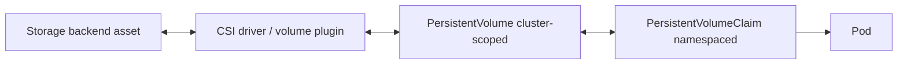

# PersistentVolume

## Mục lục

- [Tổng quan](#tổng-quan)
- [1. PV nằm ở đâu trong storage model](#1-pv-nằm-ở-đâu-trong-storage-model)
- [2. Cấu trúc PersistentVolume](#2-cấu-trúc-persistentvolume)
- [3. Provisioning và binding](#3-provisioning-và-binding)
- [4. Lifecycle và phase](#4-lifecycle-và-phase)
- [5. Reclaim policy](#5-reclaim-policy)
- [6. Topology và nodeAffinity](#6-topology-và-nodeaffinity)
- [7. Static provisioning](#7-static-provisioning)
- [8. Pre-binding và tái sử dụng volume Retain](#8-pre-binding-và-tái-sử-dụng-volume-retain)
- [9. Protection và finalizer](#9-protection-và-finalizer)
- [10. Quan sát PV động](#10-quan-sát-pv-động)
- [11. Troubleshooting](#11-troubleshooting)
- [12. Best practices](#12-best-practices)
- [Tài liệu tham khảo](#tài-liệu-tham-khảo)

---

## Tổng quan

`PersistentVolume` (PV) là cluster-scoped API object đại diện cho một storage asset. Asset thật có thể là cloud block volume, filesystem share, LUN, local disk hoặc storage do CSI driver quản lý. PV lưu contract để Kubernetes bind, attach, mount và reclaim asset; PV không chứa bytes dữ liệu trong API server.



PV có lifecycle độc lập với Pod. Xóa Pod không tự xóa PV. Xóa PVC có thể dẫn đến giữ hoặc xóa PV/backing asset tùy reclaim policy.

## 1. PV nằm ở đâu trong storage model

Ranh giới trách nhiệm:

| Object/thành phần | Trách nhiệm |
|---|---|
| Storage backend | Lưu bytes, replication, snapshot, durability theo sản phẩm |
| CSI driver | Chuyển API workflow thành create/delete/attach/mount operation |
| PV | Mô tả capacity, class, mode, access capability, topology và volume handle |
| PVC | Yêu cầu storage của workload trong Namespace |
| Pod | Consume PVC qua mount hoặc raw block device |

PV giống Node ở chỗ đều là cluster resource mà workload yêu cầu gián tiếp. Application bundle portable thường khai báo PVC, không khai báo vendor-specific PV.

## 2. Cấu trúc PersistentVolume

Ví dụ PV tĩnh dùng NFS đã tồn tại:

```yaml
apiVersion: v1
kind: PersistentVolume
metadata:
  name: reports-nfs-pv
  labels:
    data-tier: reports
spec:
  capacity:
    storage: 100Gi
  volumeMode: Filesystem
  accessModes:
    - ReadWriteMany
  persistentVolumeReclaimPolicy: Retain
  storageClassName: nfs-static
  mountOptions:
    - hard
    - nfsvers=4.1
  nfs:
    server: nfs.example.internal
    path: /exports/reports
```

Đây là manifest minh họa; server/export phải tồn tại và mọi Node cần NFS client phù hợp.

Các field chính:

| Field | Ý nghĩa |
|---|---|
| `capacity.storage` | Dung lượng PV quảng bá cho binding |
| `volumeMode` | `Filesystem` mặc định hoặc `Block` |
| `accessModes` | Capability được yêu cầu khi bind: RWO, ROX, RWX, RWOP |
| `storageClassName` | Nhóm policy/class mà PVC phải khớp |
| `persistentVolumeReclaimPolicy` | Xử lý sau khi claim bị xóa |
| `mountOptions` | Option mount; API không validate correctness |
| `nodeAffinity` | Node/topology được phép dùng Volume |
| Volume source | `csi`, `nfs`, `local`, `iscsi`,... và identifier backend |

Capacity trong PV là contract scheduling/binding, không thay thế quota thật ở storage backend. Với `Filesystem`, usable bytes có thể nhỏ hơn do filesystem metadata.

## 3. Provisioning và binding

### 3.1 Static provisioning

Administrator tạo storage asset rồi tạo PV tương ứng. Controller tìm PV phù hợp khi PVC xuất hiện.

Static phù hợp khi:

- Import volume hoặc dữ liệu có sẵn.
- Backend không có dynamic provisioner.
- Local disk được quản lý theo inventory.
- Cần workflow phê duyệt/chuẩn bị đặc biệt trước cấp phát.

Chi phí là operator phải quản lý inventory, cleanup và tránh mapping một asset vào nhiều PV sai cách.

### 3.2 Dynamic provisioning

PVC yêu cầu StorageClass; provisioner tạo asset và PV. Luồng chi tiết nằm tại [Dynamic Provisioning](/storage/dynamic-provisioning/).

### 3.3 Điều kiện binding

Binder so khớp ít nhất:

- `storageClassName`.
- Requested capacity: PV phải có dung lượng bằng hoặc lớn hơn yêu cầu.
- Access modes.
- `volumeMode`.
- Selector nếu PVC chỉ định.
- Reservation/pre-binding nếu có.

Một PV chỉ bind độc quyền với một PVC. `ReadWriteMany` không có nghĩa một PV bind với nhiều PVC; nhiều Pod dùng cùng PVC trong một Namespace mới là mô hình thông thường.

## 4. Lifecycle và phase

```text
Provisioning → Available → Bound → Released → reclaim/delete/manual recovery
                                      └────→ Failed nếu reclaim tự động lỗi
```

| Phase | Diễn giải |
|---|---|
| `Available` | PV chưa bind và có thể được claim phù hợp |
| `Bound` | PV đã bind một-một với PVC |
| `Released` | PVC cũ đã bị xóa nhưng data/reference cũ chưa được reclaim hoàn tất |
| `Failed` | Automated reclaim thất bại |

PV `Released` không tự trở thành `Available` vì dữ liệu của tenant cũ vẫn còn và `claimRef` ngăn bind nhầm. Đây là data isolation boundary, không phải lỗi cần xóa finalizer vội.

Theo dõi:

```bash
kubectl get pv
kubectl describe pv PV_NAME
kubectl get pv PV_NAME \
  -o jsonpath='{.status.phase}{" "}{.spec.claimRef.namespace}{"/"}{.spec.claimRef.name}{"\n"}'
```

## 5. Reclaim policy

### 5.1 `Delete`

Xóa PVC dẫn đến xóa PV và, khi driver hỗ trợ, backing storage asset. PV động kế thừa `StorageClass.reclaimPolicy`; nếu class bỏ field này, mặc định là `Delete`.

`Delete` giảm orphan volume và chi phí, nhưng accidental PVC deletion có blast radius lớn. Backup và policy bảo vệ phải tồn tại trước khi dựa vào automation.

### 5.2 `Retain`

Xóa PVC giữ PV/backing asset để operator phục hồi hoặc xử lý thủ công. PV chuyển `Released`, không sẵn sàng cho claim khác.

`Retain` phù hợp với dữ liệu quan trọng hoặc workflow cần phê duyệt. Trade-off là orphan asset, credential, chi phí và dữ liệu tenant cũ phải được quản lý.

### 5.3 `Recycle`

`Recycle` đã deprecated; nó chỉ scrub cơ bản và không phải isolation/recovery workflow an toàn cho platform hiện đại. Dùng dynamic provisioning hoặc quy trình sanitize backend được kiểm chứng.

Kiểm tra và đổi policy trước thao tác nguy hiểm:

```bash
kubectl get pv PV_NAME \
  -o custom-columns=NAME:.metadata.name,CLAIM:.spec.claimRef.name,POLICY:.spec.persistentVolumeReclaimPolicy
kubectl patch pv PV_NAME -p '{"spec":{"persistentVolumeReclaimPolicy":"Retain"}}'
```

Đổi policy chỉ ảnh hưởng reclaim tương lai; nó không tạo backup.

## 6. Topology và nodeAffinity

Block volume thường chỉ attach trong một zone; local PV chỉ tồn tại trên một Node. PV có `nodeAffinity` để scheduler đặt Pod vào nơi truy cập được:

```yaml
nodeAffinity:
  required:
    nodeSelectorTerms:
      - matchExpressions:
          - key: kubernetes.io/hostname
            operator: In
            values: ["worker-storage-01"]
```

`local` PV bắt buộc có `nodeAffinity`. Với dynamic provisioning, CSI driver thường đặt topology từ kết quả provisioning. Không tự sửa/xóa affinity để ép Pod chạy; backend có thể không route hoặc không attach được ở topology mới.

StorageClass `WaitForFirstConsumer` giúp scheduler cân nhắc CPU, taint, affinity và storage topology trước khi chọn nơi tạo/bind Volume.

## 7. Static provisioning

Ví dụ local PV cho lab/edge workload chịu được Node failure:

```yaml
apiVersion: storage.k8s.io/v1
kind: StorageClass
metadata:
  name: local-static
provisioner: kubernetes.io/no-provisioner
volumeBindingMode: WaitForFirstConsumer
---
apiVersion: v1
kind: PersistentVolume
metadata:
  name: local-pv-worker-01
spec:
  capacity:
    storage: 20Gi
  volumeMode: Filesystem
  accessModes: ["ReadWriteOnce"]
  persistentVolumeReclaimPolicy: Retain
  storageClassName: local-static
  local:
    path: /mnt/disks/app-data
  nodeAffinity:
    required:
      nodeSelectorTerms:
        - matchExpressions:
            - key: kubernetes.io/hostname
              operator: In
              values: ["worker-01"]
```

Trước khi apply:

1. Path phải là mount point/storage được chuẩn bị trên đúng Node.
2. Permission và filesystem phải phù hợp workload.
3. Node label/value phải khớp thật.
4. Có runbook cleanup/sanitize vì Kubernetes không tự chuẩn bị local disk.

Xác minh:

```bash
kubectl get pv local-pv-worker-01
kubectl get node worker-01 --show-labels
kubectl describe pv local-pv-worker-01
```

## 8. Pre-binding và tái sử dụng volume Retain

PVC có thể chọn PV cụ thể bằng `volumeName`:

```yaml
apiVersion: v1
kind: PersistentVolumeClaim
metadata:
  name: recovered-data
  namespace: recovery
spec:
  storageClassName: ""
  volumeName: recovered-pv
  accessModes: ["ReadWriteOnce"]
  resources:
    requests:
      storage: 100Gi
```

PV có thể reserve ngược lại bằng `claimRef`:

```yaml
spec:
  claimRef:
    name: recovered-data
    namespace: recovery
```

Pre-binding không bỏ qua mọi validation: class, mode, access mode và size vẫn phải hợp lệ. Nó cũng không làm topology sai trở nên truy cập được.

Workflow khôi phục asset `Retain` cần change control:

1. Xác nhận backup/snapshot và identity của backing asset.
2. Bảo đảm workload cũ đã dừng; tránh hai writer.
3. Xóa/recreate PV mapping theo driver procedure hoặc xử lý `claimRef` có kiểm soát.
4. Pre-bind PVC mới với đúng PV.
5. Mount read-only vào recovery Pod trước nếu có thể.
6. Validate filesystem/application data rồi mới đưa vào service.
7. Khôi phục reclaim policy mong muốn.

Không xóa `claimRef` trên PV đang dùng hoặc chưa xác nhận ownership.

## 9. Protection và finalizer

Kubernetes dùng finalizer để trì hoãn xóa object khi storage còn được tham chiếu hoặc backend operation chưa hoàn tất:

- `kubernetes.io/pv-protection`: bảo vệ PV còn bind.
- Finalizer của CSI external provisioner: bảo đảm backing asset được xử lý trước khi PV `Delete` biến mất.

```bash
kubectl get pv PV_NAME -o jsonpath='{.metadata.finalizers}{"\n"}'
kubectl get pvc PVC_NAME -n NS -o jsonpath='{.metadata.finalizers}{"\n"}'
```

> [!WARNING]
> Không xóa finalizer thủ công chỉ để object biến mất. Việc đó có thể orphan disk, bỏ qua detach/delete hoặc làm mất dấu asset. Thu log controller/CSI và xác minh backend trước.

## 10. Quan sát PV động

Nếu cluster có default StorageClass, tạo một PVC test:

```yaml
apiVersion: v1
kind: PersistentVolumeClaim
metadata:
  name: pv-observe
  namespace: storage-lab
spec:
  accessModes: ["ReadWriteOnce"]
  resources:
    requests:
      storage: 1Gi
```

```bash
kubectl create namespace storage-lab
kubectl apply -f pvc-observe.yaml
kubectl get pvc pv-observe -n storage-lab -w
PV_NAME=$(kubectl get pvc pv-observe -n storage-lab -o jsonpath='{.spec.volumeName}')
kubectl get pv "$PV_NAME" -o yaml
```

Quan sát `storageClassName`, `csi.driver`, `csi.volumeHandle`, reclaim policy, access/volume modes và node affinity. Nếu class dùng `WaitForFirstConsumer`, PVC có thể `Pending` cho đến khi một Pod tham chiếu nó; đó là behavior đúng.

Trước cleanup, xem reclaim policy:

```bash
kubectl get pv "$PV_NAME" \
  -o custom-columns=NAME:.metadata.name,POLICY:.spec.persistentVolumeReclaimPolicy,HANDLE:.spec.csi.volumeHandle
kubectl delete namespace storage-lab
```

Với `Retain`, tiếp tục dọn PV/backing asset theo runbook của platform.

## 11. Troubleshooting

### PV `Available`, PVC vẫn `Pending`

```bash
kubectl describe pvc PVC -n NS
kubectl get pv PV -o yaml
```

So sánh class, size, access mode, volume mode, selector và `claimRef`. Kiểm tra PVC đang chờ first consumer hay không.

### PV `Released`

Đây thường là reclaim policy `Retain`. Xác định PVC cũ, owner dữ liệu, backend asset và recovery/erase decision. Không chỉ sửa phase vì `status.phase` do controller quản lý.

### PV/PVC kẹt `Terminating`

```bash
kubectl get pod -A -o yaml | grep -n "claimName: PVC_NAME" -B 5 -A 5
kubectl describe pv PV_NAME
kubectl describe pvc PVC_NAME -n NS
kubectl get volumeattachment
```

Tìm Pod còn tham chiếu, attachment còn tồn tại, CSI controller lỗi hoặc API deletion ordering sai.

### Mount option sai

Kubernetes không validate `mountOptions`. Event thường có `MountVolume.MountDevice failed` hoặc exit status từ mount helper. Đối chiếu option với filesystem/backend và thử trên Node theo quy trình của administrator; không thêm option theo phỏng đoán.

### Asset backend tồn tại sau PV `Delete`

Kiểm tra CSI provisioner log, finalizer, credential, API rate limit và backend ID từ `volumeHandle`. Nếu PV object đã mất, cần inventory/audit log để map asset; đây là lý do phải đồng bộ tag và theo dõi orphan volume.

## 12. Best practices

1. Application bundle khai báo PVC; platform quản lý StorageClass/PV vendor-specific.
2. Dùng CSI driver thay cho integration in-tree cũ khi platform hỗ trợ.
3. Chọn reclaim policy theo data classification; `Retain` cần orphan cleanup, `Delete` cần backup và deletion guardrail.
4. Dùng `WaitForFirstConsumer` cho storage topology-constrained.
5. Gắn tag/label backend asset để map cluster, Namespace, PVC UID và owner.
6. Theo dõi PV `Released`, `Failed`, object `Terminating` lâu và unattached orphan disk.
7. Không sửa trực tiếp `PV.spec.capacity` để resize; sửa PVC theo driver và StorageClass capability.
8. Test detach/reattach, node failure và restore; phase `Bound` không chứng minh storage khỏe hoặc dữ liệu recoverable.

## Tài liệu tham khảo

- [Persistent Volumes](https://kubernetes.io/docs/concepts/storage/persistent-volumes/)
- [Change the Reclaim Policy of a PersistentVolume](https://kubernetes.io/docs/tasks/administer-cluster/change-pv-reclaim-policy/)
- [Local Volumes](https://kubernetes.io/docs/concepts/storage/volumes/#local)
