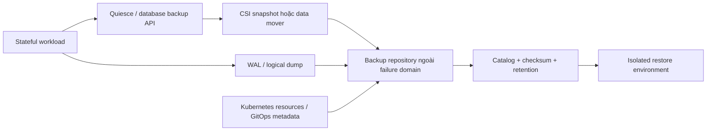

# Backup và Restore Storage

## Mục lục

- [Tổng quan](#tổng-quan)
- [1. Bắt đầu từ failure scenario, RPO và RTO](#1-bắt-đầu-từ-failure-scenario-rpo-và-rto)
- [2. Backup phải bao phủ những gì](#2-backup-phải-bao-phủ-những-gì)
- [3. Snapshot, replication và backup](#3-snapshot-replication-và-backup)
- [4. Consistency model](#4-consistency-model)
- [5. Kiến trúc backup](#5-kiến-trúc-backup)
- [6. Quy trình tạo backup](#6-quy-trình-tạo-backup)
- [7. Quy trình restore an toàn](#7-quy-trình-restore-an-toàn)
- [8. Kubernetes manifests và cluster-scoped dependencies](#8-kubernetes-manifests-và-cluster-scoped-dependencies)
- [9. Security, isolation và ransomware resistance](#9-security-isolation-và-ransomware-resistance)
- [10. Retention, lifecycle và cost](#10-retention-lifecycle-và-cost)
- [11. Restore drill và acceptance criteria](#11-restore-drill-và-acceptance-criteria)
- [12. Scenario: khôi phục database StatefulSet](#12-scenario-khôi-phục-database-statefulset)
- [13. Troubleshooting](#13-troubleshooting)
- [14. Checklist production](#14-checklist-production)
- [Tài liệu tham khảo](#tài-liệu-tham-khảo)

---

## Tổng quan

Backup là bản dữ liệu có thể dùng để phục hồi sau một tập failure scenario đã xác định. Restore là quy trình dựng lại hệ thống và xác minh application hoạt động đúng. Một job báo `Completed`, một snapshot `readyToUse` hoặc một object tồn tại trong bucket chưa chứng minh khả năng recovery.

```text
Production state
├── Application data
├── WAL/binlog/transaction log
├── Kubernetes desired state
├── Secret/key/certificate references
├── StorageClass/CSI assumptions
└── External dependencies
        │ backup + catalog + retention
        ▼
Isolated recovery point
        │ restore + validation + cutover
        ▼
Recovered service đạt RPO/RTO
```

Kubernetes không có một API core tự backup toàn bộ workload. Platform thường kết hợp database-native tool, CSI snapshot, object storage và tool backup Kubernetes resources.

## 1. Bắt đầu từ failure scenario, RPO và RTO

### 1.1 RPO

Recovery Point Objective là lượng dữ liệu tối đa có thể mất, đo theo thời gian. RPO 15 phút yêu cầu recovery point hoặc transaction log cho phép phục hồi gần thời điểm sự cố trong khoảng đó.

### 1.2 RTO

Recovery Time Objective là thời gian tối đa để dịch vụ được phục hồi ở mức chấp nhận. RTO gồm detect, decision, provision infrastructure, download/restore, application recovery, validation và cutover; không chỉ thời gian copy bytes.

### 1.3 Failure matrix

| Failure | Cần bảo vệ | Snapshot cùng backend đủ? |
|---|---|---:|
| Pod/Node mất | PV/backend durability, replication | Có thể, nhưng thường reschedule/reattach trước |
| Xóa PVC nhầm | Retained/off-volume recovery point | Có thể nếu snapshot không bị cascade delete |
| Logical corruption | Point-in-time cũ + WAL/catalog | Có thể là một phần |
| Storage account/region outage | Bản sao ở failure domain khác | Không |
| Cluster bị xóa | Data + manifests + keys + CSI prerequisites | Không |
| Credential compromise/ransomware | Immutable/separate-account backup | Không |
| Application bug ghi sai nhiều giờ | Retention đủ dài + PITR | Snapshot mới nhất không đủ |

Mỗi workload cần owner, RPO/RTO, data classification và restore runbook riêng. “Backup hàng ngày” không nói được recovery point usable hay restore time.

## 2. Backup phải bao phủ những gì

### 2.1 Application data

- Database data files hoặc logical dump.
- WAL/binlog/archive log cho point-in-time recovery.
- Uploaded files/object references.
- Schema, extension, user/grant và application-specific metadata.

### 2.2 Kubernetes desired state

- Namespace-scoped manifests: StatefulSet/Deployment, Service, ConfigMap, PVC intent, policy.
- Helm/GitOps release values/source revision nếu dùng.
- CRs do Operator quản lý và CRD/controller version tương thích.
- Cluster-scoped dependencies: StorageClass, VolumeSnapshotClass, CRD, RBAC, admission/policy theo scope kế hoạch.

Git có thể là source of truth cho non-secret manifests, nhưng không chứa runtime data hoặc mọi generated state.

### 2.3 Identity và cryptographic material

- KMS key access và recovery procedure.
- Certificate/CA chain cần decrypt/connect.
- External secret references và quyền tái tạo Secret.
- Database encryption keys/tablespace keys.

Backup encrypted nhưng mất key là không restore được. Copy key cùng bucket cùng credential lại giảm isolation.

### 2.4 External dependencies

DNS, load balancer, object store, message queue, external database, identity provider và license/config ngoài cluster có thể quyết định service có phục hồi không. Ghi dependency và thứ tự restore.

## 3. Snapshot, replication và backup

| Cơ chế | Mục tiêu chính | Không tự bảo vệ khỏi |
|---|---|---|
| Replica/application HA | Tiếp tục phục vụ khi instance/Node lỗi | Logical deletion/corruption replicate sang replicas |
| Storage replication | Durability/availability của blocks | Lỗi account, key, region hoặc application logic tùy scope |
| CSI snapshot | Point-in-time nhanh, clone/restore Volume | Mất backend/failure domain, thiếu metadata, consistency |
| Logical backup | Portable hơn, hiểu application schema | Restore chậm, tải CPU/I/O, có thể thiếu physical state |
| Physical backup + logs | RTO tốt/PITR cho database phù hợp | Version/tool compatibility và storage cost |
| Kubernetes resource backup | Dựng desired state | Bytes trong PV nếu không tích hợp data mover/snapshot |

Chiến lược tốt thường kết hợp nhiều lớp. Ví dụ database có three replicas cho HA, WAL archive liên tục sang object storage tách account, full backup định kỳ và CSI snapshot ngắn hạn để rollback nhanh.

## 4. Consistency model

### 4.1 Crash-consistent

Capture trạng thái tương tự power loss. Filesystem/database journal có thể recover nhưng không bảo đảm nhiều Volume hoặc external system cùng transaction point.

### 4.2 Application-consistent

Application flush/checkpoint/quiesce trước capture. Database-native tool thường biết WAL/catalog/transaction boundary tốt hơn generic filesystem copy.

### 4.3 Logical consistency giữa services

Order service và payment service có backup riêng ở hai thời điểm khác nhau có thể tạo dữ liệu business không khớp. Giải pháp có thể là event replay, reconciliation, coordinated checkpoint hoặc domain-specific restore order; Kubernetes snapshot không giải quyết distributed transaction.

### 4.4 Quiesce an toàn

Pre/post hooks phải có timeout và luôn resume writes khi backup thất bại:

```text
Acquire backup lock
→ flush/checkpoint
→ capture recovery point
→ verify capture accepted
→ release lock trong success/failure path
```

Không để database read-only vô hạn vì snapshot controller timeout.

## 5. Kiến trúc backup

Một kiến trúc điển hình:



Các control plane cần có:

- Scheduler và policy chọn workload/recovery point.
- Credential riêng cho backup writer và restore reader/operator.
- Catalog map backup với cluster, Namespace, PVC UID, app version, schema, consistency và key ID.
- Integrity verification/checksum.
- Retention/immutability và legal hold.
- Metrics/alert cho backup age, failure, duration, size và restore test.

## 6. Quy trình tạo backup

### Bước 1: Xác định scope và preflight

Ghi workload, Namespace, PVCs, database role, source version, recovery target, free space và replication health.

```bash
kubectl get statefulset,pod,pvc -n NS -o wide
kubectl get pv
kubectl get events -n NS --sort-by=.lastTimestamp | tail -n 50
```

Không backup một replica đang corrupt/lag nặng nếu procedure yêu cầu source healthy.

### Bước 2: Tạo application-consistent point

Dùng tool/API chính thức của application. Nếu dùng CSI snapshot, quiesce theo runbook rồi tạo [VolumeSnapshot](/storage/volume-snapshots/). Với nhiều PVC, coordinate hoặc dùng feature group snapshot đã được test.

### Bước 3: Đưa dữ liệu ra failure domain backup

Snapshot backend có thể cần export/data mover hoặc copy sang account/region khác. Theo dõi bytes thực, không chỉ metadata object.

### Bước 4: Lưu metadata

Ít nhất:

```text
backup ID, UTC start/end
cluster/namespace/workload UID
PVC/PV UID, driver, volume mode, size
application/version/schema
consistency method + checkpoint/WAL position
encryption key reference
checksum/object count/size
retention/expiry
```

### Bước 5: Verify

- Job/operation thành công.
- Recovery point xuất hiện trong catalog.
- Object/checksum/size hợp lý so với baseline.
- Snapshot ready hoặc archive log liên tục.
- Không còn application bị quiesce.
- Alert age/error được cập nhật.

Verification tốt nhất là restore tự động cách ly, không chỉ `HEAD` object.

## 7. Quy trình restore an toàn

### Bước 1: Chọn recovery target

Xác định incident time, timezone, last known good point và RPO impact. Giữ nhiều recovery points; không xóa source/corrupt data trước forensic.

### Bước 2: Dựng môi trường cách ly

Dùng Namespace/cluster/network riêng. Chặn outbound side effect như gửi email, charge payment hoặc gọi production webhook. Dùng DNS/credential test.

### Bước 3: Khôi phục prerequisites

Cài compatible CRDs/Operator/CSI driver/StorageClass/VolumeSnapshotClass, KMS access và policies. Không restore workload trước controller mà CRs phụ thuộc.

### Bước 4: Restore data vào Volume mới

Tạo PVC từ snapshot, import backup hoặc chạy database restore. Không overwrite Volume production hiện tại khi chưa có rollback point.

### Bước 5: Application recovery

Replay WAL/log tới target, chạy crash recovery/migration theo version và kiểm tra cluster/member identity. Chỉ khởi động số replicas/writers đúng procedure.

### Bước 6: Validate

- Filesystem/database integrity.
- Schema/version/checkpoint.
- Record counts và business invariants.
- Read/write smoke test.
- Permission/Secret/connectivity.
- Performance đủ cho service.

### Bước 7: Cutover và rollback window

Đóng băng write cũ nếu còn, đồng bộ delta, đổi Service/DNS/route có kiểm soát, theo dõi error/latency và giữ source/backup trong rollback window.

## 8. Kubernetes manifests và cluster-scoped dependencies

Không restore mù toàn bộ YAML dump:

- `status`, `resourceVersion`, UID, managed fields và finalizer cũ thường không nên apply như desired spec.
- PV chứa `volumeHandle` của backend/cluster cũ; restore sai có thể map nhầm asset.
- Service `clusterIP`, Node-specific object và generated Secret cần xử lý theo type.
- CR phải tương thích với CRD/Operator version đích.
- RBAC và webhook cluster-scoped có blast radius lớn.

Ưu tiên GitOps/Helm/source manifests cho desired state, rồi restore runtime objects chỉ khi chúng thật sự là source of truth và đã có transform/validation.

PVC restore nên tạo object mới từ data source/backup, không copy `spec.volumeName` cũ trừ quy trình import PV có chủ đích.

## 9. Security, isolation và ransomware resistance

Backup chứa dữ liệu production và thường là mục tiêu có giá trị cao. Guardrails:

- Mã hóa in transit/at rest; quản lý key tách biệt và test key recovery.
- Backup writer chỉ append/create, không có quyền xóa nếu backend hỗ trợ.
- Retention lock/object lock/immutability theo requirement.
- Tách account/project/region và credential khỏi production admin path.
- Restore role tách backup operator; break-glass có audit và MFA.
- Network restriction và private endpoint khi phù hợp.
- Scan secret exposure trong manifest backup/log.
- Audit mọi delete, retention change và restore/download.

Air gap logic/physical phụ thuộc threat model. Một bucket khác nhưng cùng compromised root credential không phải isolation đủ.

## 10. Retention, lifecycle và cost

Retention phải bao phủ detection delay. Nếu corruption được phát hiện sau 20 ngày, chỉ giữ 7 ngày không đáp ứng recovery.

Một policy mẫu mang tính minh họa, không phải recommendation chung:

```text
24 recovery points theo giờ
30 recovery points theo ngày
12 recovery points theo tháng
WAL liên tục đủ PITR trong 14 ngày
```

Tính theo RPO, compliance, growth, dedup/compression, restore frequency và cost. Kiểm tra:

- Incremental chain có phụ thuộc full backup đã hết hạn không.
- Snapshot deletion có thật sự giải phóng blocks/cost không.
- Legal hold override lifecycle ra sao.
- Orphan VolumeSnapshotContent/PV/backend snapshot.
- Egress và restore speed từ cold tier.

## 11. Restore drill và acceptance criteria

Diễn tập theo lịch và sau thay đổi lớn của Kubernetes, CSI, database, encryption hoặc backup tool.

Acceptance criteria phải đo được:

| Tiêu chí | Ví dụ cách đo |
|---|---|
| Recovery point | Timestamp/checkpoint đạt RPO |
| Restore duration | Từ incident declaration đến service ready |
| Integrity | Database check + checksum + business invariants |
| Completeness | Manifests, secrets references, data, external dependency |
| Isolation | Không có side effect tới production |
| Operability | Monitoring, backup mới và alert hoạt động sau restore |
| Documentation | Runbook đủ cho on-call khác thực hiện |

Ghi actual RPO/RTO, bottleneck và action item. Một restore drill không cập nhật runbook/automation chỉ cho bằng chứng tạm thời.

## 12. Scenario: khôi phục database StatefulSet

Giả định:

- StatefulSet ba replicas, mỗi ordinal một PVC.
- Database replication riêng.
- Full backup + WAL archive ngoài cluster.
- CSI snapshots ngắn hạn.

Runbook cấp cao:

1. Tuyên bố incident, dừng automation có thể xóa/rollout và lưu evidence.
2. Xác định logical corruption time và chọn backup + WAL target trước thời điểm đó.
3. Dựng Namespace/cluster recovery với exact compatible database/Operator version.
4. Restore một seed Volume/PVC; không mount cùng lúc bởi production Pod.
5. Chạy database recovery đến target timestamp và integrity checks.
6. Khởi động member đầu ở isolated mode; xác nhận cluster identity.
7. Tạo các replicas mới bằng database replication, không nhân bản bừa filesystem identity.
8. Chạy query/business acceptance và load smoke test.
9. Quiesce đường ghi cũ, cut over Service/DNS, theo dõi.
10. Bật lại backup cho hệ thống recovered và giữ old environment theo rollback/forensic retention.

Nếu database yêu cầu restore đồng thời nhiều PVC, dùng tool chính thức và mapping ordinal được ghi trong catalog. Không giả định snapshot `data-db-0`, `data-db-1`, `data-db-2` tạo tuần tự là một cluster-consistent set.

## 13. Troubleshooting

### Backup job thành công nhưng không thấy dữ liệu mới

Kiểm tra catalog timestamp, object count/size, source selection, incremental parent và application checkpoint. Job có thể chỉ backup metadata hoặc selector không chọn PVC mới.

### Backup kéo dài vượt cửa sổ

Xác định bottleneck CPU, source I/O, network, object store throttling, compression/encryption và snapshot/data mover. Throttle backup để bảo vệ production nhưng đánh giá lại RPO; scale concurrency có thể làm storage latency xấu hơn.

### Snapshot ready nhưng export/copy lỗi

Snapshot control path và data mover là hai phase khác nhau. Giữ snapshot, sửa credential/network/capacity của repository rồi retry idempotently. Đừng xóa snapshot source trước khi copy được verify.

### Restore PVC Pending

Kiểm tra CSI driver/class/snapshot API, target topology/capacity, dataSource, size/mode và backend snapshot access. Xem [Volume Snapshots](/storage/volume-snapshots/) để chẩn đoán.

### Database restore mở không được

Kiểm tra exact engine version, encryption key, WAL chain, consistency mode, filesystem mode/permission và restore target. Clone recovery point để thử repair; giữ bản gốc immutable.

### Restore đạt integrity nhưng application lỗi

Thiếu Secret/config/schema migration, external dependency, DNS/service identity hoặc application version mismatch. Đây là lý do backup scope phải bao phủ desired state và dependency, không chỉ bytes.

### Không đạt RTO do restore quá chậm

Đo từng phase: provisioning, data transfer, log replay, integrity validation và cutover. Cải thiện bằng recovery point gần hơn, warm standby, parallel restore được application hỗ trợ, tier storage nhanh hơn hoặc automation; không bỏ integrity check chỉ để đạt số đẹp.

## 14. Checklist production

- [ ] Mỗi workload có owner, data classification, failure matrix, RPO và RTO.
- [ ] Backup bao phủ data, transaction logs, manifests, key references và external dependencies.
- [ ] Consistency method được ghi rõ và test.
- [ ] Recovery point được copy ra failure domain phù hợp; snapshot không phải bản duy nhất.
- [ ] Backup repository mã hóa, immutable/tách credential theo threat model.
- [ ] Catalog map app/PVC/PV/driver/version/checkpoint/key/retention.
- [ ] Alert cho backup age, failure, duration, size anomaly, WAL gap và retention failure.
- [ ] Restore tạo Volume/môi trường mới, cách ly side effects và giữ rollback point.
- [ ] Restore drill định kỳ đo actual RPO/RTO và business integrity.
- [ ] CSI/database/backup tool upgrade trigger compatibility và restore test.
- [ ] Runbook xử lý key loss, region loss, logical corruption và operator deletion.
- [ ] Cleanup recovery test không xóa backup hoặc production asset do selector/reclaim policy sai.

## Tài liệu tham khảo

- [Volume Snapshots](https://kubernetes.io/docs/concepts/storage/volume-snapshots/)
- [Persistent Volumes](https://kubernetes.io/docs/concepts/storage/persistent-volumes/)
- [StatefulSets](https://kubernetes.io/docs/concepts/workloads/controllers/statefulset/)
- [Kubernetes CSI Documentation](https://kubernetes-csi.github.io/docs/)
