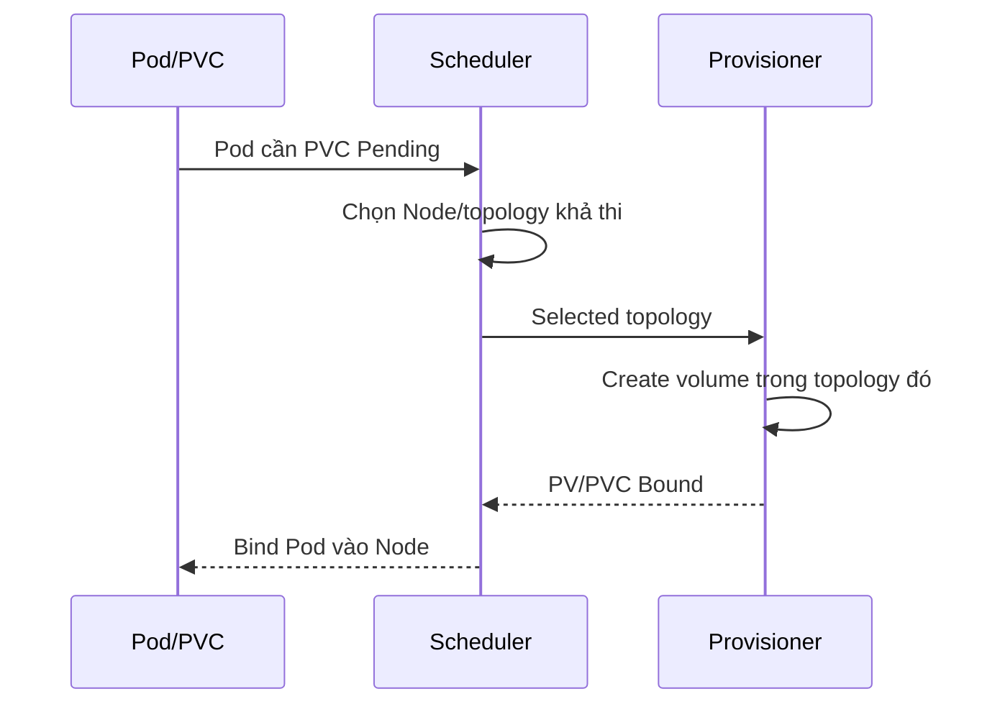

# StorageClass

## Mục lục

- [Tổng quan](#tổng-quan)
- [1. StorageClass là policy profile](#1-storageclass-là-policy-profile)
- [2. Các field cốt lõi](#2-các-field-cốt-lõi)
- [3. Default StorageClass](#3-default-storageclass)
- [4. Immediate và WaitForFirstConsumer](#4-immediate-và-waitforfirstconsumer)
- [5. Reclaim policy và data safety](#5-reclaim-policy-và-data-safety)
- [6. Expansion và mount options](#6-expansion-và-mount-options)
- [7. Parameters và allowedTopologies](#7-parameters-và-allowedtopologies)
- [8. Thiết kế catalog storage](#8-thiết-kế-catalog-storage)
- [9. Thay đổi và migration StorageClass](#9-thay-đổi-và-migration-storageclass)
- [10. Thực hành đọc StorageClass](#10-thực-hành-đọc-storageclass)
- [11. Troubleshooting](#11-troubleshooting)
- [12. Checklist production](#12-checklist-production)
- [Tài liệu tham khảo](#tài-liệu-tham-khảo)

---

## Tổng quan

`StorageClass` là cluster-scoped API object mô tả một profile storage mà platform cung cấp. User chọn profile bằng `PersistentVolumeClaim.spec.storageClassName`; provisioner chuyển profile đó thành backing volume và PersistentVolume.

```text
PVC storageClassName: database-zonal
        │
        ▼
StorageClass
├── provisioner: driver nào tạo Volume
├── parameters: loại disk/filesystem/encryption theo driver
├── volumeBindingMode: tạo ở thời điểm/topology nào
├── reclaimPolicy: xóa hay giữ asset sau PVC
└── allowVolumeExpansion: có cho resize không
```

StorageClass không phải storage pool và không chứa capacity. Nó là policy interface giữa platform team và application team.

## 1. StorageClass là policy profile

Kubernetes không quy định class `fast`, `gold` hay `backup-enabled` phải có nghĩa gì. Platform phải định nghĩa và công bố SLO/capability của mỗi class:

- Block hay shared filesystem.
- Zonal, regional hay node-local failure domain.
- IOPS/throughput/latency envelope.
- Encryption và KMS boundary.
- Snapshot/clone/resize support.
- Reclaim, backup và retention policy.
- Access modes thực tế.
- Cost model và quota.

Tên class nên ổn định và mô tả contract, không chỉ tên sản phẩm. `database-zonal` dễ giữ qua migration vendor hơn `vendor-x-premium-v3`, nhưng profile vẫn cần tài liệu implementation mapping.

## 2. Các field cốt lõi

Manifest vendor-neutral minh họa; thay provisioner/parameters theo CSI driver:

```yaml
apiVersion: storage.k8s.io/v1
kind: StorageClass
metadata:
  name: database-zonal
  annotations:
    storageclass.kubernetes.io/is-default-class: "false"
provisioner: csi.storage.example.com
parameters:
  type: ssd
  encrypted: "true"
reclaimPolicy: Retain
allowVolumeExpansion: true
volumeBindingMode: WaitForFirstConsumer
mountOptions:
  - noatime
allowedTopologies:
  - matchLabelExpressions:
      - key: topology.kubernetes.io/zone
        values: ["zone-a", "zone-b"]
```

| Field | Default/API behavior | Điều cần quyết định |
|---|---|---|
| `provisioner` | Bắt buộc | Phải khớp tên CSI/external provisioner |
| `parameters` | Driver-specific | API không hiểu semantics; kiểm tra docs driver |
| `reclaimPolicy` | `Delete` nếu bỏ trống | Blast radius và orphan workflow |
| `allowVolumeExpansion` | Không cho expansion nếu không bật | Driver/backend/filesystem vẫn phải hỗ trợ |
| `volumeBindingMode` | `Immediate` | Dùng `WaitForFirstConsumer` cho topology-constrained |
| `mountOptions` | Không có | Không được API validate; sai option làm mount fail |
| `allowedTopologies` | Không hạn chế thêm | Chỉ giới hạn khi có requirement thật |

StorageClass object phần lớn không nên được chỉnh sửa tùy tiện sau khi tạo. Tạo class version mới khi đổi contract lớn rồi migrate workload có kiểm soát.

## 3. Default StorageClass

Annotation đánh dấu default:

```yaml
metadata:
  annotations:
    storageclass.kubernetes.io/is-default-class: "true"
```

PVC không có `storageClassName` sẽ dùng default class. PVC ghi rõ `storageClassName: ""` yêu cầu PV không class và không nhận default.

Kiểm tra:

```bash
kubectl get storageclass
kubectl get storageclass \
  -o custom-columns=NAME:.metadata.name,DEFAULT:.metadata.annotations.storageclass\.kubernetes\.io/is-default-class,MODE:.volumeBindingMode,RECLAIM:.reclaimPolicy
```

Kubernetes có thể chọn default mới nhất nếu nhiều class cùng được đánh dấu, nhằm hỗ trợ chuyển đổi. Platform vẫn nên duy trì đúng một default ở steady state để behavior dễ dự đoán.

### 3.1 Chọn default nào

Default nên là profile an toàn cho workload phổ thông:

- Có availability phù hợp baseline của cluster.
- Mã hóa theo policy tổ chức.
- `WaitForFirstConsumer` nếu volume zonal.
- Cost không quá cao.
- Access mode và snapshot behavior được tài liệu hóa.

Không dùng class thử nghiệm, local disk hoặc tier cực đắt làm default.

## 4. Immediate và WaitForFirstConsumer

### 4.1 `Immediate`

Provision/bind ngay khi PVC được tạo. Với storage truy cập toàn cluster, đây có thể là behavior đơn giản. Với zonal storage, provisioner chọn zone trước khi scheduler biết Pod có thể chạy ở đâu.

```text
PVC → volume tạo zone A
Pod constraints → chỉ chạy zone B
Kết quả → Pod unschedulable
```

### 4.2 `WaitForFirstConsumer`

PVC chờ một Pod consume. Scheduler cân nhắc resource request, node selector, affinity, taint và storage topology rồi provision/bind phù hợp.



> [!WARNING]
> Không đặt `spec.nodeName` trực tiếp khi dùng `WaitForFirstConsumer`; cách đó bypass scheduler và PVC có thể tiếp tục `Pending`. Dùng `nodeSelector`/affinity nếu cần giới hạn Node.

`WaitForFirstConsumer` giảm xung đột topology nhưng không bảo đảm capacity luôn tồn tại. CSI storage capacity reporting và backend quota vẫn ảnh hưởng.

## 5. Reclaim policy và data safety

PV động kế thừa `reclaimPolicy` của class:

- `Delete`: xóa PVC thường dẫn đến xóa PV và backing asset.
- `Retain`: giữ PV/asset ở trạng thái cần xử lý thủ công.

Class cho cache/dev có thể dùng `Delete` để tránh chi phí. Class cho database quan trọng có thể dùng `Retain`, nhưng phải có controller/runbook phát hiện `Released` PV và quyết định recover/sanitize/delete.

> [!IMPORTANT]
> `Retain` không phải backup: asset vẫn có thể hỏng, bị xóa ngoài Kubernetes hoặc nằm cùng failure domain. `Delete` cũng không sai nếu backup, deletion guardrail và restore test đủ mạnh.

Thay reclaim policy trên StorageClass chỉ ảnh hưởng PV được provision sau đó. Kiểm tra PV hiện có và patch riêng nếu change plan yêu cầu.

## 6. Expansion và mount options

`allowVolumeExpansion: true` cho phép user tăng request trên PVC. Nó không bảo đảm mọi operation thành công; CSI driver phải support controller/node expansion và filesystem phải phù hợp.

Không hỗ trợ shrink PVC. Trước expansion production:

1. Kiểm tra backend quota/max size.
2. Backup và xác nhận restore point.
3. Kiểm tra driver/filesystem có online expansion hay cần restart.
4. Theo dõi PVC conditions, Events và application latency.

`mountOptions` được copy vào PV động. API không validate:

```yaml
mountOptions:
  - noatime
```

Option có thể cải thiện hoặc làm thay đổi durability/performance semantics. Chỉ thêm khi driver/backend docs hỗ trợ và đã test. Một typo có thể làm mọi Pod mới của class mount thất bại.

## 7. Parameters và allowedTopologies

`parameters` là opaque string map đối với Kubernetes. Tên, giá trị, default và tính mutable do provisioner định nghĩa. Ví dụ thường gặp gồm filesystem, disk tier, encryption, replication hoặc secret reference, nhưng không có schema portable chung.

Nguyên tắc:

- Pin version CSI driver và review compatibility trước khi thêm parameter.
- Không đưa credential trực tiếp vào StorageClass; dùng secret reference theo driver.
- Quản lý class như infrastructure code có review.
- Kiểm tra asset backend thực sự nhận encryption/tier/tag dự kiến.

`allowedTopologies` giới hạn nơi provision volume. Với `WaitForFirstConsumer`, thường không cần giới hạn nếu mọi zone hợp lệ. Dùng khi storage chỉ được cấp ở tập zone đã phê duyệt hoặc rollout theo giai đoạn.

Giới hạn quá hẹp có thể làm Pod Pending khi zone hết compute/storage capacity.

## 8. Thiết kế catalog storage

Một catalog nhỏ, rõ contract thường tốt hơn nhiều class gần giống:

| Profile ví dụ | Backend | Binding | Reclaim | Use case |
|---|---|---|---|---|
| `general-zonal` | Block zonal | Wait | Delete | Stateless app cần volume, dev/test |
| `database-zonal` | Block zonal, IOPS cao | Wait | Retain | Database tự replication |
| `shared-rwx` | Distributed file | Immediate/driver-specific | Retain | Shared content, không phải mọi database |
| `local-fast` | Local NVMe | Wait | Retain | Cache/shard tự replicate và chịu Node loss |

Mỗi profile cần công bố:

- Supported access/volume modes.
- Failure domain và durability claim của backend.
- Performance limit và noisy-neighbor behavior.
- Snapshot/clone/resize support.
- Backup coverage mặc định.
- Cost owner và quota.
- Runbook khi full, attachment stuck hoặc zone failure.

Không đặt tên `fast` nếu không có tiêu chí đo và monitoring.

## 9. Thay đổi và migration StorageClass

PVC đã bind không tự migrate vì bạn đổi default hoặc tạo class mới. `storageClassName` của PVC không phải nút chuyển dữ liệu tùy ý.

Migration thường cần:

1. Tạo class mới và canary PVC/workload.
2. Benchmark, failure test, snapshot/restore test.
3. Tạo Volume đích qua clone/snapshot/backup restore hoặc application replication.
4. Quiesce/cut over theo consistency requirement.
5. Validate application, capacity, permissions và performance.
6. Giữ rollback point theo retention window.
7. Sau cùng mới retire class/asset cũ.

Đổi default chỉ tác động PVC mới hoặc default assignment behavior; inventory PVC cũ phải được quản lý riêng.

## 10. Thực hành đọc StorageClass

Không cần tạo storage asset để thực hành inspection:

```bash
kubectl get storageclass
SC=$(kubectl get storageclass -o jsonpath='{.items[0].metadata.name}')
kubectl get storageclass "$SC" -o yaml
```

Trả lời các câu hỏi:

```bash
kubectl get storageclass "$SC" \
  -o jsonpath='{.provisioner}{"\n"}{.volumeBindingMode}{"\n"}{.reclaimPolicy}{"\n"}{.allowVolumeExpansion}{"\n"}'
```

- Provisioner Pod nào xử lý class này?
- Binding là `Immediate` hay `WaitForFirstConsumer`?
- Nếu xóa PVC, backing asset dự kiến ra sao?
- Có resize được không?
- Parameters nào là vendor-specific?
- Class có default không?

Tìm CSI controller bằng label/tên phụ thuộc distribution:

```bash
kubectl get pods -A -o wide | grep -iE 'csi|storage|provisioner'
kubectl get csidriver
```

Không sửa class của platform trong lab dùng chung.

## 11. Troubleshooting

### PVC báo class không tồn tại

```bash
kubectl get pvc PVC -n NS -o jsonpath='{.spec.storageClassName}{"\n"}'
kubectl get storageclass
```

Tên class là exact match và case-sensitive. Sửa manifest/deployment values; không tạo class giả chỉ để PVC hết lỗi.

### Provisioning timeout

```bash
kubectl describe pvc PVC -n NS
kubectl get events -n NS --sort-by=.lastTimestamp
kubectl get pods -A -o wide | grep -i csi
```

Kiểm tra provisioner availability, credential, backend quota/capacity, parameter validity, topology và network tới storage API.

### PVC chờ first consumer mãi

Tạo/kiểm tra Pod thực sự tham chiếu PVC. Xem scheduler Events, resource/affinity/taint constraints. Tránh `nodeName` trực tiếp.

### Volume tạo sai zone

Kiểm tra `volumeBindingMode`, Pod scheduling constraint, PV node affinity và CSI topology labels. Class `Immediate` thường là nguyên nhân thiết kế; migration sang class `WaitForFirstConsumer` áp dụng cho volume mới, không tự di chuyển volume hiện hữu.

### Mount fail hàng loạt sau đổi class

So sánh `mountOptions`/parameters và PV mới/cũ. Roll back bằng class version trước hoặc ngừng cấp PVC mới; không mutate hàng loạt PV đang chạy nếu chưa test.

## 12. Checklist production

- [ ] CSI driver/version có support matrix rõ với Kubernetes version.
- [ ] Một default class an toàn; migration default có kế hoạch.
- [ ] Zonal/local class dùng `WaitForFirstConsumer`.
- [ ] Reclaim policy khớp data classification và có orphan/deletion runbook.
- [ ] Encryption, KMS, secret references và backend tags đã verify trên asset thật.
- [ ] Quota/cost attribution theo Namespace/team/class.
- [ ] Snapshot, clone, expansion và restore đã test, không chỉ được ghi là “supported”.
- [ ] Alert cho provisioning latency/error, capacity, attachment, volume full và PV `Released`.
- [ ] Class change dùng version mới + canary thay vì sửa contract âm thầm.

## Tài liệu tham khảo

- [Storage Classes](https://kubernetes.io/docs/concepts/storage/storage-classes/)
- [Dynamic Volume Provisioning](https://kubernetes.io/docs/concepts/storage/dynamic-provisioning/)
- [Storage Capacity](https://kubernetes.io/docs/concepts/storage/storage-capacity/)
