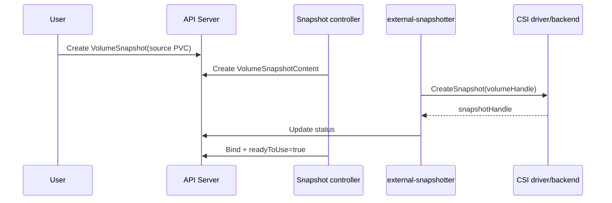

# Volume Snapshots

## Mục lục

- [Tổng quan](#tổng-quan)
- [1. Snapshot giải quyết và không giải quyết gì](#1-snapshot-giải-quyết-và-không-giải-quyết-gì)
- [2. Ba API objects](#2-ba-api-objects)
- [3. Kiến trúc và lifecycle](#3-kiến-trúc-và-lifecycle)
- [4. Kiểm tra prerequisites](#4-kiểm-tra-prerequisites)
- [5. VolumeSnapshotClass](#5-volumesnapshotclass)
- [6. Tạo và xác minh snapshot](#6-tạo-và-xác-minh-snapshot)
- [7. Restore thành PVC mới](#7-restore-thành-pvc-mới)
- [8. Crash consistency và application consistency](#8-crash-consistency-và-application-consistency)
- [9. Deletion policy và retention](#9-deletion-policy-và-retention)
- [10. Static pre-provisioned snapshot](#10-static-pre-provisioned-snapshot)
- [11. Thực hành end-to-end](#11-thực-hành-end-to-end)
- [12. Troubleshooting](#12-troubleshooting)
- [13. Best practices](#13-best-practices)
- [Tài liệu tham khảo](#tài-liệu-tham-khảo)

---

## Tổng quan

`VolumeSnapshot` yêu cầu CSI storage backend tạo point-in-time snapshot của Volume đứng sau PVC. API model tương tự PVC/PV:

```text
VolumeSnapshot (namespaced request)
        │ bind một-một
        ▼
VolumeSnapshotContent (cluster-scoped representation)
        │
        ▼
Snapshot asset trong storage backend
```

`VolumeSnapshotClass` chọn CSI driver, parameters và deletion policy. Snapshot APIs là CRDs thuộc `snapshot.storage.k8s.io`, không phải core API; distribution/platform phải cài CRDs, snapshot controller và CSI snapshotter.

## 1. Snapshot giải quyết và không giải quyết gì

Snapshot hữu ích cho:

- Recovery point trước schema change/upgrade.
- Tạo PVC mới để test, forensic hoặc clone môi trường.
- Building block trong backup workflow.
- Rollback data nhanh khi backend hỗ trợ.

Snapshot **không tự là backup hoàn chỉnh**:

- Có thể nằm cùng account/region/storage system với Volume gốc.
- Có thể bị xóa cùng credential/control plane bị compromise.
- Không chứa Kubernetes manifests, Secret, external dependency hoặc database catalog ngoài Volume.
- Snapshot khi ứng dụng đang ghi thường chỉ crash-consistent.
- `readyToUse: true` không chứng minh restore/application validation thành công.

## 2. Ba API objects

| Object | Scope | Vai trò | Tương tự |
|---|---|---|---|
| `VolumeSnapshot` | Namespace | User request từ PVC hoặc content có sẵn | PVC |
| `VolumeSnapshotContent` | Cluster | Đại diện snapshot backend và binding | PV |
| `VolumeSnapshotClass` | Cluster | Driver, parameters, deletion policy | StorageClass |

`VolumeSnapshot` phải cùng Namespace với source PVC khi dynamic snapshot. `VolumeSnapshotContent` giữ `snapshotHandle` hoặc source volume handle và reference về request.

## 3. Kiến trúc và lifecycle



Thành phần:

- Snapshot controller watch `VolumeSnapshot`/`VolumeSnapshotContent`, quản lý binding/lifecycle.
- CSI `external-snapshotter` sidecar gọi `CreateSnapshot`/`DeleteSnapshot` trên driver.
- CSI driver chuyển operation tới backend.
- Validating webhook/CRD schema tăng validation tùy distribution.

Nếu driver không support snapshot, cài CRDs vẫn không làm feature hoạt động.

## 4. Kiểm tra prerequisites

```bash
kubectl api-resources | grep -i volumesnapshot
kubectl get crd | grep snapshot.storage.k8s.io
kubectl get volumesnapshotclass
kubectl get csidriver
```

Kiểm tra source PVC/PV driver:

```bash
PVC=app-data
NS=production
PV=$(kubectl get pvc "$PVC" -n "$NS" -o jsonpath='{.spec.volumeName}')
DRIVER=$(kubectl get pv "$PV" -o jsonpath='{.spec.csi.driver}')
printf 'PV=%s DRIVER=%s\n' "$PV" "$DRIVER"
kubectl get volumesnapshotclass \
  -o custom-columns=NAME:.metadata.name,DRIVER:.driver,POLICY:.deletionPolicy
```

`VolumeSnapshotClass.driver` phải khớp CSI driver của source Volume. Kiểm tra driver docs/support matrix và snapshot controller Pods của distribution.

## 5. VolumeSnapshotClass

```yaml
apiVersion: snapshot.storage.k8s.io/v1
kind: VolumeSnapshotClass
metadata:
  name: database-snapshots
  annotations:
    snapshot.storage.kubernetes.io/is-default-class: "true"
driver: csi.storage.example.com
deletionPolicy: Retain
parameters:
  profile: durable
```

Manifest là placeholder; `driver` và `parameters` phải theo platform.

Field chính:

- `driver`: bắt buộc, phải khớp source CSI driver.
- `deletionPolicy`: bắt buộc, `Delete` hoặc `Retain`.
- `parameters`: opaque driver-specific map.
- Default annotation: có thể có một default class cho mỗi CSI driver.

Nếu có nhiều default VolumeSnapshotClass cho cùng driver, snapshot không chỉ định class có thể thất bại vì controller không chọn được.

Class thường immutable; tạo class mới khi đổi policy/parameters.

## 6. Tạo và xác minh snapshot

Dynamic snapshot từ PVC:

```yaml
apiVersion: snapshot.storage.k8s.io/v1
kind: VolumeSnapshot
metadata:
  name: app-data-before-upgrade
  namespace: production
spec:
  volumeSnapshotClassName: database-snapshots
  source:
    persistentVolumeClaimName: app-data
```

Apply và chờ:

```bash
kubectl apply -f app-data-snapshot.yaml
kubectl get volumesnapshot app-data-before-upgrade -n production -w
```

Xác minh status:

```bash
kubectl get volumesnapshot app-data-before-upgrade -n production \
  -o jsonpath='{.status.readyToUse}{" "}{.status.boundVolumeSnapshotContentName}{" "}{.status.restoreSize}{"\n"}'
kubectl describe volumesnapshot app-data-before-upgrade -n production
```

Chỉ tiếp tục upgrade/restore khi `readyToUse` là `true`. Lưu snapshot name/UID, content name, source PVC/PV UID, driver, creation time, consistency procedure và application checkpoint/WAL position trong backup catalog.

## 7. Restore thành PVC mới

Kubernetes restore bằng cách **provision PVC mới** có `dataSource` là VolumeSnapshot; không overwrite PVC hiện tại:

```yaml
apiVersion: v1
kind: PersistentVolumeClaim
metadata:
  name: app-data-restored
  namespace: production
spec:
  storageClassName: database-zonal
  dataSource:
    apiGroup: snapshot.storage.k8s.io
    kind: VolumeSnapshot
    name: app-data-before-upgrade
  accessModes: ["ReadWriteOnce"]
  volumeMode: Filesystem
  resources:
    requests:
      storage: 100Gi
```

Target class/driver phải hỗ trợ restore và tương thích snapshot. Requested size không được nhỏ hơn restore size/backend requirement.

```bash
kubectl apply -f restored-pvc.yaml
kubectl get pvc app-data-restored -n production -w
kubectl describe pvc app-data-restored -n production
```

Sau khi `Bound`, mount vào recovery Pod read-only nếu application cho phép:

```yaml
apiVersion: v1
kind: Pod
metadata:
  name: snapshot-inspector
  namespace: production
spec:
  containers:
    - name: inspector
      image: busybox:1.36
      command: ["sh", "-c", "find /restore -maxdepth 2 -type f | head; sleep 3600"]
      volumeMounts:
        - name: restore
          mountPath: /restore
          readOnly: true
  volumes:
    - name: restore
      persistentVolumeClaim:
        claimName: app-data-restored
```

Filesystem listing chỉ là infrastructure validation. Database cần integrity check, recovery log replay, schema/version check và query acceptance test.

## 8. Crash consistency và application consistency

### 8.1 Crash-consistent

Snapshot capture blocks ở một thời điểm gần như khi máy mất điện. Filesystem journal/database WAL có thể recover, nhưng transaction đang bay hoặc data trải trên nhiều Volume có thể không đồng bộ.

### 8.2 Application-consistent

Application flush/checkpoint và tạm dừng write hoặc dùng database-native backup API trước snapshot. Workflow:

```text
Pre-hook: stop writes / flush / checkpoint
→ tạo snapshot
→ chờ backend xác nhận capture phù hợp
→ post-hook: resume writes
→ verify snapshot metadata
```

Giữ quiesce window ngắn và có timeout/rollback để tránh application bị freeze nếu snapshot controller lỗi.

### 8.3 Multi-volume consistency

Tạo tuần tự nhiều `VolumeSnapshot` không bảo đảm cùng instant. Với database data + WAL trên hai PVC, dùng database-native coordination hoặc group snapshot feature đã được platform/driver kiểm chứng. Nếu không, backup có thể từng Volume hợp lệ nhưng tổ hợp không recover được.

## 9. Deletion policy và retention

Khi xóa `VolumeSnapshot`:

- Class/content `deletionPolicy: Delete`: xóa `VolumeSnapshotContent` và underlying snapshot.
- `Retain`: giữ content và underlying snapshot để administrator quản lý.

Kiểm tra trước xóa:

```bash
CONTENT=$(kubectl get volumesnapshot app-data-before-upgrade -n production \
  -o jsonpath='{.status.boundVolumeSnapshotContentName}')
kubectl get volumesnapshotcontent "$CONTENT" \
  -o custom-columns=NAME:.metadata.name,POLICY:.spec.deletionPolicy,HANDLE:.status.snapshotHandle
```

`Retain` cần inventory và cleanup để tránh snapshot orphan/cost. `Delete` cần RBAC/admission/backup retention guardrail để tránh xóa nhầm.

Snapshot source protection có thể trì hoãn xóa PVC khi snapshot đang thực hiện. Đừng remove finalizer để bypass; chờ snapshot ready hoặc abort theo controller/driver procedure.

## 10. Static pre-provisioned snapshot

Khi backend snapshot đã tồn tại, administrator tạo `VolumeSnapshotContent` với `snapshotHandle` và reference tới `VolumeSnapshot`:

```yaml
apiVersion: snapshot.storage.k8s.io/v1
kind: VolumeSnapshotContent
metadata:
  name: imported-snapshot-content
spec:
  deletionPolicy: Retain
  driver: csi.storage.example.com
  source:
    snapshotHandle: backend-snapshot-123
  sourceVolumeMode: Filesystem
  volumeSnapshotRef:
    name: imported-snapshot
    namespace: recovery
---
apiVersion: snapshot.storage.k8s.io/v1
kind: VolumeSnapshot
metadata:
  name: imported-snapshot
  namespace: recovery
spec:
  source:
    volumeSnapshotContentName: imported-snapshot-content
```

Driver, handle, mode và backend access phải chính xác. Import sai handle có thể expose dữ liệu nhầm tenant hoặc làm restore thất bại; quy trình cần dual review và audit.

## 11. Thực hành end-to-end

Prerequisites:

- CSI driver support snapshot.
- Một VolumeSnapshotClass hợp lệ.
- Một PVC có dữ liệu test.

```bash
kubectl get volumesnapshotclass
kubectl get pvc -n storage-lab
```

Tạo snapshot bằng manifest phần 6 sau khi thay names, rồi:

```bash
kubectl apply -f snapshot.yaml
kubectl wait --for=jsonpath='{.status.readyToUse}'=true \
  volumesnapshot/SNAPSHOT -n storage-lab --timeout=300s
kubectl get volumesnapshot SNAPSHOT -n storage-lab -o yaml
```

Tạo restored PVC phần 7 và consumer Pod. So sánh checksum file test giữa source/restore khi source đã được quiesce:

```bash
kubectl exec SOURCE_POD -n storage-lab -- sha256sum /data/test-file
kubectl exec snapshot-inspector -n storage-lab -- sha256sum /restore/test-file
```

Sau validation, cleanup theo thứ tự và policy:

```bash
kubectl delete pod snapshot-inspector -n storage-lab
kubectl delete pvc RESTORED_PVC -n storage-lab
kubectl delete volumesnapshot SNAPSHOT -n storage-lab
```

Xác minh backend/content đã xóa hoặc được retain như kế hoạch.

## 12. Troubleshooting

### API không nhận `VolumeSnapshot`

```bash
kubectl api-resources | grep -i snapshot
kubectl get crd | grep snapshot.storage.k8s.io
```

CRDs/controller chưa cài hoặc API version không tương thích. Không đổi sang API cũ theo phỏng đoán; kiểm tra distribution/driver installation.

### Snapshot không `readyToUse`

```bash
kubectl describe volumesnapshot SNAPSHOT -n NS
kubectl get volumesnapshotcontent
kubectl get pods -A | grep -i snapshot
```

Kiểm tra class driver mismatch, external-snapshotter/controller, CSI capability, backend permission/quota và source Volume health.

### Restore PVC `Pending`

```bash
kubectl describe pvc RESTORED -n NS
kubectl describe volumesnapshot SNAPSHOT -n NS
kubectl get storageclass
```

Kiểm tra snapshot ready, dataSource name/namespace, target driver/class, size, access/volume mode và topology.

### Snapshot ready nhưng database không mở

Có thể snapshot chỉ crash-consistent, version không khớp, encryption key thiếu, WAL/data lệch hoặc multi-volume không đồng bộ. Giữ source/backup nguyên, clone lần khác cho forensic và dùng database recovery tool; không “repair” bản recovery duy nhất.

### Xóa snapshot nhưng backend asset còn

Kiểm tra deletion policy, content/finalizer và snapshotter log. Với `Retain`, đây là behavior đúng. Với `Delete`, correlate `snapshotHandle` và sửa driver/backend deletion failure trước khi xóa finalizer.

## 13. Best practices

1. Xác minh CRDs, controller, sidecar và exact CSI capability.
2. Chọn deletion policy theo retention requirement; audit snapshot orphan.
3. Ghi consistency level và application checkpoint cùng snapshot metadata.
4. Dùng application quiesce/database-native backup cho dữ liệu quan trọng.
5. Không coi snapshot cùng backend/failure domain là bản backup duy nhất.
6. Restore vào PVC mới, mount cách ly và validate trước cutover.
7. Test multi-volume consistency, encryption key recovery và cross-cluster restore.
8. Alert snapshot failure/age/retention và định kỳ restore drill.

## Tài liệu tham khảo

- [Volume Snapshots](https://kubernetes.io/docs/concepts/storage/volume-snapshots/)
- [Volume Snapshot Classes](https://kubernetes.io/docs/concepts/storage/volume-snapshot-classes/)
- [CSI Snapshotter](https://kubernetes-csi.github.io/docs/external-snapshotter.html)
