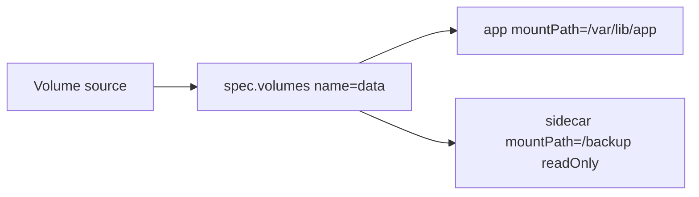

# Volumes

## Mục lục

- [Tổng quan](#tổng-quan)
- [1. Vì sao container filesystem chưa đủ](#1-vì-sao-container-filesystem-chưa-đủ)
- [2. Mental model của Volume](#2-mental-model-của-volume)
- [3. Khai báo và mount Volume](#3-khai-báo-và-mount-volume)
- [4. Chọn loại Volume](#4-chọn-loại-volume)
- [5. emptyDir và chia sẻ dữ liệu trong Pod](#5-emptydir-và-chia-sẻ-dữ-liệu-trong-pod)
- [6. ConfigMap, Secret và projected Volume](#6-configmap-secret-và-projected-volume)
- [7. hostPath và local storage](#7-hostpath-và-local-storage)
- [8. subPath và read-only mount](#8-subpath-và-read-only-mount)
- [9. Permission và security context](#9-permission-và-security-context)
- [10. Thực hành quan sát lifecycle](#10-thực-hành-quan-sát-lifecycle)
- [11. Troubleshooting](#11-troubleshooting)
- [12. Best practices](#12-best-practices)
- [Tài liệu tham khảo](#tài-liệu-tham-khảo)

---

## Tổng quan

Container image cung cấp root filesystem ban đầu, nhưng writable layer của container không phải nơi phù hợp để chia sẻ hoặc lưu dữ liệu quan trọng. Khi container bị thay thế, writable layer mới bắt đầu từ image. Kubernetes Volume tạo một filesystem hoặc block device riêng rồi đưa nó vào filesystem view của container.

Một Pod có thể dùng nhiều Volume; mỗi container tự chọn Volume nào được mount và mount ở đâu:

```text
Pod
├── Volume shared-work
│   ├── mounted /work trong container producer
│   └── mounted /input trong container consumer
└── Volume config
    └── mounted read-only /etc/app trong cả hai container
```

Volume là abstraction ở cấp Pod. `volumeMounts` chỉ xác định Volume được gắn vào đâu trong filesystem của từng container. Việc dữ liệu được lưu ở đâu, có tồn tại sau khi Pod bị xóa hay có thể được truy cập từ nhiều Node hay không phụ thuộc vào **volume type** và storage backend. Chỉ khai báo `volumeMounts` không tự làm cho dữ liệu trở thành persistent storage.

## 1. Vì sao container filesystem chưa đủ

Cần phân biệt ba lifecycle:

| Nơi ghi dữ liệu | Giữ dữ liệu khi container được khởi động lại trong cùng Pod | Giữ dữ liệu khi Pod cũ được thay bằng Pod mới | Phạm vi chia sẻ |
|---|---:|---:|---|
| Writable layer của container | Không nên dựa vào | Không | Một container |
| Ephemeral Volume như `emptyDir` | Có, nếu vẫn là cùng một Pod trên cùng Node | Không | Các container trong Pod |
| Persistent Volume qua PVC | Có | Có | Theo capability và access mode của backend |

`emptyDir` gắn với vòng đời của **một Pod cụ thể**, không phải với vòng đời của từng container trong Pod:

- Nếu container bị lỗi, kubelet có thể khởi động lại container bên trong cùng Pod. Pod vẫn giữ nguyên UID và tiếp tục dùng `emptyDir` cũ, nên dữ liệu còn tồn tại.
- Nếu Pod bị xóa, bị eviction hoặc được controller thay thế, Pod cũ kết thúc. Pod mới có UID khác và nhận một `emptyDir` mới, nên dữ liệu trong `emptyDir` của Pod cũ không được chuyển sang.

Ví dụ, khi container trong một Pod của Deployment bị crash, dữ liệu trong `emptyDir` vẫn còn sau khi container được khởi động lại. Nhưng nếu chạy `kubectl delete pod <pod-name>`, Deployment tạo Pod thay thế và Pod mới bắt đầu với một `emptyDir` trống.

> [!IMPORTANT]
> Việc dữ liệu còn tồn tại sau khi **container được khởi động lại trong cùng Pod** không có nghĩa là dữ liệu đó là persistent. Persistent storage phải tiếp tục tồn tại ngay cả khi Pod cũ bị xóa và một Pod mới được tạo.

## 2. Mental model của Volume

Khai báo Volume có hai phía:

1. `.spec.volumes[]` xác định nguồn dữ liệu hoặc storage.
2. `.spec.containers[].volumeMounts[]` xác định đường dẫn mà từng container nhìn thấy.



Tên Volume nối hai phía. `mountPath` không phải đường dẫn trên Node và không tự tạo persistent storage. Khi mount vào một thư mục đã có dữ liệu từ image, mount che nội dung cũ tại đường dẫn đó trong lúc container chạy; dữ liệu image không bị copy tự động vào Volume.

Volume có lifecycle độc lập với container, nhưng không nhất thiết độc lập với Pod. [PersistentVolume](/storage/persistent-volume/) và [PersistentVolumeClaim](/storage/persistent-volume-claim/) mới tách storage lifecycle khỏi một Pod cụ thể.

## 3. Khai báo và mount Volume

Ví dụ tối thiểu dùng `emptyDir`:

```yaml
apiVersion: v1
kind: Pod
metadata:
  name: volume-demo
  namespace: storage-lab
spec:
  containers:
    - name: writer
      image: busybox:1.36
      command: ["sh", "-c"]
      args:
        - while true; do date -Iseconds >> /work/timestamps.log; sleep 5; done
      volumeMounts:
        - name: work
          mountPath: /work
    - name: reader
      image: busybox:1.36
      command: ["sh", "-c"]
      args: ["tail -F /input/timestamps.log"]
      volumeMounts:
        - name: work
          mountPath: /input
          readOnly: true
  volumes:
    - name: work
      emptyDir:
        sizeLimit: 100Mi
```

`writer` và `reader` thấy cùng dữ liệu dù dùng hai `mountPath` khác nhau. `readOnly: true` chỉ làm mount của `reader` read-only; nó không đổi mount của `writer`.

Kiểm tra mapping đã được API chấp nhận:

```bash
kubectl get pod volume-demo -n storage-lab \
  -o jsonpath='{range .spec.containers[*]}{.name}{": "}{.volumeMounts}{"\n"}{end}'
kubectl logs volume-demo -n storage-lab -c reader
```

### 3.1 Mount filesystem và raw block

Volume dạng `Filesystem` dùng `volumeMounts` và `mountPath`. Raw block Volume dùng `volumeDevices` và `devicePath`; application phải tự hiểu block device và filesystem không được kubelet mount hộ. Xem [Access Modes và Volume Modes](/storage/access-modes-volume-modes/).

## 4. Chọn loại Volume

Bắt đầu từ lifecycle và sharing requirement thay vì bắt đầu từ tên driver:

| Nhu cầu | Lựa chọn thường phù hợp | Giới hạn chính |
|---|---|---|
| Scratch/cache trong một Pod | `emptyDir` | Mất khi Pod rời Node hoặc bị xóa |
| File cấu hình read-only | `configMap`, `secret`, `projected` | Không dành cho dữ liệu lớn hoặc ghi runtime |
| Dữ liệu sống qua Pod replacement | PVC | Cần StorageClass/PV và storage driver |
| File hệ thống của Node cho system agent | `hostPath` read-only, phạm vi hẹp | Rủi ro bảo mật, phụ thuộc Node |
| Disk cục bộ bền và scheduler biết topology | `local` PV | Node failure làm volume không truy cập được |
| Scratch có capability của storage driver | Generic ephemeral Volume | Tạo PVC tạm, phụ thuộc dynamic provisioning |

Không đưa database production vào `emptyDir` nếu mất Pod đồng nghĩa mất dữ liệu. Ngược lại, không dùng network-attached PVC cho cache có thể tái tạo nếu latency và chi phí của backend không cần thiết.

## 5. emptyDir và chia sẻ dữ liệu trong Pod

Kubelet tạo `emptyDir` khi Pod được gán vào Node. Volume ban đầu rỗng và bị xóa vĩnh viễn khi Pod bị loại khỏi Node.

Hai backing medium phổ biến:

```yaml
# Node ephemeral storage
emptyDir:
  sizeLimit: 2Gi
```

```yaml
# tmpfs; dữ liệu tính vào memory usage của container ghi dữ liệu
emptyDir:
  medium: Memory
  sizeLimit: 256Mi
```

`sizeLimit` không đặt trước dung lượng riêng biệt. Với disk-backed `emptyDir`, image layers, container logs và các Pod khác vẫn cạnh tranh node ephemeral storage; Node có thể vào `DiskPressure` trước khi Volume chạm giới hạn. Với `medium: Memory`, dữ liệu tiêu thụ memory và có thể góp phần gây OOM.

Pod nên khai báo `ephemeral-storage` requests/limits khi dùng nhiều local scratch:

```yaml
resources:
  requests:
    ephemeral-storage: 500Mi
  limits:
    ephemeral-storage: 2Gi
```

Đi sâu vào các loại ephemeral storage tại [Ephemeral Volumes](/storage/ephemeral-volumes/).

## 6. ConfigMap, Secret và projected Volume

Các Volume này biến API data thành file read-only:

```yaml
volumes:
  - name: app-input
    projected:
      defaultMode: 0440
      sources:
        - configMap:
            name: app-config
        - secret:
            name: app-credentials
            items:
              - key: username
                path: credentials/username
```

`projected` gom nhiều source vào cùng directory. Source namespaced phải ở cùng Namespace với Pod. Khi key trùng path, manifest phải được review cẩn thận; thiếu object/key bắt buộc có thể chặn Pod startup.

ConfigMap/Secret volume có cơ chế cập nhật theo chu kỳ, nhưng application phải đọc lại file. Mount một key bằng `subPath` không nhận update tự động. Xem [ConfigMap](/cau-hinh/configmap/) và [Secret](/cau-hinh/secret/).

## 7. hostPath và local storage

`hostPath` đưa một path của Node trực tiếp vào Pod. Nó phù hợp với một số node agent cần đọc log hoặc socket hệ thống, không phải persistent storage portable.

```yaml
volumes:
  - name: node-logs
    hostPath:
      path: /var/log
      type: Directory
```

> [!WARNING]
> Read-write `hostPath` có thể cho container sửa file hệ thống, đọc credential hoặc truy cập container runtime socket. Pod chạy trên Node khác cũng có thể thấy nội dung khác. Hạn chế bằng Pod Security/admission policy, allowlist path và read-only mount.

Nếu dữ liệu thực sự là disk cục bộ bền, dùng `local` PersistentVolume với `nodeAffinity`. Scheduler khi đó hiểu volume thuộc Node nào. Tuy nhiên Node hỏng vẫn làm dữ liệu unavailable; application phải chấp nhận failure domain này.

## 8. subPath và read-only mount

`subPath` chỉ mount một thư mục hoặc file con của Volume:

```yaml
volumeMounts:
  - name: app-data
    mountPath: /var/lib/app
    subPath: data
  - name: app-data
    mountPath: /var/log/app
    subPath: logs
```

Cách này có thể tách layout trong một Volume, nhưng cũng tạo coupling: hai chức năng chia cùng capacity, reclaim policy, backup và failure domain. Với dữ liệu có lifecycle khác nhau, dùng PVC riêng rõ ràng hơn.

`subPathExpr` cho phép tạo path từ environment variable đã inject, ví dụ `$(POD_NAME)`. Không dùng đồng thời `subPath` và `subPathExpr` trên cùng mount.

## 9. Permission và security context

Mount thành công không bảo đảm process có quyền đọc/ghi. Kiểm tra đồng thời:

- UID/GID của process trong image.
- Owner và mode của filesystem/backend.
- `runAsUser`, `runAsGroup`, `fsGroup` và policy của CSI driver.
- Mount có `readOnly: true` hay backend export read-only.
- SELinux/AppArmor và policy của Node nếu được bật.

Ví dụ cấp group cho filesystem Volume:

```yaml
spec:
  securityContext:
    runAsNonRoot: true
    runAsUser: 10001
    runAsGroup: 10001
    fsGroup: 20001
    fsGroupChangePolicy: OnRootMismatch
```

Behavior `fsGroup` phụ thuộc volume type và CSI capability. Recursive ownership change trên volume nhiều file có thể làm Pod startup chậm; kiểm tra driver có xử lý group khi mount và benchmark trên dữ liệu thực.

## 10. Thực hành quan sát lifecycle

Tạo Namespace và Pod từ manifest ở phần 3:

```bash
kubectl create namespace storage-lab
kubectl apply -f volume-demo.yaml
kubectl wait --for=condition=Ready pod/volume-demo -n storage-lab --timeout=90s
kubectl logs volume-demo -n storage-lab -c reader --tail=5
```

Restart process bằng cách xóa container không có API trực tiếp; có thể xóa process chính trong lab hoặc chờ một container failure. Quan sát restart count và file vẫn tăng vì Pod/`emptyDir` còn tồn tại:

```bash
kubectl exec -n storage-lab volume-demo -c writer -- pkill sh || true
kubectl get pod volume-demo -n storage-lab \
  -o jsonpath='{.status.containerStatuses[?(@.name=="writer")].restartCount}{"\n"}'
kubectl logs volume-demo -n storage-lab -c reader --tail=5
```

Sau đó xóa và tạo lại Pod. `timestamps.log` bắt đầu lại vì đây là Pod mới:

```bash
kubectl delete pod volume-demo -n storage-lab
kubectl apply -f volume-demo.yaml
kubectl wait --for=condition=Ready pod/volume-demo -n storage-lab --timeout=90s
kubectl logs volume-demo -n storage-lab -c reader --tail=5
```

Cleanup:

```bash
kubectl delete namespace storage-lab
```

## 11. Troubleshooting

### Pod kẹt `ContainerCreating`

Thu thập Event trước khi xóa Pod:

```bash
kubectl describe pod POD -n NS
kubectl get events -n NS --sort-by=.lastTimestamp
```

Tìm `FailedMount`, `FailedAttachVolume`, object không tồn tại, timeout từ CSI, filesystem/mount option lỗi hoặc Node không truy cập backend.

### `not found` hoặc `no such file`

Kiểm tra ba tên/path riêng biệt:

```bash
kubectl get pod POD -n NS -o yaml
kubectl exec POD -n NS -c CONTAINER -- mount
kubectl exec POD -n NS -c CONTAINER -- ls -ld /EXPECTED/PATH
```

- `volumes[].name` phải khớp `volumeMounts[].name`.
- `mountPath` phải nằm trong đúng container.
- `subPath` phải tồn tại hoặc được tạo đúng cách.
- Mount có thể đã che file từ image.

### `Permission denied` hoặc read-only filesystem

```bash
kubectl exec POD -n NS -c CONTAINER -- id
kubectl exec POD -n NS -c CONTAINER -- stat -c '%u:%g %a %n' /MOUNT/PATH
kubectl get pod POD -n NS -o jsonpath='{.spec.securityContext}{"\n"}'
```

Không sửa bằng `privileged: true` hoặc chạy root trước khi xác định owner, mode, export option và security policy.

### Node `DiskPressure`

```bash
kubectl describe node NODE
kubectl top pod -A --containers
kubectl get pod POD -n NS -o jsonpath='{.spec.containers[*].resources}{"\n"}'
```

Kiểm tra `emptyDir`, logs, writable layers và image garbage. Xóa Pod chỉ giảm triệu chứng; cần limit, log rotation, capacity và alert phù hợp.

## 12. Best practices

1. Chọn Volume theo lifecycle, sharing, topology và recovery requirement.
2. Dùng PVC thay vì gắn application trực tiếp với storage implementation khi cần portability.
3. Khai báo `readOnly` cho mount không cần ghi và chạy process non-root.
4. Đặt request/limit cho local ephemeral storage; đặt `emptyDir.sizeLimit` như guardrail bổ sung.
5. Tránh `hostPath` cho application thông thường; chặn path nhạy cảm bằng admission policy.
6. Không ghép dữ liệu có retention, backup hoặc performance requirement khác nhau vào cùng Volume chỉ để giảm số PVC.
7. Quan sát Event, latency, capacity và lỗi attach/mount; Volume `Mounted` không chứng minh dữ liệu đúng hoặc application-consistent.
8. Backup và thử restore cho dữ liệu persistent; replication và snapshot cục bộ không tự thay thế backup.

## Tài liệu tham khảo

- [Volumes](https://kubernetes.io/docs/concepts/storage/volumes/)
- [Local ephemeral storage](https://kubernetes.io/docs/concepts/storage/ephemeral-storage/)
- [Configure a Pod to Use a Volume](https://kubernetes.io/docs/tasks/configure-pod-container/configure-volume-storage/)
