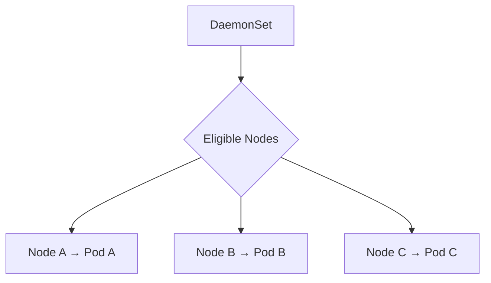

# DaemonSet

## Mục lục

- [Tổng quan](#tổng-quan)
- [1. Cách DaemonSet hoạt động](#1-cách-daemonset-hoạt-động)
- [2. Use cases](#2-use-cases)
- [3. Manifest mẫu](#3-manifest-mẫu)
- [4. Chọn tập Nodes](#4-chọn-tập-nodes)
- [5. Taints và tolerations](#5-taints-và-tolerations)
- [6. Update strategy](#6-update-strategy)
- [7. Host access và security](#7-host-access-và-security)
- [8. Capacity và priority](#8-capacity-và-priority)
- [9. Thực hành](#9-thực-hành)
- [10. Troubleshooting](#10-troubleshooting)
- [11. Best practices](#11-best-practices)
- [Tài liệu tham khảo](#tài-liệu-tham-khảo)

---

## Tổng quan

DaemonSet bảo đảm mỗi Node phù hợp chạy một Pod. Khi Node mới tham gia cluster, DaemonSet tạo Pod trên Node đó; khi Node bị loại, Pod tương ứng biến mất.

```text
Node A ─ agent Pod
Node B ─ agent Pod
Node C ─ agent Pod
```

Use cases điển hình là log collector, node metrics agent, CNI component, storage node plugin và security runtime agent.

> [!IMPORTANT]
> DaemonSet scale theo số Node phù hợp, không theo `replicas`. Thêm Node làm tăng số Pods và tổng chi phí tài nguyên tự động.

---

## 1. Cách DaemonSet hoạt động

DaemonSet controller xác định Nodes match `nodeSelector`/affinity và tạo một Pod cho mỗi Node. Scheduler bind Pod theo node affinity do controller thiết lập.



Status quan trọng:

- `desiredNumberScheduled`.
- `currentNumberScheduled`.
- `numberReady`.
- `numberAvailable`.
- `numberMisscheduled`.
- `updatedNumberScheduled`.

```bash
kubectl get daemonset <name> -n <namespace> -o yaml
```

---

## 2. Use cases

| Nhóm | Ví dụ |
|---|---|
| Observability | Fluent Bit, node exporter, OpenTelemetry collector agent |
| Networking | CNI node agent, kube-proxy |
| Storage | CSI node plugin |
| Security | Runtime detection, compliance agent |
| Node operations | Cache image/artifact, config watcher |

Không dùng DaemonSet cho application chỉ cần nhiều replicas nhưng không cần mọi Node. Deployment linh hoạt và tiết kiệm hơn.

Có thể tạo nhiều DaemonSets cho các Node pools khác nhau, ví dụ GPU agent chỉ chạy trên GPU Nodes.

---

## 3. Manifest mẫu

Ví dụ agent ghi heartbeat theo Node:

```yaml
apiVersion: apps/v1
kind: DaemonSet
metadata:
  name: node-agent
  namespace: daemon-lab
spec:
  selector:
    matchLabels:
      app: node-agent
  updateStrategy:
    type: RollingUpdate
    rollingUpdate:
      maxUnavailable: 1
  template:
    metadata:
      labels:
        app: node-agent
    spec:
      containers:
        - name: agent
          image: busybox:1.36
          command:
            - sh
            - -c
            - |
              while true; do
                echo "node=$NODE_NAME time=$(date -Iseconds)"
                sleep 30
              done
          env:
            - name: NODE_NAME
              valueFrom:
                fieldRef:
                  fieldPath: spec.nodeName
          resources:
            requests:
              cpu: 10m
              memory: 16Mi
            limits:
              memory: 32Mi
```

Production agent thường cần ServiceAccount, volume mounts hoặc host access; chỉ cấp phần tối thiểu.

---

## 4. Chọn tập Nodes

### 4.1 `nodeSelector`

```yaml
spec:
  template:
    spec:
      nodeSelector:
        workload.example.com/pool: observability
```

Chỉ Nodes có label tương ứng chạy Pod.

### 4.2 Node affinity

Affinity hỗ trợ điều kiện linh hoạt hơn:

```yaml
spec:
  template:
    spec:
      affinity:
        nodeAffinity:
          requiredDuringSchedulingIgnoredDuringExecution:
            nodeSelectorTerms:
              - matchExpressions:
                  - key: kubernetes.io/os
                    operator: In
                    values: ["linux"]
```

`IgnoredDuringExecution` nghĩa là thay label Node sau khi Pod đã schedule không nhất thiết evict Pod hiện tại ngay. Kiểm tra behavior thay vì dựa vào tên field.

### 4.3 Node labels đáng tin cậy

Nếu label quyết định security placement, dùng key mà kubelet không tự gán được hoặc cơ chế NodeRestriction phù hợp. Không tin label tùy ý do Node có thể tự sửa trong threat model mạnh.

---

## 5. Taints và tolerations

System DaemonSets thường cần chạy trên Nodes có taint, ví dụ control-plane hoặc dedicated pool. Thêm toleration cụ thể:

```yaml
spec:
  template:
    spec:
      tolerations:
        - key: "node-role.kubernetes.io/control-plane"
          operator: "Exists"
          effect: "NoSchedule"
```

Tránh toleration quá rộng:

```yaml
# Rủi ro: tolerate mọi taint
- operator: Exists
```

Agent hạ tầng thật sự có thể cần broad toleration, nhưng phải review vì nó cho phép Pod chạy trên Nodes dành riêng hoặc đang có vấn đề.

---

## 6. Update strategy

### 6.1 RollingUpdate

DaemonSet thay Pods theo batch. `maxUnavailable` kiểm soát số Nodes tạm thời không có agent; cluster/version hỗ trợ có thể dùng `maxSurge` theo API behavior tương ứng.

```bash
kubectl rollout status daemonset/node-agent -n daemon-lab --timeout=5m
kubectl rollout history daemonset/node-agent -n daemon-lab
```

Với network/storage/security agent, mất agent trên một Node có thể ảnh hưởng lớn. Chọn batch bảo thủ và canary trên Node pool nhỏ trước.

### 6.2 OnDelete

`OnDelete` chỉ tạo Pod từ template mới khi Pod cũ bị xóa. Cho kiểm soát thủ công nhưng dễ để Nodes chạy version khác nhau.

---

## 7. Host access và security

DaemonSet agents thường yêu cầu:

- `hostNetwork`.
- `hostPID`.
- `hostPath` mounts.
- Privileged hoặc Linux capabilities.

Mỗi quyền mở rộng blast radius đến Node. Ví dụ `hostPath: /` với write access gần như trao quyền sửa host filesystem.

Giảm rủi ro:

- Mount host paths read-only khi có thể.
- Chỉ mount path cần thiết.
- Drop capabilities, dùng seccomp.
- Chạy non-root nếu tool hỗ trợ.
- Dùng dedicated ServiceAccount và RBAC tối thiểu.
- Pin/sign/scan image.
- Áp policy admission và audit đặc biệt.

---

## 8. Capacity và priority

DaemonSet overhead tính trên **mỗi Node**:

```text
100 Nodes × 100m CPU = 10 CPU requested
100 Nodes × 200Mi = ~19.5Gi memory requested
```

Nếu có 10 agents, tổng overhead đáng kể. Theo dõi và budget system workloads trước khi cấp allocatable cho applications.

Critical node agent có thể cần PriorityClass cao để được schedule, nhưng priority/preemption sai có thể đẩy application Pods ra khỏi Node. Requests phải phản ánh sử dụng thực tế.

---

## 9. Thực hành

```bash
kubectl create namespace daemon-lab
kubectl apply -f daemonset.yaml
kubectl rollout status daemonset/node-agent -n daemon-lab --timeout=120s
kubectl get daemonset,pods -n daemon-lab -o wide
```

So sánh số Nodes và Pods:

```bash
kubectl get nodes
kubectl get pods -n daemon-lab -l app=node-agent \
  -o custom-columns='POD:.metadata.name,NODE:.spec.nodeName,READY:.status.containerStatuses[0].ready'
```

Xem logs theo Pod:

```bash
kubectl logs -n daemon-lab -l app=node-agent --prefix --tail=20
```

Nếu có Node an toàn để lab, thử label chọn subset bằng cách cập nhật manifest `nodeSelector`; không sửa label system quan trọng trên cluster dùng chung.

Cleanup:

```bash
kubectl delete namespace daemon-lab
```

---

## 10. Troubleshooting

### 10.1 Desired thấp hơn số Nodes

Có Nodes không eligible do selector/affinity, OS/architecture hoặc taints. So sánh:

```bash
kubectl get daemonset node-agent -n daemon-lab -o wide
kubectl get nodes --show-labels
kubectl describe daemonset node-agent -n daemon-lab
```

### 10.2 `numberMisscheduled` lớn hơn 0

Pods đang chạy trên Nodes không còn match. Kiểm tra label thay đổi và scheduling semantics; controller có thể cần thời gian reconcile.

### 10.3 Pod Pending trên một số Nodes

```bash
kubectl describe pod <pod> -n daemon-lab
kubectl describe node <node>
```

Tìm thiếu resource, taint, volume/host port conflict, architecture image mismatch.

### 10.4 Rollout kẹt

Một Pod mới không Ready có thể chặn budget update. Xem Pod cụ thể, image, probe, host dependencies và `maxUnavailable`.

---

## 11. Best practices

- Dùng DaemonSet chỉ khi cần một instance trên mỗi Node phù hợp.
- Chọn Nodes rõ bằng labels/affinity và tolerations tối thiểu.
- Budget overhead theo toàn fleet, không theo một Pod.
- Khai báo requests/limits và priority có chủ đích.
- Giảm privileged, host namespaces và hostPath.
- Rollout theo batch nhỏ cho agent critical.
- Theo dõi desired/current/ready/misscheduled.
- Kiểm thử Nodes mới, drain, upgrade và heterogeneous architecture.
- Có compatibility matrix giữa agent, kernel và Kubernetes version.

Tiếp tục với [Job](/workloads/job/) cho workload chạy đến khi hoàn thành.

---

## Tài liệu tham khảo

- [DaemonSet](https://kubernetes.io/docs/concepts/workloads/controllers/daemonset/)
- [Taints and Tolerations](https://kubernetes.io/docs/concepts/scheduling-eviction/taint-and-toleration/)
- [Assign Pods to Nodes](https://kubernetes.io/docs/concepts/scheduling-eviction/assign-pod-node/)
