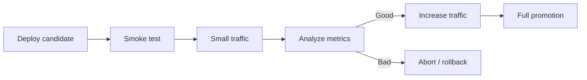

# Deployment Strategies

## Mục lục

- [Tổng quan](#tổng-quan)
- [1. Các câu hỏi phải trả lời trước](#1-các-câu-hỏi-phải-trả-lời-trước)
- [2. Recreate](#2-recreate)
- [3. Rolling Update](#3-rolling-update)
- [4. Blue-green](#4-blue-green)
- [5. Canary](#5-canary)
- [6. So sánh chiến lược](#6-so-sánh-chiến-lược)
- [7. Database và backward compatibility](#7-database-và-backward-compatibility)
- [8. Readiness, shutdown và capacity](#8-readiness-shutdown-và-capacity)
- [9. Progressive delivery và observability](#9-progressive-delivery-và-observability)
- [10. Thực hành blue-green](#10-thực-hành-blue-green)
- [11. Failure modes và rollback](#11-failure-modes-và-rollback)
- [12. Checklist production](#12-checklist-production)
- [Tài liệu tham khảo](#tài-liệu-tham-khảo)

---

## Tổng quan

Deployment strategy trả lời hai câu hỏi:

1. Version mới được đưa vào traffic như thế nào?
2. Khi tín hiệu xấu xuất hiện, hệ thống quay về trạng thái an toàn ra sao?

Kubernetes Deployment hỗ trợ native `RollingUpdate` và `Recreate`. Blue-green/canary cần phối hợp nhiều Deployments với Service, Ingress/Gateway/service mesh hoặc progressive delivery controller.

> [!IMPORTANT]
> Strategy không thể bù cho ứng dụng thiếu backward compatibility, readiness sai hoặc không có observability. “Zero downtime” là thuộc tính của toàn hệ thống, không chỉ một field trong YAML.

---

## 1. Các câu hỏi phải trả lời trước

- SLO cho phép bao nhiêu downtime và error rate?
- Có đủ capacity chạy đồng thời version cũ/mới không?
- Hai version có dùng chung database/schema/message format được không?
- Có thể route theo phần trăm, header hoặc tenant không?
- Tín hiệu nào quyết định promote/rollback?
- Rollback image có rollback được dữ liệu/schema không?
- Thời gian warm-up và drain là bao lâu?
- Ai/automation có quyền chuyển traffic?

Nếu chưa có câu trả lời, bắt đầu với RollingUpdate bảo thủ, manual approval và rollback runbook; không bắt đầu bằng canary phức tạp.

---

## 2. Recreate

```yaml
spec:
  strategy:
    type: Recreate
```

Deployment scale Pods cũ xuống trước khi tạo Pods mới.

```text
old: ███ → 0
new: 0   → ███
      downtime gap
```

Phù hợp khi:

- Hai version không thể chạy đồng thời.
- Workload dev/test chấp nhận downtime.
- Single-writer legacy app chưa thể rolling.
- Resource capacity không đủ overlap và downtime được chấp nhận.

Trade-off: đơn giản nhưng có downtime; nếu version mới fail, downtime kéo dài đến khi rollback hoàn tất.

---

## 3. Rolling Update

```yaml
spec:
  strategy:
    type: RollingUpdate
    rollingUpdate:
      maxSurge: 1
      maxUnavailable: 0
```

Deployment tăng Pods mới và giảm Pods cũ theo từng bước.

```text
old: ███ → ██ → █ → 0
new: 0   → █  → ██ → ███
```

Phù hợp mặc định cho stateless service khi version cũ và mới có thể cùng phục vụ.

### 3.1 Tuning

- `maxSurge` cao: rollout nhanh hơn nhưng cần capacity.
- `maxUnavailable` cao: ít capacity hơn nhưng giảm availability.
- `minReadySeconds`: tránh coi Pod vừa Ready chớp nhoáng là available.
- `progressDeadlineSeconds`: phát hiện rollout không tiến triển.

Rolling update phân phối traffic dựa trên số endpoints, không bảo đảm phần trăm request chính xác vì connection reuse, load-balancing behavior và request duration.

---

## 4. Blue-green

Blue và green là hai môi trường/workload hoàn chỉnh. Chỉ một màu nhận production traffic; màu còn lại được validate trước khi switch.

```text
                   ┌── Deployment blue (v1)
Client → Service ──┤   selector: track=blue
                   └── Deployment green (v2)
```

Switch bằng cách đổi Service selector:

```yaml
spec:
  selector:
    app: checkout
    track: green
```

Ưu điểm:

- Chuyển traffic nhanh.
- Rollback traffic nhanh bằng selector cũ.
- Có môi trường mới để smoke test.

Nhược điểm:

- Gần gấp đôi capacity.
- Database/shared state vẫn là rủi ro chung.
- In-flight connections không biến mất ngay.
- Sửa Service selector bằng tay dễ sai; cần automation/audit.

Blue-green không có nghĩa rollback dữ liệu. Nếu green đã ghi dữ liệu format mới, blue có thể không đọc được.

---

## 5. Canary

Canary đưa một phần traffic vào version mới rồi tăng dần:

```text
Step 1: v1 95% | v2 5%
Step 2: v1 75% | v2 25%
Step 3: v1 50% | v2 50%
Step 4: v2 100%
```

### 5.1 Canary bằng replica ratio

Một Service chọn Pods của cả hai Deployments; tỷ lệ replicas gần đúng tỷ lệ endpoints. Cách này đơn giản nhưng không chính xác và không route theo header/user.

### 5.2 Canary bằng traffic layer

Ingress controller, Gateway API, service mesh hoặc rollout controller có thể weighted routing, header routing và automated analysis. Cơ chế mạnh hơn nhưng thêm CRDs, controller và failure modes.

### 5.3 Tín hiệu canary

So sánh canary với baseline:

- HTTP error rate.
- Latency percentiles.
- Saturation CPU/memory/thread pool.
- Business success rate.
- Dependency errors.
- Crash/restart/readiness.

Traffic quá ít tạo sample không đủ; traffic quá nhiều tăng blast radius. Thời lượng analysis phải bao phủ behavior thật, không chỉ vài giây startup.

---

## 6. So sánh chiến lược

| Chiến lược | Downtime | Capacity thêm | Kiểm soát traffic | Rollback traffic | Độ phức tạp |
|---|---|---:|---|---|---|
| Recreate | Có | Thấp | Không | Chậm | Thấp |
| RollingUpdate | Thường không | Thấp-vừa | Theo endpoints | Nhanh vừa | Thấp-vừa |
| Blue-green | Thường không | Cao | Switch toàn bộ | Rất nhanh | Vừa |
| Canary | Thường không | Vừa-cao | Từng phần | Nhanh nếu tự động | Cao |

Chọn strategy tối thiểu đáp ứng SLO. Complexity là chi phí vận hành lâu dài.

---

## 7. Database và backward compatibility

Rolling, blue-green và canary đều có thời gian hai version chạy đồng thời. Contract phải tương thích:

- API request/response.
- Database schema.
- Event/message schema.
- Cache key và serialized data.

Pattern **expand → migrate → contract**:

```text
1. Expand: thêm schema mới nhưng giữ schema cũ
2. Deploy code đọc/ghi tương thích
3. Migrate/backfill dữ liệu
4. Xác minh mọi instance đã dùng format mới
5. Contract: xóa schema cũ ở change riêng
```

Không gộp destructive schema change với application rollout rồi kỳ vọng `rollout undo` cứu được. Database migration cần backup, forward-fix/rollback plan và ownership riêng.

---

## 8. Readiness, shutdown và capacity

### 8.1 Readiness

Pod chỉ nên Ready sau khi:

- Process listen đúng port.
- Dependency thiết yếu đủ để phục vụ.
- Cache/model warm-up tối thiểu hoàn tất.
- Route có thể xử lý request thật.

### 8.2 Graceful shutdown

Khi scale down, app cần:

1. Ngừng nhận request mới.
2. Hoàn thành in-flight request.
3. Flush buffer/telemetry.
4. Exit trước grace deadline.

### 8.3 Capacity

`maxSurge` cần capacity thực. Nếu cluster đầy, Pods mới Pending và rollout kẹt. Cluster Autoscaler có thể thêm Node nhưng cần thời gian; pipeline timeout phải phản ánh điều đó.

PodDisruptionBudget bảo vệ voluntary disruptions, không điều khiển toàn bộ Deployment rollout theo cách nhiều người kỳ vọng. Rollout vẫn phụ thuộc strategy và readiness.

---

## 9. Progressive delivery và observability

Một promotion flow tốt:



Automation cần guardrails:

- Timeout mỗi step.
- Minimum sample size.
- Absolute và relative error thresholds.
- Manual gate cho high-risk change.
- Audit trail.
- Abort khi observability unavailable; không coi “không có metric” là success.

---

## 10. Thực hành blue-green

Tạo Namespace và hai Deployments:

```bash
kubectl create namespace strategy-lab
kubectl create deployment web-blue --image=nginx:1.27-alpine -n strategy-lab
kubectl label deployment web-blue app=web track=blue -n strategy-lab
kubectl patch deployment web-blue -n strategy-lab --type=merge \
  -p '{"spec":{"template":{"metadata":{"labels":{"app":"web","track":"blue"}}}}}'

kubectl create deployment web-green --image=nginx:1.28-alpine -n strategy-lab
kubectl label deployment web-green app=web track=green -n strategy-lab
kubectl patch deployment web-green -n strategy-lab --type=merge \
  -p '{"spec":{"template":{"metadata":{"labels":{"app":"web","track":"green"}}}}}'
```

Tạo Service trỏ blue:

```bash
kubectl create service clusterip web --tcp=80:80 -n strategy-lab
kubectl patch service web -n strategy-lab --type=merge \
  -p '{"spec":{"selector":{"app":"web","track":"blue"}}}'
kubectl get endpointslices -n strategy-lab \
  -l kubernetes.io/service-name=web
```

Switch green:

```bash
kubectl patch service web -n strategy-lab --type=merge \
  -p '{"spec":{"selector":{"app":"web","track":"green"}}}'
kubectl get endpointslices -n strategy-lab \
  -l kubernetes.io/service-name=web
```

Rollback traffic:

```bash
kubectl patch service web -n strategy-lab --type=merge \
  -p '{"spec":{"selector":{"app":"web","track":"blue"}}}'
```

Cleanup:

```bash
kubectl delete namespace strategy-lab
```

Trong production, lưu manifests declarative thay vì chuỗi patch imperative; lab dùng patch để thấy traffic switch rõ ràng.

---

## 11. Failure modes và rollback

| Failure | Phản ứng |
|---|---|
| Pod mới không Ready | Dừng rollout, xem Events/logs/probe/capacity |
| Error rate canary tăng | Abort traffic, giữ evidence, rollback |
| Metrics pipeline mất | Dừng promotion; không promote mù |
| Schema không tương thích | Dừng rollout, theo database runbook |
| Pods cũ bị scale down quá sớm | Điều chỉnh readiness, surge/unavailable, drain |
| Rollback image vẫn lỗi | Kiểm tra config/dependency/data, không giả định code là root cause |

Rollback phải được diễn tập. Runbook cần chỉ rõ command, quyền, source revert, data impact và success criteria.

---

## 12. Checklist production

1. Chọn strategy theo SLO và capacity.
2. Xác minh backward/forward compatibility.
3. Pin artifact và ghi provenance.
4. Cấu hình startup/readiness/liveness đúng semantics.
5. Test graceful shutdown.
6. Đặt timeout/progress deadline.
7. Có dashboard, alert và business metric.
8. Định nghĩa promote/abort thresholds.
9. Đồng bộ rollback cluster với Git.
10. Có database migration plan riêng.
11. Test khi thiếu capacity và dependency outage.
12. Ghi audit cho traffic switch.

Tiếp tục với [StatefulSet](/workloads/statefulset/) để triển khai workload cần identity và storage ổn định.

---

## Tài liệu tham khảo

- [Deployments](https://kubernetes.io/docs/concepts/workloads/controllers/deployment/)
- [Argo Rollouts](https://argo-rollouts.readthedocs.io/)
- [Gateway API](https://gateway-api.sigs.k8s.io/)
