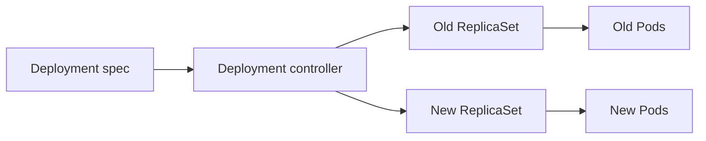

# Deployment

## Mục lục

- [Tổng quan](#tổng-quan)
- [1. Deployment quản lý điều gì?](#1-deployment-quản-lý-điều-gì)
- [2. Manifest chuẩn](#2-manifest-chuẩn)
- [3. Điều gì kích hoạt rollout?](#3-điều-gì-kích-hoạt-rollout)
- [4. RollingUpdate](#4-rollingupdate)
- [5. Theo dõi rollout](#5-theo-dõi-rollout)
- [6. Rollback](#6-rollback)
- [7. Scale, HPA và field ownership](#7-scale-hpa-và-field-ownership)
- [8. Pause và resume](#8-pause-và-resume)
- [9. Deployment status](#9-deployment-status)
- [10. Thực hành end-to-end](#10-thực-hành-end-to-end)
- [11. Troubleshooting](#11-troubleshooting)
- [12. Best practices](#12-best-practices)
- [Tài liệu tham khảo](#tài-liệu-tham-khảo)

---

## Tổng quan

Deployment là controller phổ biến nhất cho ứng dụng stateless chạy liên tục. Bạn khai báo số replicas và Pod template; Deployment quản lý ReplicaSets, còn ReplicaSets duy trì Pods.

```text
Deployment
├── old ReplicaSet ── replicas: 0
└── current ReplicaSet ── replicas: 3
    ├── Pod
    ├── Pod
    └── Pod
```

Deployment cung cấp:

- Declarative rollout khi Pod template đổi.
- Scale replicas.
- Theo dõi revision history.
- Rollback revision.
- Pause/resume nhiều thay đổi.
- Status/conditions cho automation.

> [!IMPORTANT]
> Deployment phù hợp khi các replicas có thể thay thế lẫn nhau. Nếu mỗi replica cần identity hoặc storage ổn định, xem [StatefulSet](/workloads/statefulset/).

---

## 1. Deployment quản lý điều gì?

Luồng reconciliation:



Deployment controller quyết định số replicas của từng ReplicaSet trong rollout. ReplicaSet controller mới trực tiếp tạo/xóa Pods.

Ownership chain:

```text
Deployment UID → ReplicaSet ownerReference → Pod ownerReference
```

Không quản lý ReplicaSet/Pod con bằng tay; sửa Deployment template hoặc source manifest.

---

## 2. Manifest chuẩn

```yaml
apiVersion: apps/v1
kind: Deployment
metadata:
  name: web
  namespace: workloads-lab
  labels:
    app.kubernetes.io/name: web
    app.kubernetes.io/part-of: workloads-course
spec:
  replicas: 3
  revisionHistoryLimit: 5
  progressDeadlineSeconds: 300
  strategy:
    type: RollingUpdate
    rollingUpdate:
      maxSurge: 1
      maxUnavailable: 0
  selector:
    matchLabels:
      app: web
  template:
    metadata:
      labels:
        app: web
        app.kubernetes.io/name: web
    spec:
      terminationGracePeriodSeconds: 30
      containers:
        - name: nginx
          image: nginx:1.27-alpine
          ports:
            - name: http
              containerPort: 80
          readinessProbe:
            httpGet:
              path: /
              port: http
            periodSeconds: 5
            failureThreshold: 2
          resources:
            requests:
              cpu: 50m
              memory: 64Mi
            limits:
              memory: 128Mi
```

Các invariant:

- Selector khớp Pod template labels.
- Selector không overlap workload khác.
- Readiness phản ánh khả năng nhận traffic.
- Cluster đủ capacity cho replicas cộng `maxSurge`.
- Image/config là bất biến và truy vết được.

---

## 3. Điều gì kích hoạt rollout?

Chỉ thay đổi `spec.template` tạo revision/rollout mới, ví dụ:

- Container image.
- Env/config reference.
- Pod labels/annotations.
- Resources, probes, security context.

Thay đổi `spec.replicas` chỉ scale ReplicaSet hiện tại, không tạo revision mới.

Kiểm tra hash:

```bash
kubectl get replicasets -n workloads-lab \
  -o custom-columns='NAME:.metadata.name,HASH:.metadata.labels.pod-template-hash,DESIRED:.spec.replicas'
```

### 3.1 ConfigMap/Secret thay đổi không tự rollout

Nếu Pod template chỉ tham chiếu cùng tên ConfigMap/Secret, sửa object đó không đổi template hash. Tùy cách consume, file mounted có thể cập nhật dần, nhưng env vars không đổi cho process đang chạy.

Cách thường dùng:

- Config object có version trong tên.
- Checksum annotation trong Pod template.
- Reloader controller được quản lý rõ.
- `kubectl rollout restart` cho thao tác có kiểm soát.

---

## 4. RollingUpdate

Hai tham số:

- `maxSurge`: số Pods có thể vượt desired trong rollout.
- `maxUnavailable`: số Pods có thể thiếu availability so với desired.

Có thể là số tuyệt đối hoặc phần trăm.

Với replicas=3, `maxSurge=1`, `maxUnavailable=0`:

```text
Bắt đầu: old=3 available
Tạo:    old=3 + new=1
New Ready
Scale:  old=2 + new=1
...
Kết thúc: new=3
```

Trade-off:

| Cấu hình | Availability | Capacity cần thêm | Tốc độ |
|---|---|---|---|
| surge cao, unavailable thấp | Cao | Cao | Nhanh nếu đủ capacity |
| surge thấp, unavailable cao | Thấp hơn | Thấp | Có thể nhanh nhưng rủi ro |
| cả hai quá chặt | Cao | Có thể rollout chậm/kẹt | Chậm |

Readiness probe là tín hiệu để Deployment biết Pod mới available. Probe quá dễ tạo false positive; probe quá chặt làm rollout kẹt.

`minReadySeconds` có thể yêu cầu Pod giữ Ready trong một khoảng trước khi được tính available.

---

## 5. Theo dõi rollout

```bash
kubectl apply --dry-run=server -f deployment.yaml
kubectl diff -f deployment.yaml || true
kubectl apply -f deployment.yaml
kubectl rollout status deployment/web -n workloads-lab --timeout=5m
```

Quan sát nhiều lớp:

```bash
kubectl get deployment,replicaset,pods -n workloads-lab
kubectl rollout history deployment/web -n workloads-lab
kubectl describe deployment web -n workloads-lab
```

Các trường quan trọng:

- `updatedReplicas`: Pods thuộc template mới.
- `readyReplicas`: Pods Ready.
- `availableReplicas`: Pods đạt availability requirement.
- `unavailableReplicas`: Pods chưa available.
- Conditions `Progressing` và `Available`.
- `observedGeneration`: generation controller đã xử lý.

Pipeline không nên coi `kubectl apply` thành công là rollout thành công; phải chờ condition với timeout.

---

## 6. Rollback

Xem lịch sử:

```bash
kubectl rollout history deployment/web -n workloads-lab
kubectl rollout history deployment/web -n workloads-lab --revision=2
```

Rollback:

```bash
kubectl rollout undo deployment/web -n workloads-lab
kubectl rollout undo deployment/web -n workloads-lab --to-revision=2
kubectl rollout status deployment/web -n workloads-lab --timeout=5m
```

Rollback tạo desired state từ revision cũ trong cluster. Nếu Git vẫn chứa image lỗi, GitOps/deploy tiếp theo sẽ đưa lỗi trở lại. Luôn revert source of truth và ghi nhận incident/change.

`revisionHistoryLimit` quá thấp làm mất khả năng rollback cũ; quá cao giữ nhiều ReplicaSets và metadata không cần thiết.

---

## 7. Scale, HPA và field ownership

Scale thủ công:

```bash
kubectl scale deployment/web --replicas=5 -n workloads-lab
```

Nếu manifest tiếp tục khai báo `replicas: 3`, lần apply sau có thể scale về 3. Khi HPA quản lý replicas, cần thiết kế để GitOps không liên tục giành field `spec.replicas`.

Nguyên tắc:

```text
Một field → một source of truth chính
```

- GitOps quản lý Pod template và strategy.
- HPA quản lý replicas.
- Deployment controller quản lý ReplicaSets/status.

Kiểm tra `managedFields` khi nghi xung đột:

```bash
kubectl get deployment web -n workloads-lab -o yaml --show-managed-fields
```

---

## 8. Pause và resume

Pause giúp gom nhiều thay đổi template vào một revision:

```bash
kubectl rollout pause deployment/web -n workloads-lab
kubectl set image deployment/web nginx=nginx:1.28-alpine -n workloads-lab
kubectl set resources deployment/web -c nginx --limits=memory=160Mi -n workloads-lab
kubectl rollout resume deployment/web -n workloads-lab
```

Trong GitOps, ưu tiên sửa manifest rồi commit một changeset thay vì nhiều command imperative. Không để Deployment paused ngoài ý muốn; rollout sẽ không tiến triển.

---

## 9. Deployment status

Ví dụ condition:

```text
Available=True      MinimumReplicasAvailable
Progressing=True    NewReplicaSetAvailable
```

Rollout kẹt vượt `progressDeadlineSeconds` có thể báo `ProgressDeadlineExceeded`. Deployment báo lỗi nhưng không tự rollback. Automation phải quyết định alert, stop promotion hoặc rollback dựa trên policy.

Số replicas đủ chưa chắc application tốt. Cần kết hợp:

- Synthetic checks.
- Error rate/latency.
- Metrics business.
- Service endpoints.
- Logs/traces.

---

## 10. Thực hành end-to-end

### 10.1 Tạo Deployment

```bash
kubectl create namespace workloads-lab
kubectl apply -f deployment.yaml
kubectl rollout status deployment/web -n workloads-lab --timeout=120s
kubectl get deployment,replicaset,pods -n workloads-lab -o wide
```

### 10.2 Update image

```bash
kubectl set image deployment/web nginx=nginx:1.28-alpine -n workloads-lab
kubectl rollout status deployment/web -n workloads-lab --timeout=120s
kubectl rollout history deployment/web -n workloads-lab
```

Sau lab, sửa `deployment.yaml` về image mong muốn để source đồng bộ.

### 10.3 Mô phỏng rollout lỗi

```bash
kubectl set image deployment/web nginx=nginx:not-found -n workloads-lab
kubectl rollout status deployment/web -n workloads-lab --timeout=30s
kubectl get pods -n workloads-lab
kubectl describe deployment web -n workloads-lab
kubectl get events -n workloads-lab --sort-by=.metadata.creationTimestamp
```

Rollback:

```bash
kubectl rollout undo deployment/web -n workloads-lab
kubectl rollout status deployment/web -n workloads-lab --timeout=120s
```

### 10.4 Self-healing và scale

```bash
POD="$(kubectl get pod -n workloads-lab -l app=web -o jsonpath='{.items[0].metadata.name}')"
kubectl delete pod "$POD" -n workloads-lab
kubectl scale deployment/web --replicas=4 -n workloads-lab
kubectl get pods -n workloads-lab --watch
```

Cleanup:

```bash
kubectl delete namespace workloads-lab
```

---

## 11. Troubleshooting

### 11.1 Rollout đứng yên

```bash
kubectl describe deployment web -n workloads-lab
kubectl get replicasets,pods -n workloads-lab
kubectl get events -n workloads-lab --sort-by=.metadata.creationTimestamp
```

Tìm:

- Image pull hoặc startup lỗi.
- Readiness không pass.
- Resource/taint/affinity làm Pod Pending.
- Quota hoặc admission từ chối tạo Pod.
- `maxSurge` cần capacity nhưng cluster không còn.
- Deployment đang paused.

### 11.2 Pods mới Ready nhưng lỗi tăng

Readiness endpoint có thể chưa phản ánh dependency hoặc warm-up. Kiểm tra metrics, logs và traffic. Rollback nếu impact vượt ngưỡng; sau đó sửa probe/test.

### 11.3 Có nhiều ReplicaSets

Đây là bình thường do revision history. ReplicaSets cũ thường scale về 0. Nếu nhiều ReplicaSet vẫn có replicas, rollout có thể đang tiến triển/kẹt hoặc actor khác đã scale trực tiếp.

### 11.4 `Available` nhưng không truy cập được

Đi tiếp qua Service selector, EndpointSlice, DNS, NetworkPolicy và application protocol. Deployment availability không kiểm tra toàn bộ đường đi request.

---

## 12. Best practices

- Dùng image tag bất biến hoặc digest; lưu commit/version trong metadata.
- Khai báo readiness chính xác và graceful shutdown.
- Chọn `maxSurge`/`maxUnavailable` theo capacity và SLO.
- Đặt `progressDeadlineSeconds` và pipeline timeout.
- Theo dõi rollout bằng status **và** application metrics.
- Giữ selector ổn định, không overlap.
- Không sửa ReplicaSet/Pod con trực tiếp.
- Đồng bộ rollback với Git/source of truth.
- Phân định rõ HPA/GitOps field ownership.
- Đặt resource requests để rollout có thể schedule dự đoán được.
- Test failed rollout, rollback và capacity shortage trước production.

Tiếp tục với [Deployment Strategies](/workloads/deployment-strategies/) để chọn Rolling Update, Recreate, blue-green hoặc canary.

---

## Tài liệu tham khảo

- [Deployments](https://kubernetes.io/docs/concepts/workloads/controllers/deployment/)
- [Perform a Rolling Update](https://kubernetes.io/docs/tutorials/kubernetes-basics/update/update-intro/)
- [kubectl rollout](https://kubernetes.io/docs/reference/kubectl/generated/kubectl_rollout/)
