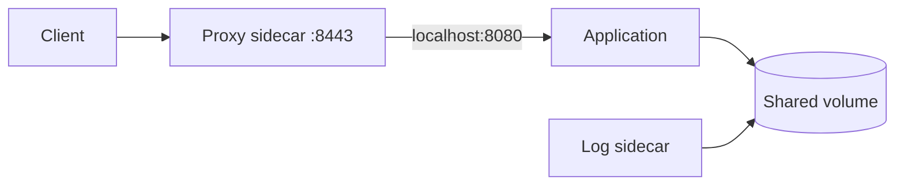

# Multi-container Pods

## Mục lục

- [Tổng quan](#tổng-quan)
- [1. Quyết định đặt chung hay tách Pod](#1-quyết-định-đặt-chung-hay-tách-pod)
- [2. Cơ chế chia sẻ](#2-cơ-chế-chia-sẻ)
- [3. Sidecar pattern](#3-sidecar-pattern)
- [4. Adapter pattern](#4-adapter-pattern)
- [5. Ambassador pattern](#5-ambassador-pattern)
- [6. Startup và termination](#6-startup-và-termination)
- [7. Resource và failure coupling](#7-resource-và-failure-coupling)
- [8. Thực hành sidecar](#8-thực-hành-sidecar)
- [9. Debug Pod nhiều container](#9-debug-pod-nhiều-container)
- [10. Anti-patterns và best practices](#10-anti-patterns-và-best-practices)
- [Tài liệu tham khảo](#tài-liệu-tham-khảo)

---

## Tổng quan

Pod có thể chạy nhiều container. Pattern này hữu ích khi một process chính cần process phụ trợ chạy cùng Node, chia sẻ `localhost`, volume và vòng đời triển khai.

```text
Pod
├── app: tạo /var/log/app/events.log
├── sidecar: đọc file và gửi log
└── emptyDir: /var/log/app
```

Số container không làm Pod trở thành microservice platform thu nhỏ. Ranh giới Pod quyết định scheduling, scale, rollout và failure domain; ghép sai container tạo coupling khó vận hành.

> [!IMPORTANT]
> Nếu hai thành phần cần scale hoặc release độc lập, hãy đặt chúng ở workload riêng và giao tiếp qua Service/API, không đặt chung Pod chỉ để “kết nối nhanh”.

---

## 1. Quyết định đặt chung hay tách Pod

Dùng cùng Pod khi câu trả lời phần lớn là “có”:

- Hai process có phải luôn chạy trên cùng Node không?
- Chúng có cùng số replicas không?
- Chúng có cùng lifecycle rollout không?
- Có cần giao tiếp qua `localhost` hoặc file volume không?
- Process phụ có phục vụ riêng cho đúng một app instance không?

Tách Pod khi:

- Một thành phần được nhiều workload dùng chung.
- Cần autoscale độc lập.
- Có release cadence hoặc owner team khác nhau.
- Cần isolation tài nguyên/failure mạnh hơn.
- Network API là contract tự nhiên hơn shared file.

| Tiêu chí | Cùng Pod | Tách Pod |
|---|---|---|
| Network | `localhost`, độ trễ thấp | Service/network |
| Scheduling | Luôn cùng Node | Độc lập |
| Scale | Cùng số replica | Độc lập |
| Rollout | Cùng Pod template | Độc lập |
| Failure domain | Coupled | Tách biệt hơn |

---

## 2. Cơ chế chia sẻ

### 2.1 Network

Các container dùng chung Pod IP và port namespace:

```text
app listens 127.0.0.1:8080
proxy listens 0.0.0.0:8443
proxy → http://127.0.0.1:8080
```

Hai container không thể cùng lắng nghe TCP port `8080` trên cùng address.

### 2.2 Volumes

Mỗi container chọn mount path riêng cho cùng volume:

```yaml
volumeMounts:
  - name: shared
    mountPath: /app/output
```

Container khác có thể mount volume đó tại `/input`. Shared volume là contract; cần thống nhất file format, atomic write, permissions và rotation.

### 2.3 Process namespace

Mặc định container không thấy process của nhau. Có thể bật `shareProcessNamespace: true`, nhưng việc này mở rộng visibility và cần đánh giá security. Phần lớn sidecar giao tiếp qua network/file không cần chia sẻ process namespace.

---

## 3. Sidecar pattern

Sidecar mở rộng chức năng của app mà không thay source app. Ví dụ:

- Log shipping.
- Local proxy/service mesh.
- Certificate/config reloader.
- Metrics exporter cho ứng dụng legacy.



### 3.1 Sidecar là container thông thường

Cách truyền thống đặt app và sidecar cùng `spec.containers`. Kubernetes start chúng gần như song song và không đảm bảo thứ tự. Mỗi container phải retry dependency của nó.

### 3.2 Native sidecar: thứ tự start/stop rõ hơn

Cluster hỗ trợ có thể khai báo sidecar trong `initContainers` với `restartPolicy: Always`. Cơ chế này cung cấp ordering/termination semantics rõ hơn. Hãy kiểm tra API support trước khi dùng:

```bash
kubectl explain pod.spec.initContainers.restartPolicy
```

Không dùng field mới nếu fleet cluster còn version không đồng nhất.

---

## 4. Adapter pattern

Adapter chuyển output của app sang format chuẩn mà platform hiểu.

Ví dụ app legacy ghi:

```text
orders_total=42;errors_total=2
```

Adapter đọc dữ liệu và expose Prometheus format:

```text
orders_total 42
errors_total 2
```

Adapter phù hợp khi không thể sửa app. Nếu có thể thay code dễ dàng, instrument trực tiếp thường đơn giản hơn vì giảm container, resource và failure mode.

---

## 5. Ambassador pattern

Ambassador đại diện app giao tiếp với external service:

```text
application → localhost:5432 → database proxy → remote database
```

Proxy có thể xử lý TLS, service discovery, retry hoặc credential rotation. App chỉ biết endpoint local.

Trade-offs:

- Ưu: đơn giản hóa app, policy tập trung trong proxy image.
- Nhược: thêm hop, resource, log và failure mode.
- Cảnh báo: retry ở proxy cộng retry ở app có thể nhân tải khi outage.

---

## 6. Startup và termination

### 6.1 Không giả định thứ tự YAML

Trong `spec.containers`, container đầu danh sách không được đảm bảo sẵn sàng trước container sau. Dùng:

- Retry với exponential backoff.
- Startup/readiness probes.
- Init container cho bước phải hoàn tất.
- Cơ chế native sidecar nếu cluster hỗ trợ.

### 6.2 Readiness của Pod

Pod Ready khi mọi container có readiness yêu cầu đều Ready. Một sidecar có readiness probe lỗi có thể loại toàn Pod khỏi Service endpoints. Chỉ thêm probe khi sidecar thực sự phải sẵn sàng để app phục vụ.

### 6.3 Termination

Mọi container cần xử lý shutdown. Với sidecar truyền thống, đừng giả định app luôn dừng trước sidecar. Nếu log sidecar phải flush sau app, cơ chế native sidecar hoặc một thiết kế flush rõ ràng giúp giảm race condition.

---

## 7. Resource và failure coupling

Scheduler dùng tổng requests của application containers trong Pod. Mỗi container bị giới hạn theo limits của nó, nhưng chúng chia sẻ Node và một số Pod-level constraints.

Ví dụ:

```text
app request:      500m CPU, 512Mi
proxy request:    100m CPU, 128Mi
log sidecar:       50m CPU,  64Mi
Pod total:        650m CPU, 704Mi
```

Nếu sidecar memory leak và bị OOM, kubelet restart riêng sidecar; tuy nhiên Pod có thể mất Ready hoặc chức năng quan trọng. Nếu Node gặp pressure, cả Pod có thể bị evict.

Theo dõi resource theo container:

```bash
kubectl top pod <pod> -n <namespace> --containers
```

---

## 8. Thực hành sidecar

Tạo Pod trong đó app ghi timestamp, sidecar đọc log:

```yaml
apiVersion: v1
kind: Pod
metadata:
  name: sidecar-demo
  namespace: workloads-lab
  labels:
    app: sidecar-demo
spec:
  containers:
    - name: writer
      image: busybox:1.36
      command:
        - sh
        - -c
        - |
          while true; do
            echo "$(date -Iseconds) event=heartbeat" >> /var/log/app/events.log
            sleep 5
          done
      volumeMounts:
        - name: logs
          mountPath: /var/log/app
      resources:
        requests:
          cpu: 10m
          memory: 16Mi
        limits:
          memory: 32Mi
    - name: reader
      image: busybox:1.36
      command: ["sh", "-c", "touch /var/log/app/events.log && tail -n+1 -F /var/log/app/events.log"]
      volumeMounts:
        - name: logs
          mountPath: /var/log/app
          readOnly: true
      resources:
        requests:
          cpu: 10m
          memory: 16Mi
        limits:
          memory: 32Mi
  volumes:
    - name: logs
      emptyDir: {}
```

Apply và quan sát:

```bash
kubectl create namespace workloads-lab
kubectl apply -f sidecar-demo.yaml
kubectl wait --for=condition=Ready pod/sidecar-demo -n workloads-lab --timeout=60s
kubectl logs sidecar-demo -n workloads-lab -c reader -f
```

Terminal khác:

```bash
kubectl logs sidecar-demo -n workloads-lab -c writer
kubectl exec sidecar-demo -n workloads-lab -c writer -- ls -l /var/log/app
kubectl exec sidecar-demo -n workloads-lab -c reader -- cat /var/log/app/events.log
```

Cleanup:

```bash
kubectl delete namespace workloads-lab
```

---

## 9. Debug Pod nhiều container

Luôn chỉ định container:

```bash
kubectl logs <pod> -n <namespace> -c <container>
kubectl logs <pod> -n <namespace> -c <container> --previous
kubectl exec <pod> -n <namespace> -c <container> -- <command>
```

Liệt kê container và trạng thái:

```bash
kubectl get pod <pod> -n <namespace> \
  -o jsonpath='{range .status.containerStatuses[*]}{.name}{"\tready="}{.ready}{"\trestarts="}{.restartCount}{"\n"}{end}'
```

Checklist:

1. Container nào không Ready hoặc restart?
2. Shared volume có mount đúng name/path và permissions không?
3. Port có conflict không?
4. Sidecar có chờ endpoint local với timeout hợp lý không?
5. Probe của container phụ có vô tình làm Pod mất Ready không?
6. Resource usage theo container có vượt budget không?
7. Log rotation có khiến tailer mất file handle không?

---

## 10. Anti-patterns và best practices

### 10.1 Anti-patterns

- Ghép nhiều microservices vào một Pod để tránh tạo Service.
- Một sidecar “dùng chung” được copy vào mọi Pod dù có thể chạy tập trung.
- Không khai báo resource vì nghĩ sidecar nhẹ.
- Dùng `sleep 20` để tạo startup ordering.
- Ghi file không rotation vào `emptyDir` đến khi đầy disk.
- Sidecar có quyền root/host mount rộng hơn nhu cầu.

### 10.2 Best practices

- Giữ một application concern chính cho mỗi Pod.
- Định nghĩa rõ contract: port, path, format, ownership và shutdown.
- Khai báo requests/limits cho mọi container.
- Quan sát metrics/log theo container, không chỉ tổng Pod.
- Pin image và áp dụng security context riêng.
- Dùng volume read-only ở consumer nếu có thể.
- Test một container restart độc lập và test Pod termination.
- Đánh giá chi phí sidecar nhân với số replicas toàn fleet.

Tiếp tục với [Labels, Annotations và Selectors](/workloads/labels-annotations-selectors/) để tổ chức và liên kết các workload objects.

---

## Tài liệu tham khảo

- [Pods](https://kubernetes.io/docs/concepts/workloads/pods/)
- [Sidecar Containers](https://kubernetes.io/docs/concepts/workloads/pods/sidecar-containers/)
- [Communicate Between Containers in the Same Pod](https://kubernetes.io/docs/tasks/access-application-cluster/communicate-containers-same-pod-shared-volume/)
- [Share Process Namespace](https://kubernetes.io/docs/tasks/configure-pod-container/share-process-namespace/)
