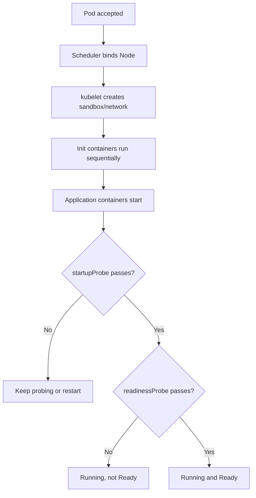

# Vòng đời Pod

## Mục lục

- [Tổng quan](#tổng-quan)
- [1. Ba lớp trạng thái cần phân biệt](#1-ba-lớp-trạng-thái-cần-phân-biệt)
- [2. Pod phase](#2-pod-phase)
- [3. Pod conditions](#3-pod-conditions)
- [4. Container states và restart](#4-container-states-và-restart)
- [5. Probes và readiness](#5-probes-và-readiness)
- [6. Luồng khởi động Pod](#6-luồng-khởi-động-pod)
- [7. Graceful termination](#7-graceful-termination)
- [8. Pod failure và replacement](#8-pod-failure-và-replacement)
- [9. Thực hành quan sát vòng đời](#9-thực-hành-quan-sát-vòng-đời)
- [10. Troubleshooting theo trạng thái](#10-troubleshooting-theo-trạng-thái)
- [11. Best practices](#11-best-practices)
- [Tài liệu tham khảo](#tài-liệu-tham-khảo)

---

## Tổng quan

Một Pod không đi thẳng từ “đã tạo” đến “đang chạy”. Nó trải qua scheduling, image pull, container startup, probes, serving và termination. Kubernetes biểu diễn quá trình này qua nhiều lớp status.

```text
Created → Scheduled → Initialized → ContainersStarted → Ready
                                                   ↓
                                            Terminating → Deleted
```

> [!IMPORTANT]
> `kubectl get pods` hiển thị cột `STATUS` để con người đọc nhanh. Giá trị này không phải lúc nào cũng trùng `status.phase`. Muốn tìm root cause, hãy đọc **conditions**, **containerStatuses** và **Events**.

---

## 1. Ba lớp trạng thái cần phân biệt

| Lớp | Câu hỏi trả lời | Ví dụ |
|---|---|---|
| Pod phase | Pod đang ở giai đoạn tổng quát nào? | `Pending`, `Running`, `Failed` |
| Pod conditions | Những điều kiện nào đã đạt? | `PodScheduled`, `Ready` |
| Container state | Container cụ thể đang làm gì? | `Waiting`, `Running`, `Terminated` |

Ví dụ Pod có phase `Running` nhưng condition `Ready=False` khi process đã chạy nhưng readiness probe thất bại. Pod tồn tại và chạy, nhưng không nên nhận traffic từ Service.

---

## 2. Pod phase

`status.phase` là bản tóm tắt cấp cao:

| Phase | Ý nghĩa |
|---|---|
| `Pending` | Pod đã được chấp nhận nhưng chưa có tất cả container chạy; có thể đang chờ schedule hoặc pull image |
| `Running` | Pod đã bind vào Node và ít nhất một container đang chạy, đang start hoặc restart |
| `Succeeded` | Mọi container đã kết thúc thành công và sẽ không restart |
| `Failed` | Mọi container đã kết thúc, ít nhất một container thất bại và sẽ không restart |
| `Unknown` | Control Plane không lấy được trạng thái Pod, thường do mất liên lạc Node |

`CrashLoopBackOff` và `ImagePullBackOff` không phải Pod phase. Đây là lý do trạng thái hiển thị trong CLI dựa trên container waiting reason.

Xem phase trực tiếp:

```bash
kubectl get pod <pod> -n <namespace> -o jsonpath='{.status.phase}{"\n"}'
```

---

## 3. Pod conditions

Các condition phổ biến:

- `PodScheduled`: Scheduler đã gán Node.
- `Initialized`: init containers hoàn tất.
- `PodReadyToStartContainers`: Pod sandbox và network đã sẵn sàng, nếu cluster/version báo condition này.
- `ContainersReady`: tất cả application containers sẵn sàng.
- `Ready`: Pod có thể phục vụ request và được đưa vào endpoint phù hợp.

```bash
kubectl get pod <pod> -n <namespace> \
  -o custom-columns='NAME:.metadata.name,SCHEDULED:.status.conditions[?(@.type=="PodScheduled")].status,READY:.status.conditions[?(@.type=="Ready")].status'
```

### 3.1 Readiness gates

`readinessGates` cho phép condition do controller bên ngoài quản lý tham gia quyết định Pod Ready. Use case là chờ đăng ký load balancer hoặc kiểm tra platform-specific. Nếu condition tùy chỉnh chưa có, Kubernetes coi nó là `False`.

Không dùng readiness gate nếu một readiness probe trong container đã đủ; gate làm tăng dependency và độ phức tạp vận hành.

---

## 4. Container states và restart

Mỗi container có một trong ba state:

- `Waiting`: chưa chạy; đọc `reason` như `ContainerCreating`, `ErrImagePull`.
- `Running`: process đang chạy; có `startedAt`.
- `Terminated`: process đã kết thúc; có `exitCode`, `reason`, `startedAt`, `finishedAt`.

Đọc bằng:

```bash
kubectl get pod <pod> -n <namespace> -o jsonpath='{.status.containerStatuses}'
kubectl describe pod <pod> -n <namespace>
```

### 4.1 `restartPolicy`

`restartPolicy` áp dụng cho application containers trong Pod và có ba giá trị:

| Giá trị | Restart khi exit 0 | Restart khi exit khác 0 |
|---|---:|---:|
| `Always` | Có | Có |
| `OnFailure` | Không | Có |
| `Never` | Không | Không |

Deployment yêu cầu semantics chạy liên tục và dùng `Always`. Job thường dùng `OnFailure` hoặc `Never`.

### 4.2 Exponential backoff

Container crash lặp lại sẽ bị restart với delay tăng dần. CLI hiển thị `CrashLoopBackOff`. Backoff là bảo vệ Node khỏi hot loop, không phải root cause.

```bash
kubectl logs <pod> -n <namespace> --previous
```

`--previous` thường là command quan trọng nhất vì container hiện tại có thể chưa kịp ghi log hoặc vừa restart.

---

## 5. Probes và readiness

| Probe | Nếu thất bại |
|---|---|
| `startupProbe` | Chưa chạy liveness/readiness; quá ngưỡng thì restart container |
| `readinessProbe` | Pod bị đánh dấu không Ready, thường bị loại khỏi Service endpoints |
| `livenessProbe` | kubelet restart container |

Ví dụ ứng dụng khởi động chậm:

```yaml
startupProbe:
  httpGet:
    path: /startup
    port: 8080
  periodSeconds: 5
  failureThreshold: 30
readinessProbe:
  httpGet:
    path: /ready
    port: 8080
  periodSeconds: 5
  failureThreshold: 2
livenessProbe:
  httpGet:
    path: /live
    port: 8080
  periodSeconds: 10
  failureThreshold: 3
```

`startupProbe` cho ứng dụng tối đa 150 giây để start. Sau khi startup thành công, readiness và liveness mới có hiệu lực.

> [!WARNING]
> Liveness probe không nên kiểm tra dependency bên ngoài như database. Database outage có thể khiến mọi Pod restart đồng loạt, làm sự cố nặng hơn. Readiness có thể phản ánh khả năng phục vụ, còn liveness chỉ nên phát hiện process bị kẹt và cần restart.

---

## 6. Luồng khởi động Pod



Các application containers không có thứ tự startup mặc định. Nếu A phải đợi B, hãy dùng retry/backoff ở A, startup probe, init container hoặc native sidecar semantics phù hợp; đừng giả định thứ tự trong YAML là thứ tự chạy.

---

## 7. Graceful termination

Khi xóa Pod:

1. API đặt `deletionTimestamp` và bắt đầu grace period.
2. Endpoint controllers cập nhật trạng thái phục vụ; traffic mới dần ngừng đến Pod.
3. kubelet chạy `preStop` nếu có.
4. Runtime gửi `SIGTERM` tới process chính.
5. Ứng dụng dừng nhận request mới, hoàn thành request đang xử lý và flush dữ liệu.
6. Khi hết `terminationGracePeriodSeconds`, kubelet gửi `SIGKILL` cho process còn sống.
7. Pod bị xóa khỏi API.

```yaml
spec:
  terminationGracePeriodSeconds: 45
  containers:
    - name: app
      image: example/app:1.0
      lifecycle:
        preStop:
          exec:
            command: ["/bin/sh", "-c", "/app/drain.sh"]
```

`preStop` nằm trong cùng grace period; hook chạy lâu sẽ làm giảm thời gian ứng dụng nhận `SIGTERM` và tự shutdown.

### 7.1 Ứng dụng phải xử lý signal đúng

Process chính trong container phải nhận `SIGTERM`. Tránh shell wrapper không dùng `exec`, ví dụ:

```dockerfile
# Không tốt nếu shell không forward signal đúng
CMD sh -c "./server"

# Tốt hơn
CMD ["./server"]
```

---

## 8. Pod failure và replacement

kubelet restart **container** trên cùng Node theo `restartPolicy`. Workload controller thay **Pod** khi Pod bị xóa, Node mất hoặc template rollout.

```text
process crash
  → kubelet restart container trong cùng Pod

Pod deleted / Node unavailable / rollout
  → controller tạo Pod mới
```

Khi Node không reachable, Control Plane cần thời gian xác định trạng thái và evict workload. Đây không phải failover tức thời. Application phải chịu được khoảng gián đoạn và chạy nhiều replicas khi availability quan trọng.

---

## 9. Thực hành quan sát vòng đời

Tạo Pod crash có kiểm soát:

```bash
kubectl create namespace lifecycle-lab
cat <<'EOF' > crashloop.yaml
apiVersion: v1
kind: Pod
metadata:
  name: crashloop
  namespace: lifecycle-lab
spec:
  containers:
    - name: worker
      image: busybox:1.36
      command: ["sh", "-c", "echo starting; sleep 3; echo failing; exit 1"]
  restartPolicy: Always
EOF
kubectl apply -f crashloop.yaml
```

Quan sát:

```bash
kubectl get pod crashloop -n lifecycle-lab --watch
kubectl describe pod crashloop -n lifecycle-lab
kubectl logs crashloop -n lifecycle-lab
kubectl logs crashloop -n lifecycle-lab --previous
kubectl get pod crashloop -n lifecycle-lab \
  -o jsonpath='{.status.containerStatuses[0].restartCount}{"\n"}'
```

Tạo Pod hoàn thành:

```bash
kubectl run completed \
  --image=busybox:1.36 \
  --restart=Never \
  -n lifecycle-lab \
  -- sh -c 'echo done'
kubectl wait --for=jsonpath='{.status.phase}'=Succeeded \
  pod/completed -n lifecycle-lab --timeout=60s
```

Cleanup:

```bash
kubectl delete namespace lifecycle-lab
```

---

## 10. Troubleshooting theo trạng thái

### 10.1 Pod `Pending`

```bash
kubectl describe pod <pod> -n <namespace>
kubectl get events -n <namespace> --sort-by=.metadata.creationTimestamp
```

Tìm `FailedScheduling`, PVC chưa bind, requests quá lớn, taint hoặc node selector không khớp.

### 10.2 `ContainerCreating`

Kiểm tra image pull, CNI sandbox, volume mount và Secret/ConfigMap bị thiếu trong Events.

### 10.3 `CrashLoopBackOff`

```bash
kubectl logs <pod> -c <container> -n <namespace> --previous
kubectl get pod <pod> -n <namespace> \
  -o jsonpath='{.status.containerStatuses[0].lastState.terminated}'
```

Phân biệt application exit, OOM, probe kill và config lỗi.

### 10.4 `Running` nhưng không Ready

```bash
kubectl describe pod <pod> -n <namespace>
kubectl get endpointslices -n <namespace>
```

Đọc readiness probe và custom readiness gates. Không restart mù quáng khi root cause là dependency.

### 10.5 `Terminating` lâu

Kiểm tra:

- `deletionTimestamp` và finalizers.
- `preStop` hoặc shutdown bị treo.
- Node mất kết nối.
- Volume detach/unmount.
- PodDisruptionBudget không chặn direct deletion nhưng có thể ảnh hưởng eviction workflow.

---

## 11. Best practices

- Đọc status theo lớp: phase → conditions → container state → Events/logs.
- Dùng `startupProbe` cho ứng dụng khởi động chậm thay vì tăng liveness delay tùy tiện.
- Tách `/live` và `/ready` theo semantics.
- Xử lý `SIGTERM`, ngừng nhận traffic và hoàn thành request trong grace period.
- Đặt grace period dựa trên thời gian shutdown thực tế, không copy cố định.
- Ghi log termination reason và expose metrics restart/readiness.
- Chạy nhiều replicas cho workload cần availability.
- Test shutdown và rollout trong staging, không chỉ test startup.

Tiếp tục với [Init Containers](/workloads/init-containers/) để chuẩn bị điều kiện trước khi application containers chạy.

---

## Tài liệu tham khảo

- [Pod Lifecycle](https://kubernetes.io/docs/concepts/workloads/pods/pod-lifecycle/)
- [Container Probes](https://kubernetes.io/docs/concepts/configuration/liveness-readiness-startup-probes/)
- [Container Lifecycle Hooks](https://kubernetes.io/docs/concepts/containers/container-lifecycle-hooks/)
- [Termination of Pods](https://kubernetes.io/docs/concepts/workloads/pods/pod-lifecycle/#pod-termination-flow)
