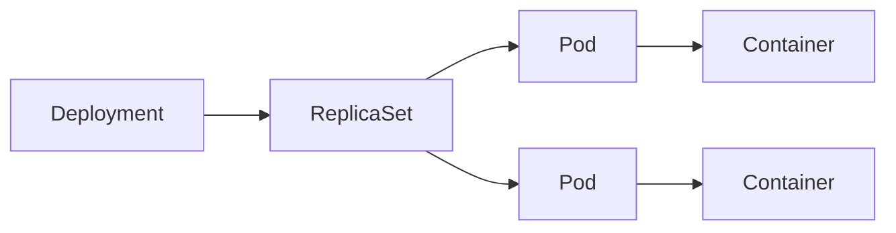
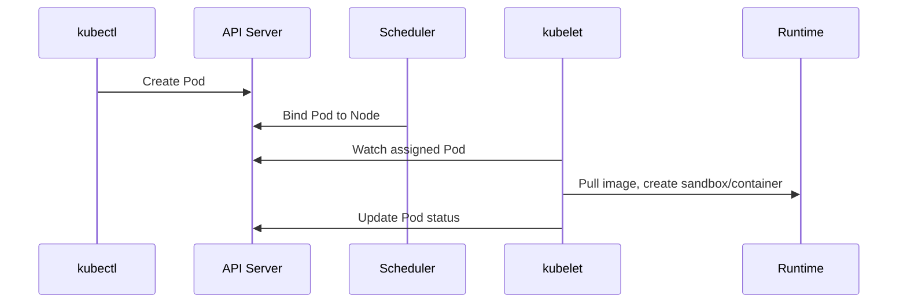

# Pod

## Mục lục

- [Tổng quan](#tổng-quan)
- [1. Pod giải quyết vấn đề gì?](#1-pod-giải-quyết-vấn-đề-gì)
- [2. Những gì các container trong Pod chia sẻ](#2-những-gì-các-container-trong-pod-chia-sẻ)
- [3. Cấu trúc manifest](#3-cấu-trúc-manifest)
- [4. Pod được tạo và chạy như thế nào?](#4-pod-được-tạo-và-chạy-như-thế-nào)
- [5. Pod là tài nguyên dùng một lần](#5-pod-là-tài-nguyên-dùng-một-lần)
- [6. Static Pod và mirror Pod](#6-static-pod-và-mirror-pod)
- [7. Thực hành](#7-thực-hành)
- [8. Troubleshooting](#8-troubleshooting)
- [9. Best practices](#9-best-practices)
- [10. Tổng kết](#10-tổng-kết)
- [Tài liệu tham khảo](#tài-liệu-tham-khảo)

---

## Tổng quan

Pod là đơn vị triển khai nhỏ nhất mà Kubernetes có thể tạo và quản lý. Một Pod chứa một hoặc nhiều container cần chạy cùng nhau trên **cùng một Node**, chia sẻ network namespace và có thể chia sẻ storage.

```text
Node
└── Pod web-7d9f...
    ├── network namespace: 10.244.1.12
    ├── volume: shared-data
    ├── container: web
    └── container: log-agent
```

Kubernetes schedule **Pod**, không schedule từng container riêng lẻ. Nếu Pod có ba container thì cả ba cùng được đặt trên một Node; Kubernetes không thể chuyển riêng một container sang Node khác.

> [!IMPORTANT]
> Pod không phải máy ảo thu nhỏ. Pod là ranh giới phối hợp cho các process gắn bó chặt chẽ. Phần lớn ứng dụng nên bắt đầu với **một application container trong mỗi Pod**.

---

## 1. Pod giải quyết vấn đề gì?

Container runtime có thể chạy container, nhưng Kubernetes cần một abstraction để:

- Schedule workload lên Node.
- Gắn network identity và volume.
- Theo dõi health và trạng thái.
- Khai báo restart behavior.
- Gom các process phải cùng vòng đời.
- Làm template cho Deployment, StatefulSet, DaemonSet hoặc Job.

Luồng quản lý phổ biến:



Trong production, bạn hiếm khi tạo Pod trần. Controller tạo và thay thế Pod để duy trì desired state. Pod trần phù hợp với thử nghiệm ngắn hoặc troubleshooting.

### 1.1 Khi nào nhiều container nên ở cùng Pod?

Chỉ đặt chung khi chúng:

1. Phải chạy trên cùng Node.
2. Phải chia sẻ `localhost` hoặc volume rất chặt.
3. Có vòng đời phụ thuộc nhau.
4. Được scale như một đơn vị.

Nếu frontend cần 10 replicas nhưng log processor chỉ cần 2, chúng không nên ở cùng Pod. Tách thành hai workload cho phép scale, rollout và cấp tài nguyên độc lập.

---

## 2. Những gì các container trong Pod chia sẻ

### 2.1 Network

Mỗi Pod thường có một IP. Các container trong Pod:

- Dùng chung IP và port space.
- Gọi nhau qua `localhost`.
- Không thể cùng bind một port/protocol.
- Ra ngoài cluster với network identity của Pod.

Ví dụ application lắng nghe `localhost:8080`, proxy sidecar có thể gọi trực tiếp địa chỉ đó.

### 2.2 Storage

Filesystem của từng container vẫn riêng. Muốn chia sẻ file, cả hai container phải mount cùng một volume:

```yaml
volumes:
  - name: shared
    emptyDir: {}
```

`emptyDir` tồn tại trong suốt vòng đời Pod. Container restart không xóa dữ liệu trong volume, nhưng Pod bị xóa hoặc thay thế thì dữ liệu mất.

### 2.3 Linux namespaces và cgroups

Container thường có process namespace và filesystem riêng, trong khi Pod chia sẻ network namespace. Resource requests/limits được khai báo theo container và Scheduler dùng tổng requests của Pod để chọn Node.

---

## 3. Cấu trúc manifest

```yaml
apiVersion: v1
kind: Pod
metadata:
  name: web
  namespace: workloads-lab
  labels:
    app.kubernetes.io/name: web
spec:
  containers:
    - name: nginx
      image: nginx:1.27-alpine
      ports:
        - name: http
          containerPort: 80
      resources:
        requests:
          cpu: 50m
          memory: 32Mi
        limits:
          memory: 64Mi
      readinessProbe:
        httpGet:
          path: /
          port: http
        periodSeconds: 5
  restartPolicy: Always
```

| Field | Vai trò |
|---|---|
| `metadata.name` | Tên object trong Namespace |
| `metadata.labels` | Metadata có thể được selector sử dụng |
| `spec.containers` | Danh sách application containers |
| `image` | Container image cần chạy |
| `ports` | Port mang tính mô tả; không tự expose ra ngoài |
| `resources` | Requests phục vụ scheduling, limits giới hạn runtime |
| `readinessProbe` | Cho biết container đã sẵn sàng phục vụ chưa |
| `restartPolicy` | Chính sách restart container trong Pod |

`containerPort` không tạo Service, firewall rule hay port mapping trên máy local. Muốn có endpoint ổn định, cần Service.

### 3.1 Spec gần như immutable

Nhiều field trong Pod không thể sửa sau khi tạo. Controller rollout bằng cách tạo Pod mới từ template mới, không biến đổi Pod cũ tại chỗ. Đây là lý do tên, UID và IP của Pod có thể thay đổi sau update.

---

## 4. Pod được tạo và chạy như thế nào?



1. API Server validate và lưu Pod.
2. Scheduler chọn Node rồi ghi binding.
3. kubelet trên Node quan sát Pod được giao.
4. Runtime tạo Pod sandbox, network và containers.
5. kubelet chạy probes, restart container khi cần và cập nhật status.

Đọc thêm luồng control plane tại [Declarative Model và Reconciliation Loop](/kien-truc/declarative-reconciliation/).

---

## 5. Pod là tài nguyên dùng một lần

Pod có identity cố định gồm name và UID. Khi Pod chết, controller tạo **Pod mới**, không hồi sinh object cũ:

```text
web-abc (UID 111, IP 10.0.1.5) --x
web-def (UID 222, IP 10.0.2.9) created
```

Hệ quả:

- Không lưu state quan trọng chỉ trong writable layer của container.
- Không cấu hình client phụ thuộc Pod IP.
- Dùng Service để tìm backend.
- Dùng PersistentVolume cho dữ liệu cần tồn tại qua replacement.
- Dùng controller thay vì tạo Pod trần.

### 5.1 Restart container khác replacement Pod

| Tình huống | Pod UID | Pod IP | Container ID |
|---|---|---|---|
| Container crash và kubelet restart | Giữ nguyên | Thường giữ nguyên | Thay đổi |
| Deployment tạo Pod thay thế | Thay đổi | Có thể thay đổi | Thay đổi |
| Pod được reschedule sang Node khác | Tạo Pod mới | Thay đổi | Thay đổi |

Kubernetes không di chuyển một Pod đang tồn tại giữa các Node.

---

## 6. Static Pod và mirror Pod

Static Pod được kubelet quản lý trực tiếp từ manifest trên Node, không do API Server tạo. kubelet tạo mirror Pod trên API để người vận hành có thể quan sát, nhưng không thể quản lý static Pod bằng cách sửa mirror Pod.

Static Pod thường dùng để chạy các Control Plane components trong cluster kubeadm. Application workload thông thường không nên dùng cơ chế này vì thiếu khả năng scheduling và quản lý tập trung như controller.

---

## 7. Thực hành

Yêu cầu: có một cluster Kubernetes bất kỳ và `kubectl` đang trỏ đúng context.

### 7.1 Tạo Namespace và Pod

```bash
kubectl create namespace workloads-lab
cat <<'EOF' > pod.yaml
apiVersion: v1
kind: Pod
metadata:
  name: web
  namespace: workloads-lab
  labels:
    app: web
spec:
  containers:
    - name: nginx
      image: nginx:1.27-alpine
      ports:
        - name: http
          containerPort: 80
      resources:
        requests:
          cpu: 50m
          memory: 32Mi
        limits:
          memory: 64Mi
EOF
kubectl apply --dry-run=server -f pod.yaml
kubectl apply -f pod.yaml
```

### 7.2 Quan sát

```bash
kubectl get pod web -n workloads-lab -o wide
kubectl describe pod web -n workloads-lab
kubectl get pod web -n workloads-lab -o yaml
kubectl logs web -n workloads-lab
```

Xem Node, Pod IP, phase, conditions, container state và Events.

### 7.3 Truy cập và chạy command

```bash
kubectl port-forward pod/web 8080:80 -n workloads-lab
```

Ở terminal khác:

```bash
curl -I http://localhost:8080
kubectl exec -n workloads-lab web -- nginx -v
```

### 7.4 Quan sát replacement

```bash
OLD_UID="$(kubectl get pod web -n workloads-lab -o jsonpath='{.metadata.uid}')"
kubectl delete pod web -n workloads-lab
kubectl apply -f pod.yaml
NEW_UID="$(kubectl get pod web -n workloads-lab -o jsonpath='{.metadata.uid}')"
printf 'old=%s\nnew=%s\n' "$OLD_UID" "$NEW_UID"
```

Cùng tên nhưng UID mới chứng minh đây là object khác.

---

## 8. Troubleshooting

Đi từ ngoài vào trong:

```bash
kubectl get pod web -n workloads-lab -o wide
kubectl describe pod web -n workloads-lab
kubectl logs web -n workloads-lab
kubectl logs web -n workloads-lab --previous
kubectl get events -n workloads-lab --sort-by=.metadata.creationTimestamp
```

| Triệu chứng | Kiểm tra đầu tiên |
|---|---|
| `Pending` | Scheduling Events, requests, taints, PVC |
| `ImagePullBackOff` | Image name, tag, registry credentials |
| `CrashLoopBackOff` | Logs hiện tại và `--previous`, command, config |
| `Running` nhưng `0/1 Ready` | Readiness probe và dependency |
| `Terminating` lâu | Finalizers, preStop, volume detach, Node health |
| Không có logs | Chọn đúng container bằng `-c`, container đã start chưa |

Đừng chỉ nhìn `STATUS`. `status.phase`, Pod conditions và `containerStatuses` trả lời các câu hỏi khác nhau.

---

## 9. Best practices

- Dùng Deployment, StatefulSet, DaemonSet hoặc Job làm owner của Pod.
- Pin image bằng tag bất biến hoặc digest; tránh `latest` trong production.
- Khai báo resource requests và memory limit phù hợp.
- Tách startup, readiness và liveness probe theo đúng mục đích.
- Ghi log ra `stdout`/`stderr`.
- Không lưu state cần bền vững trong container writable layer hoặc `emptyDir`.
- Chỉ ghép nhiều container khi chúng thật sự cần cùng lifecycle và scale unit.
- Dùng labels chuẩn để truy vấn, vận hành và phân bổ chi phí.
- Thiết kế graceful shutdown vì Pod có thể bị thay thế bất kỳ lúc nào.

---

## 10. Tổng kết

Pod là runtime envelope của một nhóm container:

```text
controller tạo Pod → Scheduler chọn Node → kubelet chạy containers
→ probes báo health → controller thay Pod khi desired state thay đổi
```

Điểm cần nhớ:

- Pod là đơn vị scheduling và replacement.
- Container trong Pod chia sẻ network và có thể chia sẻ volume.
- Pod có tính tạm thời; Service và PersistentVolume cung cấp identity/state ổn định hơn.
- Production workload nên được quản lý bởi controller.

Tiếp tục với [Vòng đời Pod](/workloads/pod-lifecycle/) để hiểu phase, conditions, restart và termination.

---

## Tài liệu tham khảo

- [Pods](https://kubernetes.io/docs/concepts/workloads/pods/)
- [Pod Overview](https://kubernetes.io/docs/concepts/workloads/pods/pod-overview/)
- [Pod Lifecycle](https://kubernetes.io/docs/concepts/workloads/pods/pod-lifecycle/)
- [Static Pods](https://kubernetes.io/docs/tasks/configure-pod-container/static-pod/)
