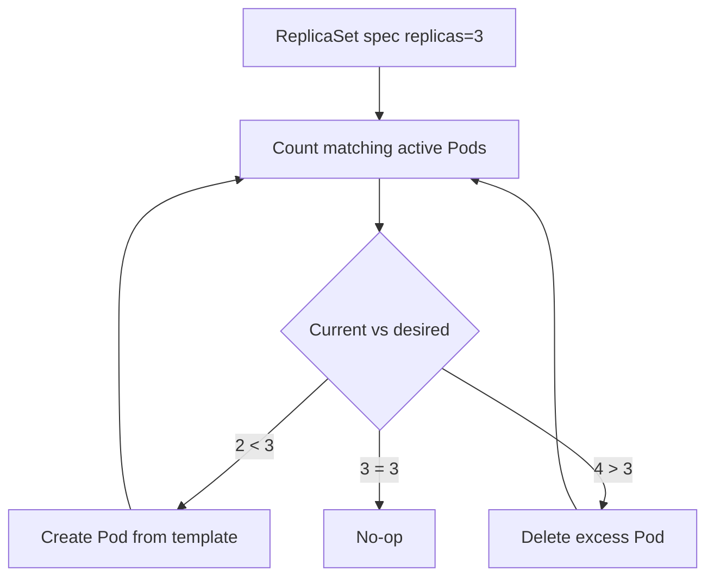

# ReplicaSet

## Mục lục

- [Tổng quan](#tổng-quan)
- [1. Reconciliation của ReplicaSet](#1-reconciliation-của-replicaset)
- [2. Cấu trúc manifest](#2-cấu-trúc-manifest)
- [3. Ownership, selector và Pod adoption](#3-ownership-selector-và-pod-adoption)
- [4. ReplicaSet và Deployment](#4-replicaset-và-deployment)
- [5. Scale và self-healing](#5-scale-và-self-healing)
- [6. Xóa và orphan Pods](#6-xóa-và-orphan-pods)
- [7. Thực hành](#7-thực-hành)
- [8. Troubleshooting](#8-troubleshooting)
- [9. Best practices](#9-best-practices)
- [Tài liệu tham khảo](#tài-liệu-tham-khảo)

---

## Tổng quan

ReplicaSet bảo đảm luôn có một số lượng Pod phù hợp với `spec.replicas` và label selector.

```text
desired=3
current matching Pods=2
         │
         ▼
ReplicaSet controller creates 1 Pod
```

Nếu có 4 matching Pods trong khi desired là 3, controller chọn một Pod để xóa. Đây là reconciliation liên tục, không phải command “tạo ba Pods” chạy một lần.

> [!IMPORTANT]
> Trong phần lớn use case stateless, hãy tạo **Deployment** thay vì ReplicaSet trực tiếp. Deployment quản lý ReplicaSets và cung cấp rollout, revision history, pause/resume, rollback.

---

## 1. Reconciliation của ReplicaSet

ReplicaSet controller lặp lại:

1. Đọc desired replicas và selector.
2. Liệt kê Pods khớp selector.
3. Xác định Pods thuộc quyền quản lý.
4. Tạo Pods nếu thiếu hoặc xóa Pods nếu thừa.
5. Cập nhật status.



ReplicaSet không bảo đảm ba Pod đều Ready. Nó chủ yếu duy trì số Pod; availability phụ thuộc scheduling, image, application và probes.

---

## 2. Cấu trúc manifest

```yaml
apiVersion: apps/v1
kind: ReplicaSet
metadata:
  name: web
  namespace: workloads-lab
  labels:
    app.kubernetes.io/name: web
spec:
  replicas: 3
  selector:
    matchLabels:
      app: web
      track: stable
  template:
    metadata:
      labels:
        app: web
        track: stable
    spec:
      containers:
        - name: nginx
          image: nginx:1.27-alpine
          ports:
            - name: http
              containerPort: 80
          resources:
            requests:
              cpu: 25m
              memory: 32Mi
            limits:
              memory: 64Mi
```

Ba field cốt lõi:

- `replicas`: số Pod mong muốn.
- `selector`: xác định tập Pods được quản lý.
- `template`: mẫu để tạo Pod mới.

Selector phải khớp labels trong template. Validate bằng:

```bash
kubectl apply --dry-run=server -f replicaset.yaml
```

---

## 3. Ownership, selector và Pod adoption

Pod do ReplicaSet tạo có `ownerReferences` trỏ về ReplicaSet:

```bash
kubectl get pod <pod> -n workloads-lab \
  -o jsonpath='{.metadata.ownerReferences[0].kind}{"/"}{.metadata.ownerReferences[0].name}{"\n"}'
```

### 3.1 Selector không đồng nghĩa ownership

Selector tìm candidates; ownerReference mô tả ownership/lifecycle. ReplicaSet có thể **adopt** Pod trần khớp selector nếu Pod chưa có controller owner phù hợp.

Tình huống nguy hiểm:

1. Có Pod trần `app=web`.
2. Tạo ReplicaSet selector `app=web`, replicas=3.
3. ReplicaSet tính Pod trần là một replica và có thể adopt nó.

Vì vậy selector phải cụ thể, không overlap với workload khác.

### 3.2 Sửa label có thể tạo replacement

Nếu xóa label match khỏi một Pod do ReplicaSet quản lý, Pod không còn được đếm. Controller tạo Pod mới để đủ desired. Pod cũ có thể vẫn tồn tại nhưng tách khỏi tập selection, gây dư workload ngoài ý muốn.

---

## 4. ReplicaSet và Deployment

Quan hệ:

```text
Deployment web
├── ReplicaSet web-7c9... (revision cũ, replicas=0)
└── ReplicaSet web-65f... (revision mới, replicas=3)
    ├── Pod
    ├── Pod
    └── Pod
```

Khi Pod template thay đổi, Deployment tạo ReplicaSet mới và scale giữa ReplicaSets theo strategy. ReplicaSet tự nó không rollout template update theo cách an toàn.

| Khả năng | ReplicaSet | Deployment |
|---|---:|---:|
| Duy trì số Pods | Có | Có, thông qua ReplicaSet |
| Rolling update | Không | Có |
| Revision history | Không | Có |
| Rollback | Không | Có |
| Khuyến nghị cho stateless app | Hiếm | Có |

Không sửa ReplicaSet do Deployment quản lý trực tiếp. Deployment controller có thể ghi đè thay đổi hoặc tạo state khó hiểu.

---

## 5. Scale và self-healing

Scale nhanh:

```bash
kubectl scale replicaset/web --replicas=5 -n workloads-lab
```

Nhưng nếu manifest/Git vẫn ghi `replicas: 3`, lần reconcile từ delivery tool có thể đưa về 3. Source of truth phải được cập nhật.

Self-healing:

```bash
POD="$(kubectl get pod -n workloads-lab -l app=web,track=stable -o jsonpath='{.items[0].metadata.name}')"
kubectl delete pod "$POD" -n workloads-lab
kubectl get pods -n workloads-lab -l app=web --watch
```

Pod mới có name và UID khác.

---

## 6. Xóa và orphan Pods

Xóa mặc định dùng background cascading deletion; dependent Pods được garbage collector xóa:

```bash
kubectl delete replicaset web -n workloads-lab
```

Có thể orphan Pods:

```bash
kubectl delete replicaset web -n workloads-lab --cascade=orphan
```

Pods tiếp tục chạy nhưng không còn controller duy trì. Đây là thao tác nâng cao, dễ tạo workload “mồ côi”; chỉ dùng khi có kế hoạch adoption/migration rõ.

Xem ownership trước và sau:

```bash
kubectl get pods -n workloads-lab -o yaml
```

---

## 7. Thực hành

```bash
kubectl create namespace workloads-lab
kubectl apply -f replicaset.yaml
kubectl wait --for=condition=Ready pod \
  -l app=web,track=stable \
  -n workloads-lab \
  --timeout=120s
```

Quan sát:

```bash
kubectl get replicaset,pods -n workloads-lab -o wide
kubectl describe replicaset web -n workloads-lab
kubectl get pods -n workloads-lab --show-labels
```

Scale và xóa một Pod:

```bash
kubectl scale replicaset/web --replicas=4 -n workloads-lab
kubectl get pods -n workloads-lab --watch
```

Trong terminal khác:

```bash
POD="$(kubectl get pod -n workloads-lab -l app=web,track=stable -o jsonpath='{.items[0].metadata.name}')"
kubectl delete pod "$POD" -n workloads-lab
```

Đưa manifest về desired state rồi apply lại:

```bash
kubectl apply -f replicaset.yaml
kubectl get replicaset web -n workloads-lab
kubectl delete namespace workloads-lab
```

---

## 8. Troubleshooting

### 8.1 Desired khác current

```bash
kubectl describe replicaset web -n workloads-lab
kubectl get pods -n workloads-lab -l app=web,track=stable
kubectl get events -n workloads-lab --sort-by=.metadata.creationTimestamp
```

Pods có thể bị Pending, rejected bởi admission hoặc không tạo được do quota.

### 8.2 Có nhiều Pods hơn dự kiến

Kiểm tra:

- Có Pods không còn match selector không?
- Có nhiều ReplicaSets selector overlap không?
- Deployment/HPA/GitOps có đang scale không?
- Pod terminating có còn hiển thị không?

```bash
kubectl get pods -n workloads-lab --show-labels
kubectl get replicasets -n workloads-lab -o wide
```

### 8.3 Sửa image nhưng Pods cũ không đổi

Thay `spec.template` trên ReplicaSet không cung cấp Deployment-style rolling update cho Pods đã tồn tại. Đây là lý do dùng Deployment.

---

## 9. Best practices

- Dùng Deployment làm API chính cho stateless long-running workload.
- Không sửa ReplicaSet do Deployment sở hữu.
- Thiết kế selector cụ thể, ổn định và không overlap.
- Không patch label Pod thủ công trong production.
- Quan sát `ownerReferences` để hiểu controller chain.
- Cập nhật source of truth khi scale.
- Dùng readiness/availability monitoring; đủ replica không có nghĩa đủ Ready.
- Chỉ dùng orphan deletion khi có migration plan và rollback rõ ràng.

Tiếp tục với [Deployment](/workloads/deployment/) để có rollout và rollback an toàn.

---

## Tài liệu tham khảo

- [ReplicaSet](https://kubernetes.io/docs/concepts/workloads/controllers/replicaset/)
- [Deployments](https://kubernetes.io/docs/concepts/workloads/controllers/deployment/)
- [Owners and Dependents](https://kubernetes.io/docs/concepts/overview/working-with-objects/owners-dependents/)
