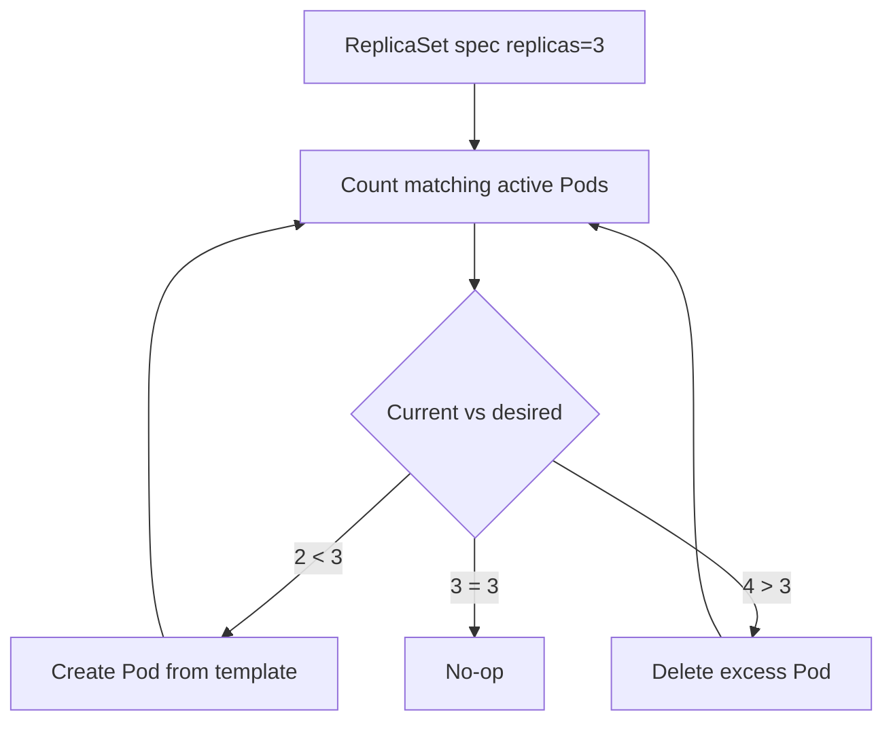

# ReplicaSet

## Mục lục

- [Tổng quan](#tổng-quan)
- [1. Reconciliation của ReplicaSet](#1-reconciliation-của-replicaset)
- [2. Cấu trúc manifest](#2-cấu-trúc-manifest)
- [3. Ownership, selector và Pod adoption](#3-ownership-selector-và-pod-adoption)
- [4. ReplicaSet và Deployment](#4-replicaset-và-deployment)
- [5. Scale và self-healing](#5-scale-và-self-healing)
- [6. Xóa và orphan Pods](#6-xóa-và-orphan-pods)
- [7. Thực hành](#7-thực-hành)
- [8. Troubleshooting](#8-troubleshooting)
- [9. Best practices](#9-best-practices)
- [Tài liệu tham khảo](#tài-liệu-tham-khảo)

---

## Tổng quan

ReplicaSet bảo đảm luôn có một số lượng Pod phù hợp với `spec.replicas` và label selector.

```text
desired=3
current matching Pods=2
         │
         ▼
ReplicaSet controller creates 1 Pod
```

Nếu có 4 matching Pods trong khi desired là 3, controller chọn một Pod để xóa. Đây là reconciliation liên tục, không phải command “tạo ba Pods” chạy một lần.

> [!IMPORTANT]
> Trong phần lớn use case stateless, hãy tạo **Deployment** thay vì ReplicaSet trực tiếp. Deployment quản lý ReplicaSets và cung cấp rollout, revision history, pause/resume, rollback.

---

## 1. Reconciliation của ReplicaSet

ReplicaSet controller lặp lại:

1. Đọc desired replicas và selector.
2. Liệt kê Pods khớp selector.
3. Xác định Pods thuộc quyền quản lý.
4. Tạo Pods nếu thiếu hoặc xóa Pods nếu thừa.
5. Cập nhật status.



ReplicaSet không bảo đảm ba Pod đều Ready. Nó chủ yếu duy trì số Pod; availability phụ thuộc scheduling, image, application và probes.

---

## 2. Cấu trúc manifest

```yaml
apiVersion: apps/v1
kind: ReplicaSet
metadata:
  name: web
  namespace: workloads-lab
  labels:
    app.kubernetes.io/name: web
spec:
  replicas: 3
  selector:
    matchLabels:
      app: web
      track: stable
  template:
    metadata:
      labels:
        app: web
        track: stable
    spec:
      containers:
        - name: nginx
          image: nginx:1.27-alpine
          ports:
            - name: http
              containerPort: 80
          resources:
            requests:
              cpu: 25m
              memory: 32Mi
            limits:
              memory: 64Mi
```

Ba field cốt lõi:

- `replicas`: số Pod mong muốn.
- `selector`: xác định tập Pods được quản lý.
- `template`: mẫu để tạo Pod mới.

Selector phải khớp labels trong template. Validate bằng:

```bash
kubectl apply --dry-run=server -f replicaset.yaml
```

---

## 3. Ownership, selector và Pod adoption

Phần này dễ nhầm vì ReplicaSet dùng **label selector** để tìm Pods, nhưng dùng **ownerReferences** để biểu diễn quan hệ sở hữu. Có thể nhớ ngắn gọn như sau:

| Thành phần | Trả lời câu hỏi | Vai trò |
|---|---|---|
| `spec.selector` | “Pod nào có label phù hợp?” | Bộ lọc để ReplicaSet đếm và tìm Pods trong cùng Namespace |
| `metadata.ownerReferences` trên Pod | “Pod này thuộc controller nào?” | Quan hệ lifecycle để controller và garbage collector biết ai quản lý Pod |
| Pod adoption | “Pod có sẵn này có thể được ReplicaSet nhận quản lý không?” | Cơ chế nhận Pod khớp selector khi Pod chưa có controller owner khác |

Pod do ReplicaSet tạo sẽ có `ownerReferences` trỏ về ReplicaSet:

```bash
kubectl get pod <pod> -n workloads-lab \
  -o jsonpath='{.metadata.ownerReferences[0].kind}{"/"}{.metadata.ownerReferences[0].name}{"\n"}'
```

Kết quả dạng sau nghĩa là Pod đang thuộc ReplicaSet `web`:

```text
ReplicaSet/web
```

### 3.1 Selector là bộ lọc, không phải bằng chứng ownership

Giả sử ReplicaSet có selector:

```yaml
selector:
  matchLabels:
    app: web
    track: stable
```

ReplicaSet sẽ tìm các Pod có đủ hai label `app=web` và `track=stable`. Một Pod khớp selector chưa chắc ban đầu do ReplicaSet tạo; nó chỉ là một candidate mà controller nhìn thấy.

Ví dụ, Pod thủ công sau khớp selector nhưng không có controller owner:

```yaml
apiVersion: v1
kind: Pod
metadata:
  name: manual-web
  namespace: workloads-lab
  labels:
    app: web
    track: stable
spec:
  containers:
    - name: nginx
      image: nginx:latest
```

Nếu sau đó tạo ReplicaSet `web` với `replicas: 3` và selector `app=web,track=stable`, ReplicaSet có thể **adopt** Pod `manual-web`. Khi đó controller tính Pod này là một replica đã có và chỉ cần tạo thêm hai Pod nữa.

```text
Trước khi tạo ReplicaSet:
manual-web      labels app=web,track=stable      owner=<none>

Sau khi ReplicaSet reconcile:
manual-web      labels app=web,track=stable      owner=ReplicaSet/web
web-xxxxx       labels app=web,track=stable      owner=ReplicaSet/web
web-yyyyy       labels app=web,track=stable      owner=ReplicaSet/web
```

Điểm quan trọng: adoption không bảo đảm Pod được nhận nuôi giống `spec.template` của ReplicaSet. Pod `manual-web` ở ví dụ trên dùng `nginx:latest`, trong khi template ReplicaSet có thể dùng `nginx:1.27-alpine`. ReplicaSet vẫn có thể đếm Pod đó nếu label khớp và Pod chưa thuộc controller khác.

> [!WARNING]
> Không dùng selector quá chung như chỉ `app: web` nếu trong Namespace có thể tồn tại nhiều workload web khác nhau. Selector overlap có thể làm ReplicaSet đếm nhầm hoặc adopt nhầm Pod.

### 3.2 Thiết kế selector đủ cụ thể

Selector nên đại diện cho identity ổn định của workload, không chỉ một label trang trí. Thay vì chỉ dùng:

```yaml
selector:
  matchLabels:
    app: web
```

nên dùng tập label ít có khả năng trùng với workload khác:

```yaml
selector:
  matchLabels:
    app.kubernetes.io/name: web
    app.kubernetes.io/instance: web-prod
    app.kubernetes.io/component: frontend
```

Nhóm `app.kubernetes.io/*` là convention được Kubernetes khuyến nghị để mô tả app theo cùng một schema giữa nhiều workload và tool. Nó không bắt buộc, nhưng giúp selector, query và dashboard rõ nghĩa hơn so với một label quá chung như `app=web`. Xem thêm mục [Schema labels khuyến nghị](/workloads/labels-annotations-selectors/#5-schema-labels-khuyến-nghị) trong bài Labels, Annotations và Selectors.

Các label trong `spec.selector.matchLabels` phải xuất hiện trong `spec.template.metadata.labels`; nếu không, ReplicaSet sẽ không tạo được Pod hợp lệ vì Pods mới không khớp chính selector của nó.

```yaml
spec:
  selector:
    matchLabels:
      app.kubernetes.io/name: web
      app.kubernetes.io/instance: web-prod
  template:
    metadata:
      labels:
        app.kubernetes.io/name: web
        app.kubernetes.io/instance: web-prod
        app.kubernetes.io/component: frontend
```

### 3.3 Sửa label có thể tạo replacement

Nếu xóa một label nằm trong selector khỏi Pod đang do ReplicaSet quản lý, Pod đó không còn được ReplicaSet đếm. Controller sẽ tạo Pod mới để đạt lại `spec.replicas`.

Ví dụ ban đầu ReplicaSet muốn 3 Pods và cả 3 đều khớp selector `app=web,track=stable`:

```text
web-abc   app=web,track=stable   owner=ReplicaSet/web
web-def   app=web,track=stable   owner=ReplicaSet/web
web-ghi   app=web,track=stable   owner=ReplicaSet/web
```

Nếu bạn xóa label `track` khỏi `web-abc`:

```bash
kubectl label pod web-abc track- -n workloads-lab
```

ReplicaSet chỉ còn thấy hai Pod khớp selector, nên nó tạo thêm một Pod mới:

```text
web-abc   app=web                không còn được selector đếm
web-def   app=web,track=stable   được selector đếm
web-ghi   app=web,track=stable   được selector đếm
web-new   app=web,track=stable   Pod replacement mới
```

Tổng số Pod chạy có thể thành 4, nhưng ReplicaSet chỉ xem 3 Pod còn khớp selector là tập mong muốn. Vì vậy không sửa label identity của Pod thủ công trong production; hãy sửa manifest của controller hoặc rollout workload mới nếu cần đổi selector.

---

## 4. ReplicaSet và Deployment

Quan hệ:

```text
Deployment web
├── ReplicaSet web-7c9... (revision cũ, replicas=0)
└── ReplicaSet web-65f... (revision mới, replicas=3)
    ├── Pod
    ├── Pod
    └── Pod
```

Khi Pod template thay đổi, Deployment tạo ReplicaSet mới và scale giữa ReplicaSets theo strategy. ReplicaSet tự nó không rollout template update theo cách an toàn.

| Khả năng | ReplicaSet | Deployment |
|---|---:|---:|
| Duy trì số Pods | Có | Có, thông qua ReplicaSet |
| Rolling update | Không | Có |
| Revision history | Không | Có |
| Rollback | Không | Có |
| Khuyến nghị cho stateless app | Hiếm | Có |

### 4.1 Vì sao không sửa ReplicaSet con trực tiếp?

Khi ReplicaSet được tạo bởi Deployment, ReplicaSet đó là **object con**. Source of truth lúc này là Deployment, không phải ReplicaSet. Bạn có thể nhận ra quan hệ này bằng `ownerReferences` của ReplicaSet:

```bash
kubectl get replicaset <rs-name> -n workloads-lab \
  -o jsonpath='{.metadata.ownerReferences[0].kind}{"/"}{.metadata.ownerReferences[0].name}{"\n"}'
```

Nếu kết quả là `Deployment/web`, hãy sửa Deployment thay vì sửa ReplicaSet.

Lý do: Deployment controller liên tục reconcile danh sách ReplicaSets con dựa trên `spec` của Deployment. Nếu bạn sửa trực tiếp ReplicaSet con, thay đổi đó không trở thành desired state chính thức của ứng dụng.

Ví dụ Deployment `web` khai báo `replicas: 3`, nhưng bạn scale ReplicaSet con lên 5:

```bash
kubectl scale replicaset/web-65f... --replicas=5 -n workloads-lab
```

Trong lần reconcile tiếp theo, Deployment controller vẫn nhìn Deployment và thấy desired state là 3 replicas. Nó có thể scale ReplicaSet con về lại số mà Deployment đang tính toán. Vì vậy bạn thấy lệnh vừa chạy có vẻ thành công, nhưng trạng thái sau đó lại “tự quay về”.

Một ví dụ khác là sửa Pod template trên ReplicaSet con. ReplicaSet không có cơ chế rollout an toàn như Deployment, còn Deployment lại theo dõi revision dựa trên template trong Deployment. Kết quả có thể là revision history, rollout status và số Pod thực tế không khớp với điều bạn nghĩ.

Quy tắc thực hành:

- Muốn đổi image, env, resource, probe hoặc label template: sửa `Deployment.spec.template`.
- Muốn scale app: sửa `Deployment.spec.replicas` hoặc dùng `kubectl scale deployment/web`.
- Chỉ xem ReplicaSet con để debug rollout, revision và Pods; không xem nó là nơi cấu hình ứng dụng lâu dài.

---

## 5. Scale và self-healing

ReplicaSet luôn so sánh hai con số:

```text
spec.replicas      = số Pod mong muốn
matching Pods      = số Pod hiện đang khớp selector và còn active
```

Nếu `matching Pods` ít hơn `spec.replicas`, ReplicaSet tạo thêm Pod từ `spec.template`. Nếu nhiều hơn, ReplicaSet xóa bớt Pod. Vì vậy scale thực chất là đổi `spec.replicas`, sau đó để controller reconcile.

### 5.1 Scale là đổi số mong muốn

Lệnh sau không “tạo ngay 5 Pod” theo kiểu imperative. Nó cập nhật field `spec.replicas` của ReplicaSet `web` thành `5`:

```bash
kubectl scale replicaset/web --replicas=5 -n workloads-lab
```

Sau đó ReplicaSet controller thấy desired state mới:

```text
Trước khi scale:
spec.replicas = 3
matching Pods = 3

Sau khi chạy kubectl scale --replicas=5:
spec.replicas = 5
matching Pods = 3
ReplicaSet tạo thêm 2 Pod
```

Kiểm tra trạng thái bằng:

```bash
kubectl get replicaset web -n workloads-lab
kubectl get pods -n workloads-lab -l app=web,track=stable
```

Điểm dễ nhầm là lệnh `kubectl scale` chỉ sửa live object trên cluster. Nếu file manifest hoặc GitOps tool vẫn khai báo `replicas: 3`, lần apply/reconcile tiếp theo có thể đưa ReplicaSet về lại 3.

```text
Cluster hiện tại:  replicas=5   # do kubectl scale
Git/manifest:      replicas=3   # source of truth cũ
Lần apply sau:     replicas quay về 3
```

Vì vậy trong môi trường dùng manifest/GitOps, hãy cập nhật source of truth thay vì chỉ scale thủ công. Scale thủ công phù hợp cho lab, xử lý tạm thời hoặc khi bạn biết rõ tool nào đang sở hữu field `spec.replicas`.

### 5.2 Self-healing là tạo Pod thay thế

Self-healing của ReplicaSet nghĩa là: khi một Pod thuộc tập quản lý bị xóa hoặc không còn active, ReplicaSet tạo Pod khác để đủ số lượng mong muốn.

Ví dụ lấy một Pod đang khớp selector rồi xóa nó:

```bash
POD="$(kubectl get pod -n workloads-lab -l app=web,track=stable -o jsonpath='{.items[0].metadata.name}')"
kubectl delete pod "$POD" -n workloads-lab
kubectl get pods -n workloads-lab -l app=web,track=stable --watch
```

Bạn sẽ thấy Pod cũ chuyển sang `Terminating`, sau đó Pod mới xuất hiện với tên khác:

```text
web-abc     Terminating
web-new     Pending
web-new     Running
```

Pod mới có name và UID khác vì ReplicaSet không “sửa” Pod cũ. Nó tạo một Pod mới từ `spec.template`.

Self-healing này có giới hạn quan trọng:

- Nếu container trong Pod crash, kubelet thường restart container trong chính Pod đó theo `restartPolicy`; ReplicaSet không trực tiếp restart container.
- Nếu Pod mới bị `Pending` do thiếu CPU/memory hoặc lỗi scheduling, ReplicaSet đã tạo Pod nhưng ứng dụng vẫn chưa available.
- ReplicaSet chủ yếu duy trì **số Pod**, không bảo đảm Pod đã Ready để nhận traffic. Readiness và availability cần được kiểm tra riêng.

---

## 6. Xóa và orphan Pods

Khi xóa ReplicaSet, cần phân biệt hai lựa chọn: xóa luôn Pods con, hoặc giữ Pods lại và bỏ quan hệ ownership.

### 6.1 Xóa mặc định: ReplicaSet và Pods con đều bị dọn

Pod do ReplicaSet tạo có `ownerReferences` trỏ về ReplicaSet. Khi bạn xóa ReplicaSet theo cách thông thường, Kubernetes garbage collector dùng quan hệ này để xóa các dependent Pods.

```bash
kubectl delete replicaset web -n workloads-lab
```

Có thể hình dung như sau:

```text
Trước khi xóa:
ReplicaSet/web
└── Pods owner=ReplicaSet/web

Sau khi xóa mặc định:
ReplicaSet/web bị xóa
Pods con cũng bị garbage collector xóa
```

`kubectl delete` có thể trả về trước khi mọi Pod biến mất hoàn toàn, vì Pod còn trải qua giai đoạn graceful termination. Kiểm tra bằng:

```bash
kubectl get pods -n workloads-lab -l app=web,track=stable --watch
```

Cách này phù hợp khi bạn muốn dọn workload do ReplicaSet quản lý.

### 6.2 Orphan deletion: xóa ReplicaSet nhưng giữ Pods lại

`--cascade=orphan` nói với Kubernetes: “xóa ReplicaSet, nhưng đừng xóa các dependent Pods”. Kubernetes sẽ bỏ quan hệ owner khỏi Pods, còn Pods vẫn tiếp tục chạy.

```bash
kubectl delete replicaset web -n workloads-lab --cascade=orphan
```

Sau thao tác này, trạng thái sẽ giống như:

```text
Trước khi orphan:
ReplicaSet/web
└── web-abc   owner=ReplicaSet/web
└── web-def   owner=ReplicaSet/web
└── web-ghi   owner=ReplicaSet/web

Sau khi orphan:
ReplicaSet/web không còn
web-abc   owner=<none>   vẫn chạy
web-def   owner=<none>   vẫn chạy
web-ghi   owner=<none>   vẫn chạy
```

Kiểm tra owner của Pods:

```bash
kubectl get pods -n workloads-lab -l app=web,track=stable \
  -o custom-columns='NAME:.metadata.name,OWNER_KIND:.metadata.ownerReferences[0].kind,OWNER_NAME:.metadata.ownerReferences[0].name'
```

Orphan Pods không còn controller duy trì. Nếu một Pod orphan bị xóa hoặc chết hẳn, ReplicaSet cũ không còn tồn tại để tạo Pod thay thế. Nếu sau đó bạn tạo ReplicaSet mới có selector khớp các Pods orphan, ReplicaSet mới có thể adopt chúng.

> [!WARNING]
> Orphan deletion là thao tác nâng cao. Dùng sai có thể để lại workload vẫn chạy nhưng không còn controller, dễ gây nhầm khi troubleshooting hoặc migration. Chỉ dùng khi bạn có kế hoạch rõ ràng: ai sẽ quản lý Pods sau đó, khi nào dọn Pods, và rollback ra sao nếu adoption/migration không đúng.

---

## 7. Thực hành

```bash
kubectl create namespace workloads-lab
kubectl apply -f replicaset.yaml
kubectl wait --for=condition=Ready pod \
  -l app=web,track=stable \
  -n workloads-lab \
  --timeout=120s
```

Quan sát:

```bash
kubectl get replicaset,pods -n workloads-lab -o wide
kubectl describe replicaset web -n workloads-lab
kubectl get pods -n workloads-lab --show-labels
```

Scale và xóa một Pod:

```bash
kubectl scale replicaset/web --replicas=4 -n workloads-lab
kubectl get pods -n workloads-lab --watch
```

Trong terminal khác:

```bash
POD="$(kubectl get pod -n workloads-lab -l app=web,track=stable -o jsonpath='{.items[0].metadata.name}')"
kubectl delete pod "$POD" -n workloads-lab
```

Đưa manifest về desired state rồi apply lại:

```bash
kubectl apply -f replicaset.yaml
kubectl get replicaset web -n workloads-lab
kubectl delete namespace workloads-lab
```

---

## 8. Troubleshooting

### 8.1 Desired khác current

```bash
kubectl describe replicaset web -n workloads-lab
kubectl get pods -n workloads-lab -l app=web,track=stable
kubectl get events -n workloads-lab --sort-by=.metadata.creationTimestamp
```

Pods có thể bị Pending, rejected bởi admission hoặc không tạo được do quota.

### 8.2 Có nhiều Pods hơn dự kiến

Kiểm tra:

- Có Pods không còn match selector không?
- Có nhiều ReplicaSets selector overlap không?
- Deployment/HPA/GitOps có đang scale không?
- Pod terminating có còn hiển thị không?

```bash
kubectl get pods -n workloads-lab --show-labels
kubectl get replicasets -n workloads-lab -o wide
```

### 8.3 Sửa image nhưng Pods cũ không đổi

Thay `spec.template` trên ReplicaSet không cung cấp Deployment-style rolling update cho Pods đã tồn tại. Đây là lý do dùng Deployment.

---

## 9. Best practices

- Dùng Deployment làm API chính cho stateless long-running workload.
- Không sửa ReplicaSet do Deployment sở hữu.
- Thiết kế selector cụ thể, ổn định và không overlap.
- Không patch label Pod thủ công trong production.
- Quan sát `ownerReferences` để hiểu controller chain.
- Cập nhật source of truth khi scale.
- Dùng readiness/availability monitoring; đủ replica không có nghĩa đủ Ready.
- Chỉ dùng orphan deletion khi có migration plan và rollback rõ ràng.

Tiếp tục với [Deployment](/workloads/deployment/) để có rollout và rollback an toàn.

---

## Tài liệu tham khảo

- [ReplicaSet](https://kubernetes.io/docs/concepts/workloads/controllers/replicaset/)
- [Deployments](https://kubernetes.io/docs/concepts/workloads/controllers/deployment/)
- [Owners and Dependents](https://kubernetes.io/docs/concepts/overview/working-with-objects/owners-dependents/)
