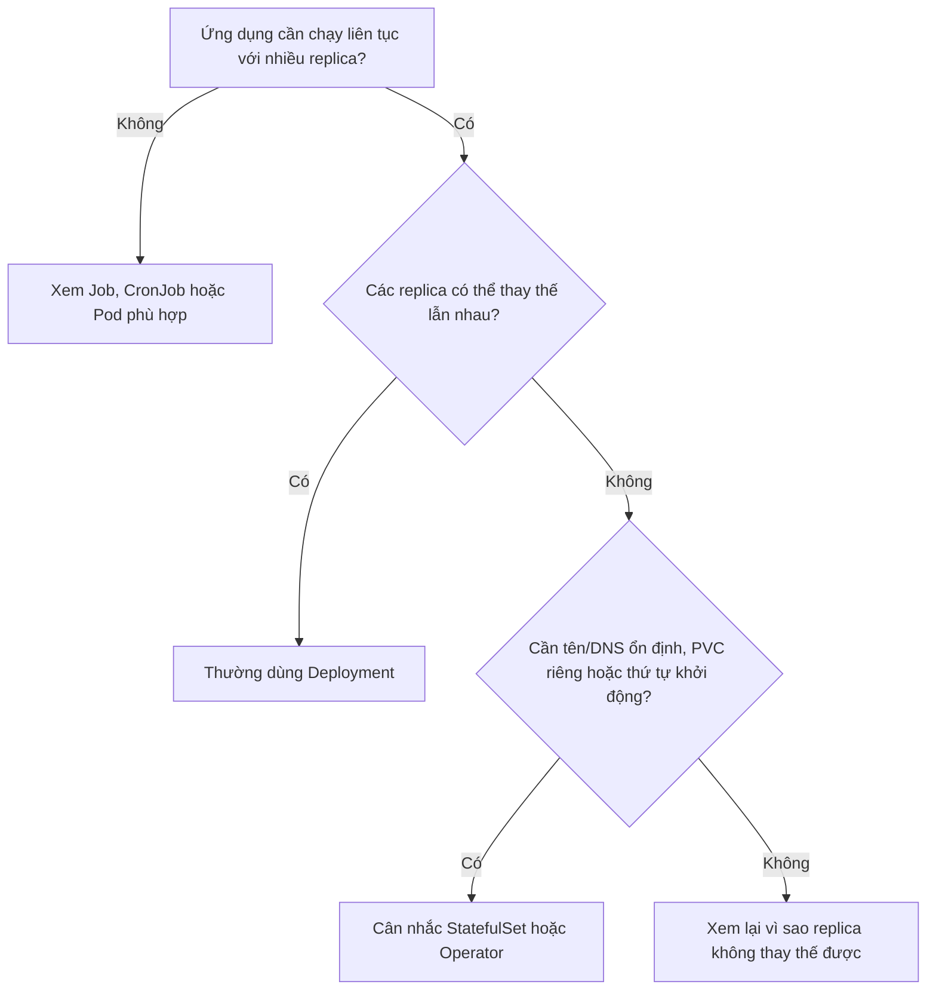
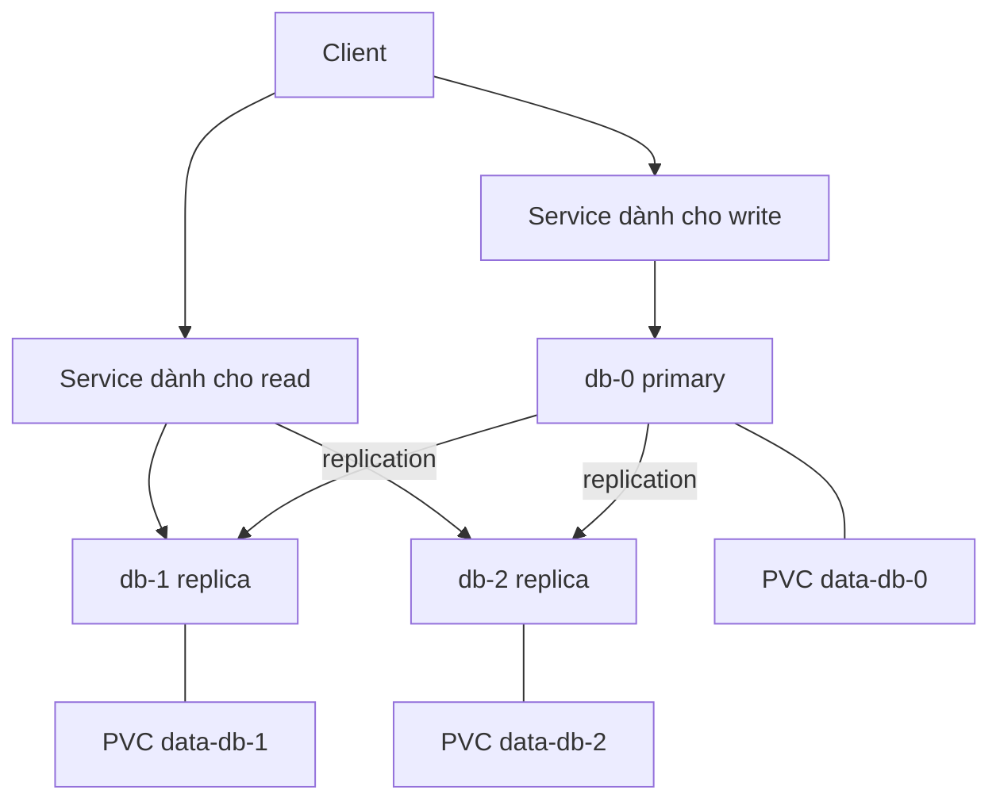

# StatefulSet

## Mục lục

- [StatefulSet giải quyết vấn đề gì?](#statefulset-giải-quyết-vấn-đề-gì)
- [Quyết định nhanh: có cần StatefulSet không?](#quyết-định-nhanh-có-cần-statefulset-không)
- [Khác biệt cốt lõi với Deployment](#khác-biệt-cốt-lõi-với-deployment)
- [Bốn khả năng StatefulSet cung cấp](#bốn-khả-năng-statefulset-cung-cấp)
- [Ví dụ thực tế: một database cluster ba thành viên](#ví-dụ-thực-tế-một-database-cluster-ba-thành-viên)
- [Headless Service dùng để làm gì?](#headless-service-dùng-để-làm-gì)
- [Mỗi replica nhận storage riêng như thế nào?](#mỗi-replica-nhận-storage-riêng-như-thế-nào)
- [Đọc một manifest hoàn chỉnh](#đọc-một-manifest-hoàn-chỉnh)
- [Lifecycle của từng Pod và PVC](#lifecycle-của-từng-pod-và-pvc)
- [Thứ tự create, scale và update](#thứ-tự-create-scale-và-update)
- [StatefulSet không làm thay ứng dụng điều gì?](#statefulset-không-làm-thay-ứng-dụng-điều-gì)
- [Khi nào nên và không nên dùng?](#khi-nào-nên-và-không-nên-dùng)
- [Thực hành: quan sát identity và dữ liệu sống qua Pod replacement](#thực-hành-quan-sát-identity-và-dữ-liệu-sống-qua-pod-replacement)
- [Troubleshooting theo từng lớp](#troubleshooting-theo-từng-lớp)
- [Best practices cho production](#best-practices-cho-production)
- [Tóm tắt](#tóm-tắt)
- [Tài liệu tham khảo](#tài-liệu-tham-khảo)

---

## StatefulSet giải quyết vấn đề gì?

Hãy bắt đầu bằng hai ứng dụng cùng có ba replica.

Ứng dụng thứ nhất là một web API. Mọi replica chạy cùng code, không lưu dữ liệu quan trọng trên disk local và dùng một database bên ngoài:

```text
api Pod A ─┐
api Pod B ─┼─ mọi Pod đều xử lý được request như nhau
api Pod C ─┘
```

Nếu Pod A chết, Kubernetes có thể tạo một Pod tên khác trên Node khác. Không ai quan tâm Pod mới có phải “A” hay không, vì các replica **có thể thay thế lẫn nhau**. Đây là trường hợp phù hợp với `Deployment`.

Ứng dụng thứ hai là một database cluster:

```text
db-0 → member ID 0 → disk chứa dữ liệu của member 0
db-1 → member ID 1 → disk chứa dữ liệu của member 1
db-2 → member ID 2 → disk chứa dữ liệu của member 2
```

Mỗi replica có danh tính và dữ liệu riêng. Nếu `db-1` chết, Pod thay thế phải tiếp tục là `db-1`, tìm lại đúng disk của `db-1` và có địa chỉ mạng mà các thành viên khác dự đoán được. Không thể lấy ngẫu nhiên disk của `db-0` gắn cho nó.

**StatefulSet dùng để quản lý nhóm Pod không hoàn toàn thay thế lẫn nhau.** Nó gắn cho từng replica một ordinal ổn định như `0`, `1`, `2`, rồi dùng ordinal đó để giữ mối quan hệ giữa:

```text
Pod identity ↔ network identity ↔ storage identity
```

Ví dụ:

```text
Pod db-1
├── tên ổn định: db-1
├── DNS ổn định: db-1.db-headless.production.svc.cluster.local
└── PVC ổn định: data-db-1
```

Khi Pod `db-1` được tạo lại, UID, IP, container và Node có thể thay đổi. Điều được giữ là **logical identity** `db-1` và mối liên hệ với PVC `data-db-1`.

> [!IMPORTANT]
> “Stateful” không chỉ có nghĩa là application có ghi dữ liệu. Câu hỏi quan trọng hơn là: **mỗi replica có cần identity hoặc storage riêng được giữ lại khi Pod bị thay thế không?**

## Quyết định nhanh: có cần StatefulSet không?

Dùng ba câu hỏi sau:



Dấu hiệu mạnh cho thấy cần StatefulSet:

- Mỗi replica phải giữ một member ID cố định.
- Mỗi replica cần một PVC riêng và phải nhận lại đúng PVC sau khi được tạo lại.
- Các thành viên phải gọi trực tiếp nhau qua hostname ổn định.
- Ứng dụng cần khởi động hoặc dừng theo thứ tự.
- Scale up cần thêm member mới theo ordinal có thể dự đoán.

Dấu hiệu cho thấy Deployment thường đủ:

- Mọi replica xử lý request giống nhau.
- Dữ liệu nằm trong managed database, object storage hoặc dịch vụ bên ngoài.
- Pod mới có tên, IP và Node khác cũng không ảnh hưởng.
- Chỉ cần một Service load-balance tới bất kỳ replica ready nào.

> [!NOTE]
> Một ứng dụng “có state” vẫn có thể dùng Deployment. Ví dụ web API lưu session trong Redis và dữ liệu trong PostgreSQL bên ngoài cluster vẫn là workload stateless ở tầng Pod. Ngược lại, một hệ thống cache có thể cần StatefulSet nếu từng member giữ shard riêng và tham gia cluster bằng identity cố định.

## Khác biệt cốt lõi với Deployment

Deployment và StatefulSet đều duy trì số Pod mong muốn, recreate Pod bị lỗi và rollout Pod template. Khác biệt nằm ở cách chúng nhìn các replica.

### Deployment: replica là bản sao có thể thay thế

```text
Deployment api, replicas=3
├── api-7c8d9f-4k2m1
├── api-7c8d9f-7n5p3
└── api-7c8d9f-b8q6r
```

Tên Pod chứa phần ngẫu nhiên. Khi một Pod mất, Pod mới có tên khác. Service thường che giấu toàn bộ Pod phía sau một địa chỉ chung; client không cần chọn replica cụ thể.

### StatefulSet: replica là một slot có identity riêng

```text
StatefulSet db, replicas=3
├── db-0 ↔ data-db-0
├── db-1 ↔ data-db-1
└── db-2 ↔ data-db-2
```

Các slot được đánh số theo ordinal. Khi `db-1` mất, StatefulSet tạo lại **`db-1`**, không tạo `db-3` để thay thế. Pod mới tiếp tục reference PVC của ordinal `1`.

| Câu hỏi | Deployment | StatefulSet |
|---|---|---|
| Replica có thay thế lẫn nhau không? | Có, đây là giả định chính | Không nhất thiết |
| Tên Pod có ổn định không? | Không | Có, theo ordinal |
| Có DNS riêng ổn định cho từng Pod không? | Không phải contract chính | Có qua Headless Service |
| Tạo một PVC riêng cho mỗi replica? | Phải tự thiết kế | Có `volumeClaimTemplates` |
| Create/scale theo thứ tự? | Không theo ordinal | Có mặc định |
| Use case phổ biến | Web, API, worker stateless | Database, broker, distributed store |

StatefulSet không “tốt hơn” Deployment. Nó có nhiều constraint hơn, rollout chậm hơn và vận hành storage phức tạp hơn. Chỉ trả chi phí đó khi ứng dụng thực sự cần các guarantee của StatefulSet.

## Bốn khả năng StatefulSet cung cấp

### 1. Tên Pod ổn định

Với StatefulSet tên `db`, `replicas: 3`, Pod luôn dùng các ordinal từ `0` đến `2`:

```text
db-0
db-1
db-2
```

Khi `db-1` bị xóa, controller tạo lại Pod tên `db-1`. “Ổn định” không có nghĩa object Pod cũ sống lại; Pod mới có UID mới.

Kiểm tra ordinal ngay trong container:

```bash
hostname
```

Nhiều application hoặc init container tách số cuối từ hostname để tạo member ID hay chọn cấu hình. Ví dụ ordinal `0` có thể bootstrap cluster, còn ordinal lớn hơn join member có trước. Logic đó thuộc application hoặc Operator, không tự xuất hiện chỉ vì dùng StatefulSet.

### 2. DNS riêng ổn định cho từng Pod

Kết hợp StatefulSet với Headless Service tạo DNS dạng:

```text
<pod-name>.<service-name>.<namespace>.svc.cluster.local
```

Ví dụ:

```text
db-0.db-headless.production.svc.cluster.local
db-1.db-headless.production.svc.cluster.local
db-2.db-headless.production.svc.cluster.local
```

Pod IP có thể đổi sau reschedule, nhưng DNS name logic vẫn giữ nguyên và sẽ resolve tới IP mới khi discovery state cập nhật.

### 3. PVC riêng ổn định cho từng Pod

Nếu `volumeClaimTemplates` có template tên `data`, StatefulSet `db` tạo:

```text
data-db-0
data-db-1
data-db-2
```

Pod `db-1` luôn mount `data-db-1`. Xóa Pod không xóa PVC mặc định; Pod thay thế gắn lại claim cũ.

### 4. Thứ tự có kiểm soát

Với policy mặc định `OrderedReady`:

```text
Tạo: db-0 Ready → db-1 Ready → db-2 Ready
Xóa/scale down: db-2 dừng → db-1 dừng → db-0 dừng
Update: thường từ ordinal cao xuống thấp
```

Thứ tự này hữu ích khi member sau phụ thuộc member trước để bootstrap hoặc join cluster. Nó cũng có trade-off: chỉ một Pod không Ready có thể chặn toàn bộ scale up hay rollout phía sau.

## Ví dụ thực tế: một database cluster ba thành viên

Hình dung một database có một primary và hai replica:



StatefulSet giúp cung cấp các building block:

- `db-0`, `db-1`, `db-2` có identity dự đoán được.
- `db-1` có thể tìm `db-0` qua DNS ổn định.
- Mỗi Pod có disk riêng.
- `db-0` có thể được tạo và Ready trước khi `db-1` bắt đầu.

Nhưng StatefulSet **không tự làm** các việc sau:

- Cài đặt database replication.
- Chọn `db-0` làm primary.
- Promote `db-1` khi primary chết.
- Biết member nào đã đồng bộ dữ liệu.
- Route write tới primary mới.
- Backup hoặc kiểm tra restore.

Những việc đó phải do database, script vận hành hoặc Operator thực hiện. Trong production, database Operator thường phù hợp hơn manifest StatefulSet tự viết vì Operator hiểu protocol của database: bootstrap, member replacement, failover, backup và upgrade.

### Những workload thường cần mô hình này

- PostgreSQL/MySQL cluster tự vận hành.
- Kafka hoặc message broker có broker identity và data log riêng.
- Elasticsearch/OpenSearch data node.
- ZooKeeper, etcd và distributed consensus store.
- Redis cluster khi mỗi member giữ shard hoặc replica riêng.

Danh sách này không phải quy tắc “thấy database là dùng StatefulSet”. Managed database ngoài cluster không cần StatefulSet trong cluster; một database production phức tạp cũng có thể nên dùng Operator thay vì StatefulSet thuần.

## Headless Service dùng để làm gì?

StatefulSet cần một Headless Service làm governing Service cho network identity. `Headless` nghĩa là Service không có virtual ClusterIP:

```yaml
apiVersion: v1
kind: Service
metadata:
  name: db-headless
  namespace: production
spec:
  clusterIP: None
  selector:
    app: db
  ports:
    - name: database
      port: 5432
```

StatefulSet reference Service này:

```yaml
spec:
  serviceName: db-headless
```

### Vì sao không chỉ dùng Service bình thường?

Service bình thường trả lời câu hỏi:

> “Hãy đưa tôi tới **một Pod ready bất kỳ** của ứng dụng.”

Headless Service giúp trả lời câu hỏi:

> “Địa chỉ của **member `db-1` cụ thể** là gì?”

```text
Service bình thường: db.production.svc → một endpoint phù hợp
Headless + Pod DNS: db-1.db-headless.production.svc → đúng member db-1
```

Distributed application thường cần cả hai:

1. **Headless Service** để các peer tìm từng member cụ thể.
2. **Service bình thường** để client gọi một nhóm Pod ready.

Tuy nhiên Service bình thường không tự biết Pod nào là primary. Nếu chỉ primary được nhận write, application hoặc Operator phải cập nhật label/endpoint để Service write chọn đúng primary.

> [!IMPORTANT]
> Headless Service không tự expose ứng dụng ra ngoài cluster và không phải một load balancer đặc biệt. Nó chủ yếu cung cấp service discovery trực tiếp tới Pod endpoints.

Theo behavior DNS và readiness, hostname của Pod mới có thể chưa resolve ngay. Một số hệ thống cần peer discovery trước khi Pod Ready và có thể dùng `publishNotReadyAddresses: true` trên Headless Service. Chỉ bật khi hiểu bootstrap protocol, vì DNS khi đó cũng có thể trả endpoint chưa sẵn sàng phục vụ client.

## Mỗi replica nhận storage riêng như thế nào?

Deployment có thể mount một PVC đã tạo sẵn, nhưng không có cơ chế native tương đương `volumeClaimTemplates` để tự tạo một claim riêng theo từng replica.

StatefulSet khai báo template một lần:

```yaml
volumeClaimTemplates:
  - metadata:
      name: data
    spec:
      accessModes:
        - ReadWriteOnce
      resources:
        requests:
          storage: 20Gi
```

Controller kết hợp ba phần để đặt tên PVC:

```text
<claim-template-name>-<statefulset-name>-<ordinal>
```

Kết quả với StatefulSet `db`, ba replicas:

```text
data-db-0
data-db-1
data-db-2
```

Mỗi Pod mount claim cùng ordinal:

```text
db-0 → data-db-0 → PV/volume A
db-1 → data-db-1 → PV/volume B
db-2 → data-db-2 → PV/volume C
```

### Điều gì ổn định và điều gì có thể đổi?

| Thành phần | Sau khi Pod được tạo lại |
|---|---|
| Pod name `db-1` | Giữ nguyên |
| PVC `data-db-1` | Giữ nguyên |
| Dữ liệu trên volume | Giữ nếu storage còn nguyên |
| DNS name logic | Giữ nguyên |
| Pod UID | Thay đổi |
| Pod IP | Có thể thay đổi |
| Node chạy Pod | Có thể thay đổi |
| Container process | Là process mới |

### PVC mặc định không tự biến mất khi scale down

Nếu scale từ 3 xuống 2, StatefulSet xóa Pod `db-2` nhưng mặc định giữ PVC `data-db-2`. Scale lên 3 sau đó có thể tái dùng dữ liệu cũ của ordinal `2`.

Behavior bảo thủ này giảm nguy cơ mất dữ liệu do scale nhầm, nhưng có hai hệ quả:

- PVC không còn Pod vẫn tạo chi phí storage.
- Dữ liệu/member metadata cũ có thể không còn hợp lệ khi scale lên lại.

StatefulSet có `persistentVolumeClaimRetentionPolicy` trên cluster/version phù hợp để chọn `Retain` hoặc `Delete` khi scale/delete. Không bật `Delete` chỉ để tự động cleanup nếu chưa có backup, approval và hiểu PV reclaim policy.

### Access mode không phải replication

`ReadWriteOnce` hoặc `ReadWriteOncePod` kiểm soát cách volume được mount theo capability của storage. Chúng không copy dữ liệu giữa `data-db-0` và `data-db-1`. Database replication vẫn phải chạy ở application layer.

Với production và CSI hỗ trợ, `ReadWriteOncePod` có thể tạo ràng buộc single-Pod mạnh hơn cho volume. Luôn kiểm tra StorageClass, CSI driver và version cluster trước khi chọn access mode.

Xem thêm [PersistentVolumeClaim](/storage/persistent-volume-claim/) và [Storage cho Stateful Workloads](/storage/stateful-storage/).

## Đọc một manifest hoàn chỉnh

Manifest dưới đây không chạy database thật. Nó chạy hai nginx Pods để minh họa chính xác identity, DNS, PVC riêng và dữ liệu sống qua Pod replacement.

```yaml
apiVersion: v1
kind: Service
metadata:
  name: web-headless
  namespace: stateful-lab
spec:
  clusterIP: None
  selector:
    app: stateful-web
  ports:
    - name: http
      port: 80
---
apiVersion: v1
kind: Service
metadata:
  name: web
  namespace: stateful-lab
spec:
  selector:
    app: stateful-web
  ports:
    - name: http
      port: 80
      targetPort: http
---
apiVersion: apps/v1
kind: StatefulSet
metadata:
  name: web
  namespace: stateful-lab
spec:
  serviceName: web-headless
  replicas: 2
  selector:
    matchLabels:
      app: stateful-web
  template:
    metadata:
      labels:
        app: stateful-web
    spec:
      terminationGracePeriodSeconds: 30
      initContainers:
        - name: initialize-data
          image: busybox:1.36
          command:
            - sh
            - -c
            - |
              if [ ! -f /data/index.html ]; then
                printf 'Khoi tao boi %s\n' "$HOSTNAME" > /data/index.html
              fi
          volumeMounts:
            - name: data
              mountPath: /data
      containers:
        - name: nginx
          image: nginx:1.27-alpine
          ports:
            - name: http
              containerPort: 80
          readinessProbe:
            httpGet:
              path: /
              port: http
            periodSeconds: 5
          resources:
            requests:
              cpu: 25m
              memory: 32Mi
            limits:
              memory: 64Mi
          volumeMounts:
            - name: data
              mountPath: /usr/share/nginx/html
  volumeClaimTemplates:
    - metadata:
        name: data
      spec:
        accessModes:
          - ReadWriteOnce
        resources:
          requests:
            storage: 1Gi
```

### Vai trò của từng phần

| Phần | Tác dụng |
|---|---|
| `web-headless` | Tạo DNS riêng cho `web-0`, `web-1` |
| Service `web` | Cho client gọi một Pod ready bất kỳ |
| `serviceName: web-headless` | Nối StatefulSet với governing Headless Service |
| `replicas: 2` | Tạo ordinal `0` và `1` |
| `initContainers` | Chỉ tạo file lần đầu khi PVC còn trống |
| `volumeMounts.name: data` | Mount claim được tạo từ template |
| `volumeClaimTemplates` | Tạo `data-web-0` và `data-web-1` |

`initContainer` cố ý chỉ ghi file khi file chưa tồn tại. Nếu Pod được thay thế và gắn lại PVC cũ, file không bị ghi đè. Nhờ đó lab có thể chứng minh dữ liệu cũ còn tồn tại.

Manifest cần một default StorageClass có dynamic provisioning. Kiểm tra trước khi apply:

```bash
kubectl get storageclass
```

Nếu cluster không có default StorageClass, PVC sẽ `Pending` cho đến khi bạn chỉ định class phù hợp hoặc provision PV thủ công.

## Lifecycle của từng Pod và PVC

### Khi StatefulSet được tạo

Với `OrderedReady`, controller thực hiện:

```text
1. Tạo PVC data-web-0
2. Tạo Pod web-0
3. Chờ web-0 Ready
4. Tạo PVC data-web-1
5. Tạo Pod web-1
6. Chờ web-1 Ready
```

### Khi container restart trong cùng Pod

Container process mới vẫn mount volume của Pod đó. Pod name, UID và PVC không đổi.

### Khi Pod bị xóa hoặc reschedule

```text
web-1 cũ bị xóa
→ StatefulSet nhận thấy ordinal 1 bị thiếu
→ tạo Pod web-1 mới với UID/IP có thể khác
→ web-1 mới mount lại data-web-1
```

Đây là giá trị chính của sticky identity: replacement mới biết chính xác identity và storage nào thuộc về nó.

### Khi scale up

Scale từ 2 lên 3 tạo:

```text
web-2 ↔ data-web-2
```

StatefulSet chỉ cấp slot và storage mới. Nếu đây là database, application phải clone/catch up dữ liệu và join `web-2` vào cluster.

### Khi scale down

Scale từ 3 xuống 2 xóa ordinal cao nhất `web-2`. PVC thường được giữ mặc định. Kubernetes không biết `web-2` có đang là leader, giữ shard cuối cùng hay chưa được remove khỏi database membership.

Trước khi scale down hệ thống stateful thật:

1. Kiểm tra quorum và replication lag.
2. Chuyển leader nếu cần.
3. Remove/rebalance member theo protocol ứng dụng.
4. Tạo và xác minh recovery point.
5. Kiểm tra PVC retention và PV reclaim policy.
6. Mới thay đổi `replicas`.

## Thứ tự create, scale và update

### `OrderedReady`: mặc định an toàn nhưng chậm

```yaml
spec:
  podManagementPolicy: OrderedReady
```

- Tạo theo `0 → 1 → 2`.
- Chờ Pod trước `Running` và `Ready` rồi mới tạo Pod sau.
- Scale down theo `2 → 1 → 0`.

Nếu `web-0` không Ready, `web-1` và `web-2` có thể chưa được tạo. Đây không phải controller “treo”; nó đang giữ ordering guarantee.

### `Parallel`: bỏ chờ thứ tự khi scale

```yaml
spec:
  podManagementPolicy: Parallel
```

Controller có thể tạo hoặc xóa các Pod song song khi scale nhưng vẫn giữ ordinal và PVC riêng. Dùng khi ứng dụng không cần startup/shutdown order và bạn muốn giảm thời gian scale.

Không đổi sang `Parallel` chỉ để che readiness sai. Nếu member cần bootstrap theo thứ tự, parallel startup có thể làm cluster không hình thành đúng.

### Rolling update

Strategy mặc định là `RollingUpdate`. StatefulSet thường cập nhật từ ordinal lớn xuống nhỏ:

```text
web-2 → Ready
web-1 → Ready
web-0 → Ready
```

Một Pod mới không Ready làm rollout dừng trước khi update Pod tiếp theo. Kiểm tra:

```bash
kubectl rollout status statefulset/web -n stateful-lab
kubectl get statefulset web -n stateful-lab -o yaml
```

Các field cần chú ý gồm `currentRevision`, `updateRevision`, `readyReplicas` và `updatedReplicas`.

### Partition update

`partition` chỉ update ordinal lớn hơn hoặc bằng một mốc:

```yaml
updateStrategy:
  type: RollingUpdate
  rollingUpdate:
    partition: 2
```

Với các Pod `0`, `1`, `2`, chỉ `web-2` nhận template mới. Cách này có thể dùng cho staged rollout, nhưng application phải cho phép hai version cùng tồn tại và cần metric để quyết định promote hay rollback.

### `OnDelete`

```yaml
updateStrategy:
  type: OnDelete
```

Template mới không tự thay Pods. Chỉ khi operator xóa một Pod, StatefulSet mới tạo Pod đó từ template hiện tại. Cách này cho kiểm soát thủ công nhưng dễ để nhiều version cùng tồn tại quá lâu.

## StatefulSet không làm thay ứng dụng điều gì?

StatefulSet cung cấp **identity và lifecycle primitives**, không cung cấp data-management protocol.

| Việc cần làm | StatefulSet có tự làm không? |
|---|---:|
| Giữ tên `db-1` qua Pod replacement | Có |
| Gắn lại PVC `data-db-1` | Có |
| Tạo DNS cho từng Pod qua Headless Service | Có, khi cấu hình đúng |
| Copy dữ liệu từ `db-0` sang `db-1` | Không |
| Bầu leader/primary | Không |
| Duy trì quorum | Không |
| Phát hiện replica đã catch up | Không |
| Backup, point-in-time recovery | Không |
| Chống logical corruption | Không |
| Tự failover an toàn giữa zone | Không |

Ba PVC không tự trở thành ba bản sao dữ liệu. Nếu mỗi database member ghi vào disk riêng nhưng application replication không chạy, mất volume của một member vẫn mất dữ liệu chỉ có trên volume đó.

Tương tự, volume bền không đồng nghĩa availability cao. Single-replica database với durable disk có thể giữ dữ liệu qua Pod restart nhưng vẫn downtime trong lúc Node failure, detach/attach và application recovery.

> [!WARNING]
> Không dùng StatefulSet như bằng chứng rằng database đã “HA”. HA là thuộc tính của toàn hệ thống: application replication, quorum, failure domains, storage, failover, routing, backup và restore.

## Khi nào nên và không nên dùng?

### Nên cân nhắc StatefulSet

| Tình huống | Vì sao StatefulSet phù hợp? |
|---|---|
| Database member có data directory riêng | Mỗi ordinal nhận một PVC riêng và ổn định |
| Broker có broker ID và log riêng | Stable identity map được với broker ID và disk |
| Distributed store cần peer DNS cụ thể | Mỗi Pod có hostname dự đoán được |
| Cluster cần bootstrap theo thứ tự | `OrderedReady` tạo member trước rồi mới tạo member sau |
| Single-replica app cần identity/PVC giữ chắc qua replacement | StatefulSet diễn đạt mối quan hệ Pod–PVC rõ; vẫn cần đánh giá downtime |

### Thường không nên dùng StatefulSet

| Tình huống | Lựa chọn thường đơn giản hơn |
|---|---|
| Web/API/frontend stateless | Deployment |
| Worker lấy job từ queue, replica thay thế được | Deployment |
| Ứng dụng lưu toàn bộ state trong dịch vụ bên ngoài | Deployment |
| Batch chạy đến khi hoàn thành | Job |
| Tác vụ theo lịch | CronJob |
| Một Pod trên mỗi Node | DaemonSet |
| Database production có lifecycle phức tạp | Operator hoặc managed service thường an toàn hơn StatefulSet tự viết |

### Trường hợp một replica và một PVC

Một Deployment một replica có thể mount một PVC tạo sẵn. Cách này phù hợp nếu:

- Không cần DNS/member identity ổn định.
- Chấp nhận tự quản lý PVC.
- Strategy tránh hai Pod cùng tranh volume, thường cần đánh giá `Recreate`.
- Recovery đơn giản và downtime được chấp nhận.

StatefulSet một replica phù hợp hơn khi muốn identity `app-0`, claim template và lifecycle rõ ràng. Nhưng StatefulSet không loại bỏ single point of failure; chỉ một replica vẫn downtime khi Pod hoặc Node gặp sự cố.

### Checklist quyết định

Trước khi chọn StatefulSet, trả lời:

- [ ] Replica `0` có khác replica `1` về identity hoặc dữ liệu không?
- [ ] Pod thay thế có bắt buộc nhận lại đúng storage của ordinal cũ không?
- [ ] Các peer có cần gọi trực tiếp một member cụ thể không?
- [ ] Ứng dụng có thật sự cần create/delete order không?
- [ ] Ai quản lý replication, membership, leader và failover?
- [ ] Scale down an toàn cần procedure gì?
- [ ] Backup nằm ở đâu và restore đã được test chưa?

Nếu chỉ câu đầu tiên đến câu thứ tư đều là “không”, Deployment thường là lựa chọn đúng hơn.

## Thực hành: quan sát identity và dữ liệu sống qua Pod replacement

Lab dùng manifest ở phần trước. Mục tiêu không phải triển khai database mà là quan sát đúng contract của StatefulSet.

### Điều kiện trước khi bắt đầu

- Có cluster học tập và `kubectl`.
- Có default StorageClass hỗ trợ dynamic provisioning.
- Lưu manifest ở phần trước thành `statefulset.yaml`.

Kiểm tra StorageClass:

```bash
kubectl get storageclass
```

### 1. Tạo namespace và workload

```bash
kubectl create namespace stateful-lab
kubectl apply -f statefulset.yaml
kubectl get pods -n stateful-lab --watch
```

Quan sát `web-0` được tạo và Ready trước `web-1`. Nhấn `Ctrl+C` sau khi cả hai Pod `Running` và `Ready`.

Xác minh toàn bộ resource:

```bash
kubectl get statefulset,pod,service,pvc -n stateful-lab -o wide
```

Bạn phải thấy quan hệ:

```text
web-0 → data-web-0
web-1 → data-web-1
```

Nếu chỉ có `web-0`, kiểm tra readiness và PVC của `web-0`; `OrderedReady` sẽ chưa tạo `web-1` khi predecessor chưa Ready.

### 2. Kiểm tra DNS riêng của từng Pod

Từ `web-0`, resolve và gọi `web-1`:

```bash
kubectl exec web-0 -n stateful-lab -- \
  nslookup web-1.web-headless.stateful-lab.svc.cluster.local

kubectl exec web-0 -n stateful-lab -- \
  wget -qO- http://web-1.web-headless.stateful-lab.svc.cluster.local/
```

Response ban đầu phải chứa:

```text
Khoi tao boi web-1
```

Điều này chứng minh hostname `web-1...` đưa request tới đúng ordinal `1`, không phải một replica ngẫu nhiên.

### 3. Ghi dữ liệu riêng vào `web-1`

```bash
kubectl exec web-1 -n stateful-lab -- sh -c \
  'printf "Du lieu rieng cua web-1\n" > /usr/share/nginx/html/index.html'

kubectl exec web-1 -n stateful-lab -- \
  cat /usr/share/nginx/html/index.html
```

Expected result:

```text
Du lieu rieng cua web-1
```

### 4. Xóa Pod và quan sát replacement

Ghi lại UID và IP cũ:

```bash
kubectl get pod web-1 -n stateful-lab \
  -o custom-columns='NAME:.metadata.name,UID:.metadata.uid,IP:.status.podIP,NODE:.spec.nodeName'
```

Xóa Pod:

```bash
kubectl delete pod web-1 -n stateful-lab
kubectl wait --for=condition=Ready pod/web-1 \
  -n stateful-lab --timeout=180s
```

Xem lại UID/IP rồi đọc dữ liệu:

```bash
kubectl get pod web-1 -n stateful-lab \
  -o custom-columns='NAME:.metadata.name,UID:.metadata.uid,IP:.status.podIP,NODE:.spec.nodeName'

kubectl exec web-1 -n stateful-lab -- \
  cat /usr/share/nginx/html/index.html
```

Kết quả cần quan sát:

- Tên vẫn là `web-1`.
- UID đã đổi; IP và Node có thể đổi.
- PVC vẫn là `data-web-1`.
- File vẫn chứa `Du lieu rieng cua web-1`.

Đây chính là sticky identity mà StatefulSet cung cấp.

### 5. Scale down rồi scale up

Scale xuống một replica:

```bash
kubectl scale statefulset/web -n stateful-lab --replicas=1
kubectl get pod,pvc -n stateful-lab
```

`web-1` bị xóa trước vì có ordinal cao hơn, nhưng `data-web-1` thường vẫn còn theo retention mặc định.

Scale lên lại:

```bash
kubectl scale statefulset/web -n stateful-lab --replicas=2
kubectl wait --for=condition=Ready pod/web-1 \
  -n stateful-lab --timeout=180s
kubectl exec web-1 -n stateful-lab -- \
  cat /usr/share/nginx/html/index.html
```

Nếu output vẫn là `Du lieu rieng cua web-1`, ordinal `1` đã tái dùng claim cũ như dự kiến.

### 6. Cleanup có chủ đích

Xóa StatefulSet và Services trước, sau đó quan sát PVC:

```bash
kubectl delete statefulset web -n stateful-lab
kubectl delete service web web-headless -n stateful-lab
kubectl get pvc -n stateful-lab
```

PVC còn lại là behavior bảo vệ dữ liệu. Trong lab, sau khi xác nhận không cần dữ liệu:

```bash
kubectl delete pvc data-web-0 data-web-1 -n stateful-lab
kubectl delete namespace stateful-lab
rm -f statefulset.yaml
```

> [!WARNING]
> Xóa PVC có thể làm PV và volume thật bị xóa theo reclaim policy. Không chạy cleanup này với dữ liệu production.

## Troubleshooting theo từng lớp

### Chỉ có `web-0`, các Pod sau không được tạo

Với `OrderedReady`, StatefulSet đang chờ ordinal trước Ready:

```bash
kubectl get pods -n stateful-lab
kubectl describe pod web-0 -n stateful-lab
kubectl logs web-0 -n stateful-lab -c initialize-data
kubectl logs web-0 -n stateful-lab -c nginx
```

Kiểm tra readiness probe, init container, image pull, volume mount và application startup. Không đổi ngay sang `Parallel`; hãy xác định Pod đầu tiên chưa Ready vì sao.

### Pod `Pending` và PVC cũng `Pending`

```bash
kubectl get pvc -n stateful-lab
kubectl describe pvc data-web-0 -n stateful-lab
kubectl get storageclass
kubectl describe pod web-0 -n stateful-lab
```

Nguyên nhân thường gặp:

- Không có default StorageClass.
- Storage provisioner không chạy hoặc không có quyền.
- Hết quota/capacity.
- StorageClass dùng topology không giao với Node mà Pod có thể chạy.
- Access mode không được driver hỗ trợ.

### PVC `Bound` nhưng Pod kẹt `ContainerCreating`

Tìm Events như `FailedAttachVolume` hoặc `FailedMount`:

```bash
kubectl describe pod web-0 -n stateful-lab
```

Kiểm tra CSI node plugin, stale attachment, filesystem, permission và topology. Với `ReadWriteOnce`, volume có thể cần detach khỏi Node cũ trước khi attach Node mới.

### DNS của Pod không resolve

```bash
kubectl get service web-headless -n stateful-lab -o yaml
kubectl get endpointslice -n stateful-lab \
  -l kubernetes.io/service-name=web-headless -o wide
kubectl get pod web-1 -n stateful-lab -o wide
```

Kiểm tra:

- `serviceName` của StatefulSet có đúng `web-headless` không?
- Service có `clusterIP: None` không?
- Selector Service có match Pod label không?
- Pod có Ready không?
- Client có dùng đúng Namespace và cluster domain không?
- DNS có đang giữ negative cache từ lần query trước khi Pod tồn tại không?

### Pod replacement không mount đúng dữ liệu

Kiểm tra claim Pod đang reference:

```bash
kubectl get pod web-1 -n stateful-lab \
  -o jsonpath='{range .spec.volumes[*]}{.name}{" -> "}{.persistentVolumeClaim.claimName}{"\n"}{end}'
```

Sau đó xem PVC/PV:

```bash
kubectl get pvc data-web-1 -n stateful-lab -o wide
kubectl describe pvc data-web-1 -n stateful-lab
```

Không đổi ownerReference, rename claim hay gắn thủ công PVC của ordinal khác nếu application lưu member identity trong data.

### Rollout kẹt ở một ordinal

```bash
kubectl rollout status statefulset/web -n stateful-lab --timeout=2m
kubectl get statefulset web -n stateful-lab -o yaml
kubectl describe pod POD -n stateful-lab
kubectl logs POD -n stateful-lab --all-containers
```

So sánh `currentRevision` và `updateRevision`. Nếu template mới làm Pod không bao giờ Ready, rollout ordered sẽ dừng. Sau khi revert template, một số tình huống có thể cần xóa Pod lỗi để StatefulSet recreate nó từ revision đã sửa; thu thập log và xác nhận revision trước khi xóa.

### Pod kẹt `Terminating` trên Node mất kết nối

Không force-delete ngay. Force deletion giải phóng tên trong API trước khi xác nhận process cũ đã chết; StatefulSet có thể tạo Pod mới cùng identity trong khi instance cũ vẫn chạy. Với database quorum, đây là đường dẫn tới split-brain và data corruption.

Chỉ force-delete sau khi Node/instance cũ đã được **fence**, nghĩa là chắc chắn không thể tiếp tục ghi storage hoặc giao tiếp với cluster. Thao tác này cần runbook của platform và storage provider.

## Best practices cho production

### Ưu tiên Operator cho hệ thống phức tạp

StatefulSet chỉ biết Pod, ordinal và PVC. Operator của database/broker có thể hiểu thêm:

- Bootstrap và cluster membership.
- Leader election/failover.
- Replication lag và member health.
- Backup, restore và point-in-time recovery.
- Upgrade theo version compatibility.
- Scale down/rebalance đúng protocol.

Không phải Operator nào cũng tốt; vẫn cần review maturity, backup model, upgrade path và quyền RBAC. Nhưng với database production, StatefulSet YAML tự viết thường chưa đủ.

### Thiết kế failure domain

- Phân tán replicas qua Node và zone bằng topology spread hoặc anti-affinity.
- Kiểm tra volume của từng replica cũng nằm ở failure domain phù hợp.
- Hiểu StorageClass là zonal, regional hay node-local.
- Kiểm thử mất Node/zone và thời gian detach/attach.
- Đặt PodDisruptionBudget theo quorum nhưng nhớ PDB không bảo vệ mọi failure tự phát.

### Readiness phải phản ánh khả năng phục vụ

Process mở port chưa chắc member đã catch up hoặc sẵn sàng nhận traffic. Readiness nên phản ánh role và serving state mà Service cần. Tuy nhiên probe quá chặt hoặc phụ thuộc peer sai cách có thể chặn toàn bộ `OrderedReady` rollout.

Tách rõ:

- Liveness: process có cần restart không?
- Readiness: Pod có nên nhận traffic không?
- Startup: ứng dụng có cần thêm thời gian khởi động/recovery không?

### Backup và restore độc lập với StatefulSet

PVC retention không phải backup. Backup cần:

- Application-consistent hoặc database-native khi cần.
- Nằm ngoài failure domain chính.
- Mã hóa và có retention.
- Restore drill định kỳ.
- RPO/RTO được đo, không chỉ ghi trong tài liệu.

### Scale theo protocol ứng dụng

Không chạy `kubectl scale` trên database production như scale web server. Trước scale down, xác định ordinal bị xóa, member role, quorum, replication lag, dữ liệu/shard và retention. Sau scale up, chờ member clone/catch up trước khi tính capacity mới đã sẵn sàng.

### Theo dõi cả Kubernetes và application

Kubernetes signals:

- `readyReplicas`, `currentReplicas`, `updatedReplicas`.
- PVC capacity/phase.
- Attach/mount errors.
- Pod restart, scheduling và topology.

Application signals:

- Leader/quorum status.
- Replication lag.
- Storage latency, IOPS và free space.
- Backup age và restore test.
- Rebalance/recovery progress.

Pod `Ready` không chứng minh dữ liệu đã được replicate an toàn nếu probe không kiểm tra điều đó.

## Tóm tắt

StatefulSet phù hợp khi từng replica phải giữ một **slot có identity riêng**:

```text
StatefulSet db
├── db-0 ↔ DNS db-0.db-headless ↔ PVC data-db-0
├── db-1 ↔ DNS db-1.db-headless ↔ PVC data-db-1
└── db-2 ↔ DNS db-2.db-headless ↔ PVC data-db-2
```

Cách chọn nhanh:

```text
Replica thay thế lẫn nhau
→ Deployment

Replica cần tên/DNS/PVC riêng hoặc thứ tự ổn định
→ StatefulSet hoặc Operator
```

StatefulSet làm tốt bốn việc: stable Pod name, stable per-Pod DNS, stable per-Pod PVC và ordered lifecycle. Nó không tự cung cấp replication, leader election, failover, backup hay high availability. Với database/broker production, hãy xem StatefulSet là building block và cân nhắc Operator hoặc managed service.

Tiếp tục với [DaemonSet](/workloads/daemonset/) để học controller dùng cho mô hình hoàn toàn khác: một Pod trên mỗi Node phù hợp.

---

## Tài liệu tham khảo

- [StatefulSets](https://kubernetes.io/docs/concepts/workloads/controllers/statefulset/)
- [Run a Replicated Stateful Application](https://kubernetes.io/docs/tasks/run-application/run-replicated-stateful-application/)
- [Force Delete StatefulSet Pods](https://kubernetes.io/docs/tasks/run-application/force-delete-stateful-set-pod/)
- [Headless Services](https://kubernetes.io/docs/concepts/services-networking/service/#headless-services)
- [Persistent Volumes](https://kubernetes.io/docs/concepts/storage/persistent-volumes/)
