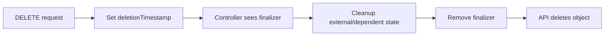

# Garbage Collection và Workload Cleanup

## Mục lục

- [Tổng quan](#tổng-quan)
- [1. Ownership graph](#1-ownership-graph)
- [2. Cascading deletion](#2-cascading-deletion)
- [3. Finalizers](#3-finalizers)
- [4. TTL và history cleanup](#4-ttl-và-history-cleanup)
- [5. Những gì không nên tự động xóa mù quáng](#5-những-gì-không-nên-tự-động-xóa-mù-quáng)
- [6. Namespace cleanup](#6-namespace-cleanup)
- [7. Cleanup theo labels](#7-cleanup-theo-labels)
- [8. Quy trình cleanup an toàn](#8-quy-trình-cleanup-an-toàn)
- [9. Thực hành ownership và orphan](#9-thực-hành-ownership-và-orphan)
- [10. Troubleshooting resource kẹt xóa](#10-troubleshooting-resource-kẹt-xóa)
- [11. Best practices](#11-best-practices)
- [Tài liệu tham khảo](#tài-liệu-tham-khảo)

---

## Tổng quan

Kubernetes không chỉ tạo resources; nó còn quản lý dependency và deletion thông qua owner references, garbage collector, finalizers và các controller cleanup chuyên biệt.

```text
Deployment
└── ReplicaSet
    └── Pods
```

Khi xóa Deployment, garbage collector có thể xóa ReplicaSets và Pods phụ thuộc. Nhưng PVC, external load balancer, cloud disk hoặc custom resources có thể có lifecycle khác.

> [!WARNING]
> Cleanup là thao tác thay đổi hoặc mất dữ liệu. Trước khi xóa hàng loạt, phải inventory đúng scope, backup dữ liệu cần giữ, preview selector và hiểu finalizer/retention policy.

---

## 1. Ownership graph

Dependent object có `metadata.ownerReferences`:

```yaml
metadata:
  ownerReferences:
    - apiVersion: apps/v1
      kind: ReplicaSet
      name: web-7d9f6
      uid: 3c7d...
      controller: true
      blockOwnerDeletion: true
```

UID quan trọng vì object bị xóa rồi tạo lại cùng tên là owner khác.

Xem chain:

```bash
kubectl get pod <pod> -n <namespace> \
  -o jsonpath='{range .metadata.ownerReferences[*]}{.kind}{"/"}{.name}{" uid="}{.uid}{"\n"}{end}'
```

### 1.1 Ownership không phải selector

- OwnerReference dùng cho lifecycle/garbage collection.
- Label selector dùng để tìm/đếm/route objects.

Service chọn Pods nhưng không sở hữu Pods. Xóa Service không xóa Deployment/Pods.

### 1.2 Scope constraints

Cross-namespace owner references không phải ownership hợp lệ. Namespaced dependent phải tham chiếu owner trong cùng Namespace hoặc owner cluster-scoped theo rule API. Thiết kế custom controller phải tuân thủ scope để garbage collector không bỏ qua reference.

---

## 2. Cascading deletion

Khi xóa owner, propagation policy quyết định xử lý dependents.

### 2.1 Background

Owner biến mất trước; garbage collector xóa dependents nền. Đây thường là behavior mặc định của `kubectl delete`.

```bash
kubectl delete deployment web -n workloads-lab --cascade=background
```

### 2.2 Foreground

Owner ở trạng thái terminating cho đến khi dependents chặn deletion được xóa.

```bash
kubectl delete deployment web -n workloads-lab --cascade=foreground
```

Phù hợp khi automation cần chờ dependency graph được dọn, nhưng finalizer/dependent lỗi có thể giữ owner lâu.

### 2.3 Orphan

Xóa owner nhưng giữ dependents:

```bash
kubectl delete deployment web -n workloads-lab --cascade=orphan
```

ReplicaSets/Pods có thể tiếp tục chạy mà không còn owner cấp trên. Dùng trong migration đặc biệt, không phải cleanup thông thường.

| Policy | Owner | Dependents | Use case |
|---|---|---|---|
| Background | Xóa sớm | Xóa nền | Mặc định phổ biến |
| Foreground | Chờ | Xóa trước | Cần xác nhận graph sạch |
| Orphan | Xóa | Giữ | Migration/adoption có chủ đích |

---

## 3. Finalizers

Finalizer là key trong `metadata.finalizers` báo rằng controller phải cleanup trước khi object biến mất.

Delete flow:



Ví dụ:

```yaml
metadata:
  finalizers:
    - example.com/external-cleanup
```

Object có `deletionTimestamp` nhưng còn finalizer sẽ hiển thị `Terminating`.

### 3.1 Không xóa finalizer như phản xạ đầu tiên

Force remove finalizer có thể orphan:

- Cloud load balancer.
- DNS record.
- Volume/snapshot.
- Database user.
- Network rule.

Trước khi patch, xác định controller owner, logs, RBAC, external state và cleanup thủ công. Chỉ remove sau quyết định chấp nhận/rút external state với audit rõ.

---

## 4. TTL và history cleanup

### 4.1 Finished Jobs

```yaml
spec:
  ttlSecondsAfterFinished: 3600
```

TTL controller xóa Job sau khi Complete/Failed và dependents được garbage collect.

### 4.2 CronJob history

```yaml
spec:
  successfulJobsHistoryLimit: 3
  failedJobsHistoryLimit: 5
```

Giới hạn số Jobs cũ được giữ.

### 4.3 Deployment revisions

```yaml
spec:
  revisionHistoryLimit: 5
```

Giới hạn old ReplicaSets đủ cho rollback cần thiết.

Cleanup policy phải cân bằng API object count với forensic/debug needs. Logs và audit cần ship ra hệ thống ngoài lifecycle object.

---

## 5. Những gì không nên tự động xóa mù quáng

### 5.1 PVC và PV

Xóa StatefulSet thường không có nghĩa xóa dữ liệu. PVC/PV có retention và reclaim policy riêng. `Delete` có thể xóa storage asset; `Retain` giữ lại để xử lý thủ công.

Trước khi xóa:

```bash
kubectl get pvc -n <namespace>
kubectl get pv
kubectl get volumeattachments
```

### 5.2 LoadBalancer và resources ngoài cluster

Service type LoadBalancer hoặc custom controller có thể tạo cloud resource. Chờ finalizer/controller cleanup và xác minh provider state để tránh chi phí rò rỉ.

### 5.3 Secrets và audit evidence

Secret cũ có thể cần revoke external credential trước khi xóa. Job logs/result có thể cần retention theo compliance. “Không còn dùng” và “được phép xóa” là hai khái niệm khác nhau.

### 5.4 CRDs trước custom resources

Xóa CRD trước khi custom resources/finalizers được xử lý có thể làm controller mất API cần cleanup. Uninstall Operator phải theo thứ tự được vendor/runbook quy định.

---

## 6. Namespace cleanup

Xóa Namespace là bulk cascading operation:

```bash
kubectl delete namespace preview-123
```

Phù hợp cho ephemeral environment khi mọi resource cần xóa cùng lifecycle. Không phù hợp nếu Namespace chứa shared PVC, Secret hoặc resource của nhiều owner.

Inventory namespaced resource types:

```bash
kubectl api-resources --verbs=list --namespaced -o name
```

Liệt kê từng type:

```bash
for resource in $(kubectl api-resources --verbs=list --namespaced -o name); do
  kubectl get "$resource" -n <namespace> --ignore-not-found
 done
```

Một số APIService lỗi có thể khiến discovery/namespace deletion gặp vấn đề. Ghi nhận errors thay vì bỏ qua.

---

## 7. Cleanup theo labels

Preview trước:

```bash
kubectl get deployment,service,job -n preview \
  -l 'app.kubernetes.io/instance=pr-123'
```

Xóa:

```bash
kubectl delete deployment,service,job -n preview \
  -l 'app.kubernetes.io/instance=pr-123'
```

Rủi ro lớn nhất là selector quá rộng hoặc labels không nhất quán. Không chạy `kubectl delete ... -l` khi chưa:

1. Xác nhận context và Namespace.
2. Preview đúng resource types.
3. Đếm và review names.
4. Đánh giá dependents/PVC/external state.
5. Có approval/backup nếu cần.

`kubectl delete all -l ...` không xóa “tất cả” Kubernetes resources.

---

## 8. Quy trình cleanup an toàn

### Bước 1: Xác định source và owner

```bash
kubectl config current-context
kubectl config view --minify
kubectl get <kind> <name> -n <namespace> -o yaml
```

Nếu GitOps quản lý object, xóa source trước hoặc controller sẽ tạo lại.

### Bước 2: Inventory

Liệt kê ownerReferences, selectors, PVC/PV, Services LoadBalancer, CRs và finalizers.

### Bước 3: Phân loại dữ liệu

- Có thể xóa.
- Cần backup/snapshot.
- Cần retain/chuyển owner.
- Cần revoke ở external system.

### Bước 4: Preview và change approval

Ghi rõ scope, expected count, rollback/recovery và maintenance window.

### Bước 5: Xóa từ source of truth

Apply Git change hoặc delete object cấp owner phù hợp; để garbage collector xử lý dependents.

### Bước 6: Quan sát

```bash
kubectl get <kind> <name> -n <namespace> --watch
kubectl get events -n <namespace> --sort-by=.metadata.creationTimestamp
```

### Bước 7: Xác minh external state và chi phí

Kiểm tra cloud load balancer, disks, snapshots, DNS, certificates và credentials.

---

## 9. Thực hành ownership và orphan

Tạo Deployment:

```bash
kubectl create namespace cleanup-lab
kubectl create deployment web \
  --image=nginx:1.27-alpine \
  --replicas=2 \
  -n cleanup-lab
kubectl get deployment,replicaset,pods -n cleanup-lab
```

Xem owner chain:

```bash
RS="$(kubectl get replicaset -n cleanup-lab -l app=web -o jsonpath='{.items[0].metadata.name}')"
POD="$(kubectl get pod -n cleanup-lab -l app=web -o jsonpath='{.items[0].metadata.name}')"
kubectl get replicaset "$RS" -n cleanup-lab -o jsonpath='{.metadata.ownerReferences}{"\n"}'
kubectl get pod "$POD" -n cleanup-lab -o jsonpath='{.metadata.ownerReferences}{"\n"}'
```

Orphan dependents:

```bash
kubectl delete deployment web -n cleanup-lab --cascade=orphan
kubectl get replicaset,pods -n cleanup-lab
```

Xóa ReplicaSet theo foreground:

```bash
kubectl delete replicaset "$RS" -n cleanup-lab --cascade=foreground
kubectl get pods -n cleanup-lab
```

Cleanup Namespace:

```bash
kubectl delete namespace cleanup-lab
```

Lab cho thấy orphan không phải “xóa sạch”; dependent tiếp tục chạy đến khi có thao tác tiếp theo.

---

## 10. Troubleshooting resource kẹt xóa

### 10.1 Đọc deletion state

```bash
kubectl get <kind> <name> -n <namespace> -o yaml
```

Tập trung vào:

- `deletionTimestamp`.
- `finalizers`.
- `ownerReferences`.
- Events và controller conditions.

### 10.2 Xác định controller sở hữu finalizer

Tên finalizer thường có domain. Kiểm tra controller Deployment/Pod, logs, RBAC và dependency external.

### 10.3 Namespace `Terminating`

```bash
kubectl get namespace <name> -o yaml
kubectl api-resources --verbs=list --namespaced -o name
```

Liệt kê remaining resources và finalizers. API discovery lỗi cũng có thể ngăn namespace controller xác nhận cleanup.

### 10.4 Force deletion

`--force --grace-period=0` bỏ qua graceful application termination ở API path và có thể để process tiếp tục trên Node nếu kubelet mất liên lạc. Với StatefulSet, nguy cơ duplicate identity/split-brain đặc biệt nghiêm trọng.

Force là bước cuối trong incident runbook, không phải cách cleanup nhanh mặc định.

---

## 11. Best practices

- Quản lý ephemeral resources bằng Namespace hoặc labels có schema rõ.
- Xóa owner cấp cao thay vì từng Pod con.
- Dùng TTL/history limits nhưng giữ logs/audit bên ngoài cluster.
- Inventory PVC/PV và external resources trước cleanup.
- Không force-remove finalizer thiếu root-cause analysis.
- Xóa intent ở Git/GitOps trước để tránh recreation.
- Preview selector và xác nhận context/Namespace.
- Có retention, backup, restore và compliance policy.
- Theo dõi resources kẹt terminating và cloud assets orphan.
- Diễn tập cleanup như một operation có blast radius.

Learning path Workloads kết thúc tại đây. Tiếp theo, chuyển sang phần cấu hình workload với [Environment Variables](/cau-hinh/environment-variables/).

---

## Tài liệu tham khảo

- [Garbage Collection](https://kubernetes.io/docs/concepts/architecture/garbage-collection/)
- [Owners and Dependents](https://kubernetes.io/docs/concepts/overview/working-with-objects/owners-dependents/)
- [Finalizers](https://kubernetes.io/docs/concepts/overview/working-with-objects/finalizers/)
- [Delete Objects](https://kubernetes.io/docs/tasks/administer-cluster/use-cascading-deletion/)
- [TTL-after-finished Controller](https://kubernetes.io/docs/concepts/workloads/controllers/ttlafterfinished/)
